# Binary Classification
Binary classification is a type of task where a model (like a neural network) learns to classify data into one of two categories.
The output is usually a single number between 0 and 1

- Closer to 0 → class 0
- Closer to 1 → class 1

We usually use an activation function called sigmoid at the end to squash the output between 0 and 1.

For example, If the image is cat then(1) and if not a cat then(0) where the value of y is used to denote the output label of either 1 or 0.

---

# Image Representation
An image is represented in form of 3 RGB 64 Matrices. 
If input image is 64*64 pixels then we will have 3 corresponding RGB matrices of 64 pixels.
The dimension of feature vector(list of numbers that represent important characterstics of input Example pixels) x is denoted by nx and is equal to 12288 whereas the label y has dimesnion 1 as it has only two options either 0 or 1. Hence, ny is equal to 1.

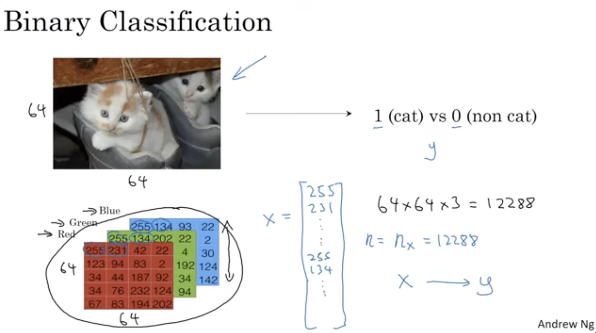

---

# Notation for training examples
They are represented by (x,y) where x is the feature vector of dimesnion nx and y is binary output having values 0 and 1.

In similar manner m is used to denote the training examples and M can be put togehter to make test sets.

The feature vector in each training examples is put together as columns so they have m input feature vector from the training sets nd have nx number of rows.

`X ∈ ℝⁿˣ x m`: Is an input matrix where each column is an input feature vector with `nₓ` features, and there are `m` examples in total.  
`X.shape = (nₓ, m)`
`Y ∈ ℝ¹ × m`: Is a row vector containing all labels.  
`Y.shape = (1, m)`

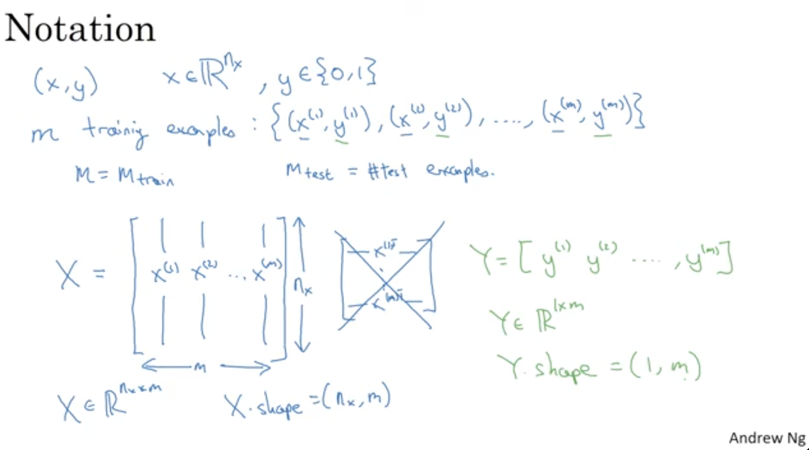

---

# Logistic Regression
Logistic Regression is a classification algorithm used to predict binary outcomes (like 0 or 1) by applying a sigmoid function to a linear equation.

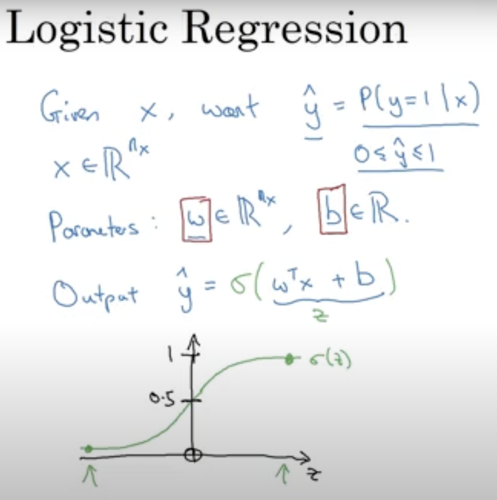

Here:
- `ŷ` is the probability that the output label `y = 1`, given the input `x`.
- `x` is the input feature vector.
- **Sigmoid function** is used to bound the value between 0 to 1.
- Unlike linear regression, which predicts a continuous output, logistic regression predicts probabilities of the outcome that are bounded between 0 and 1. This is achieved using the logistic function (also known as the sigmoid function).
  
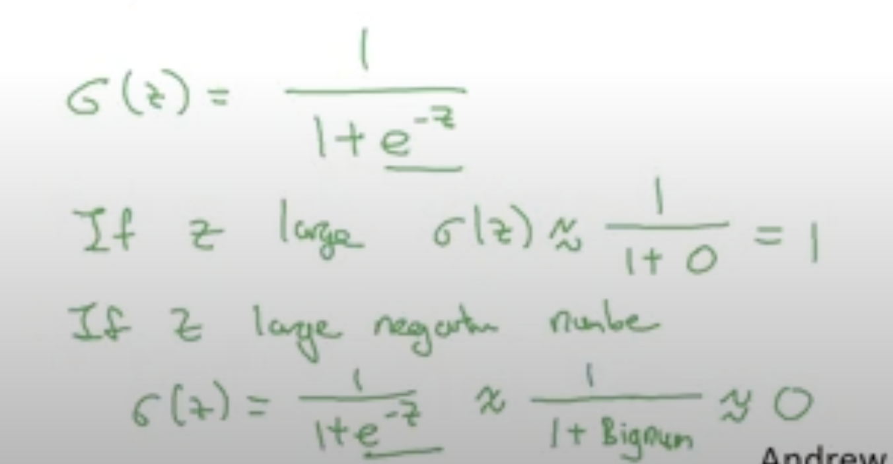

#### Parameters of Logistic Regression
- Weights (Coefficients): w is a vector assigned to each input feature.
- Bias (Intercept): b are the parameters for logistic regressions they are adjusted during the learning process to make predictions more accurate.
- z = wᵀx + b (Here z is raw output before applying any activation functions)

### Loss Function
The loss function used in logistic regression is called Log Loss or Binary Cross-Entropy Loss
A **loss function** measures how well a machine learning model’s prediction matches the actual target for a **single training example**.

It outputs a **scalar value** representing the error.

**Example:**  
For regression, a common loss function is **Mean Squared Error (MSE):**

For a single training example:
Loss = −[y∗log(p)+(1−y)∗log(1−p)]

Where:
- y = actual label (0 or 1)
- p = predicted probability (from sigmoid function)
- If y = 1, the second term vanishes and it becomes -log(p) → penalizes low probability for correct class
- If y = 0, the first term vanishes and it becomes -log(1 - p) → penalizes high probability for the wrong class
- If y = 1 and ŷ = 0.9 → Loss is small 
- If y = 1 and ŷ = 0.1 → Loss is big

### Cost Function
- To train the parameters `w` and `b` we need a cost function. The cost function is used to determine how much error is present or how close our output is to predicted output.
- For the entire training set we require the average of loss function which is the cost function.
- We need to adjust value of parameters `w` and `b` to minimize cost function `J(w,b)` using techniques like gradient descent.

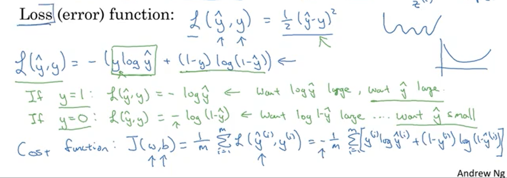

---

# Gradient Descent
It is an optimization algorithm used to minimize a cost function by finding the direction of steepest descent.

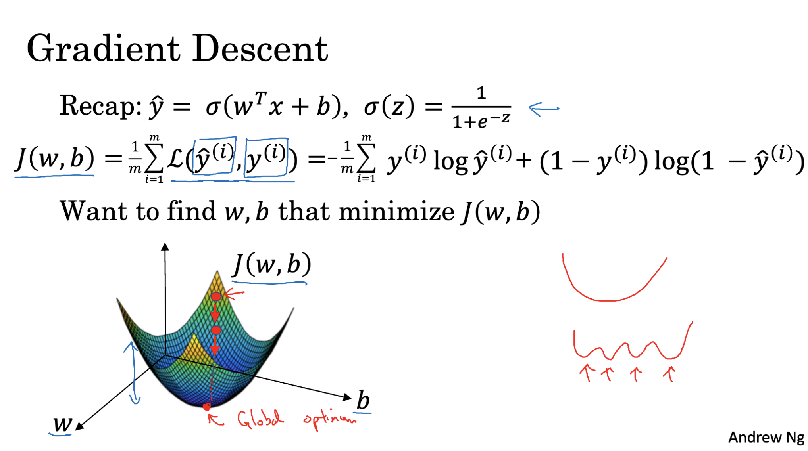

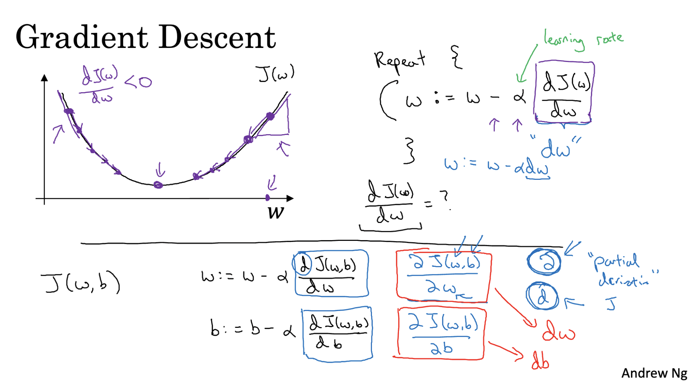

### Derivatives
Derivative is nothing but slope of a function which gives us height/width. It remains constant for all value.

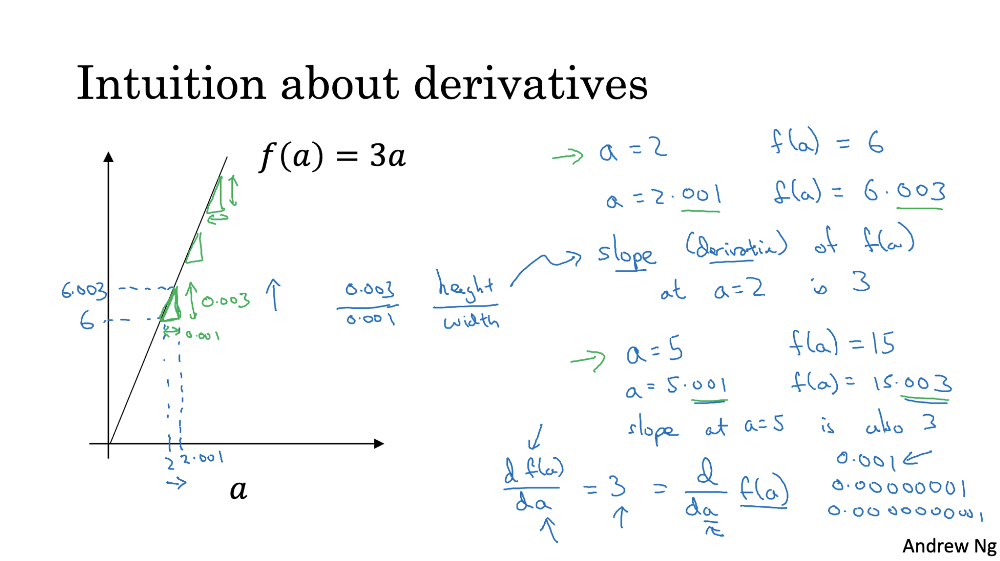

---

### Computation Graph
A computation graph is a visual way to break down and represent a mathematical function as a series of simple operations (like add, multiply, etc.) — step by step.

It helps us:
- Understand how data flows through a model 
- Calculate derivatives (for training!) using backpropagation 

---

# Logistic Regression Derivatives
Backpropogation: Backpropagation is the algorithm used to compute gradients of the loss function with respect to each parameter (like weights and biases) in a neural network — so that we can update them and reduce the error.

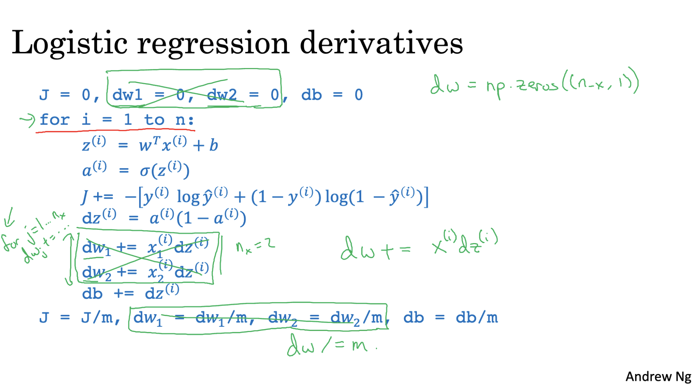

- Objective: Find the best parameter values (weights and bias) to minimize the negative log-likelihood loss function in logistic regression.
- Initial Guess: Start with random initial values for weights and bias.
- Calculate Predictions: Compute predictions using the logistic regression model with current parameter values.
- Compute Loss: Evaluate the negative log-likelihood loss function using the predictions.
- Derivatives Calculation:
  - Loss Derivative w.r.t Predictions: Calculate how the loss changes with respect to the predictions.
  - Loss Derivative w.r.t Parameters: Use the chain rule to calculate how the loss changes with respect to each parameter (weights and bias).
- Parameter Update:
  - Compute Step Size: Multiply each derivative by a small learning rate to determine the step size.
  - Adjust Parameters: Subtract the step size from the current parameter values to get updated weights and bias.
- Iterate: Repeat steps 3-6 until the parameter changes are very small or a maximum number of iterations is reached.
- Model Training: Through these iterations, gradient descent optimizes the parameters, reducing the loss and improving the model's prediction accuracy on new data.

### Gradient Descent on m examples
We have:
- m examples (like m images or data points)
- Each input example has n features (like 12288 if it's a 64×64×3 image)
We want to train a logistic regression model on all of them using vectorized math. Hence we will learn vectorization to eliminate the for loops.

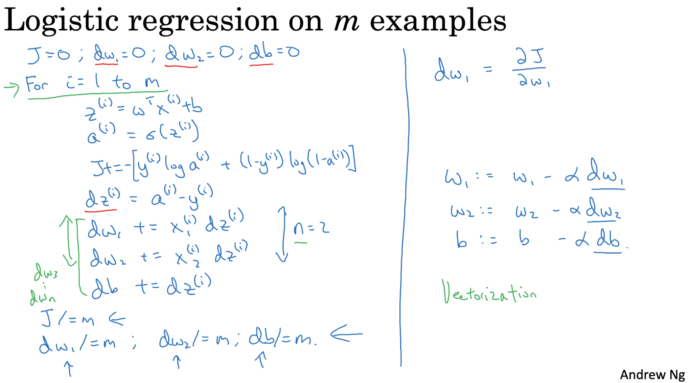

---

# Vectorization
- The main idea behind vectorization is to avoid using explicit for loops when working with data in neural networks.
- Instead of processing one training example at a time, we work with entire arrays (vectors/matrices) at once.
- This makes the implementation faster and more efficient, especially with large datasets.
- Libraries like NumPy, TensorFlow, and PyTorch are optimized to perform these vectorized operations very quickly.
- In a vectorized implementation, we directly compute dot products and other operations using matrix algebra, without looping manually.

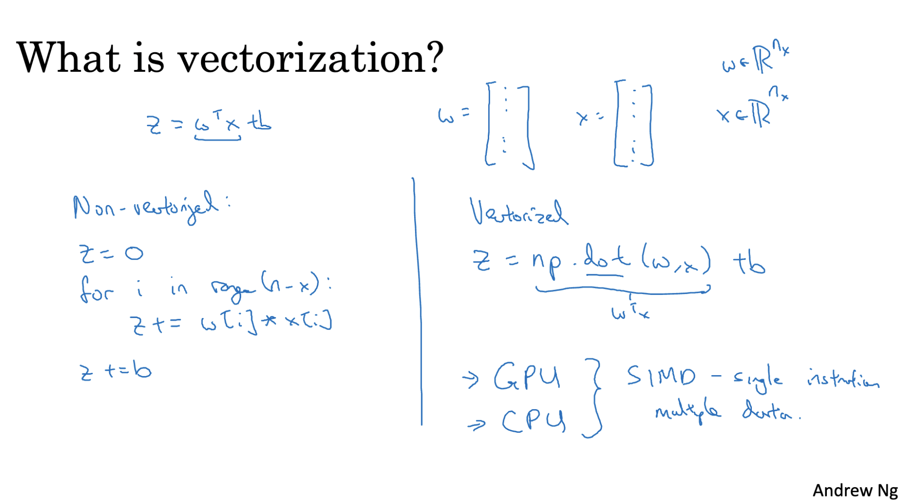

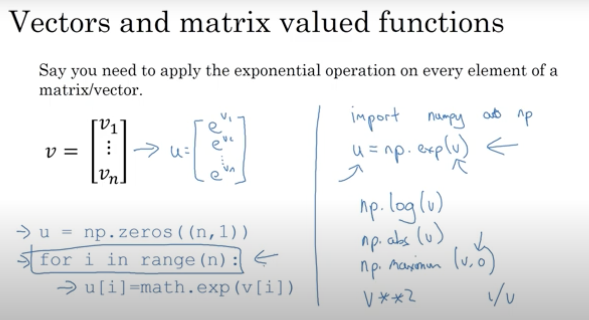

### Vectorizing Logistic Regression
Perform logistic regression over `m` training examples without using loops.

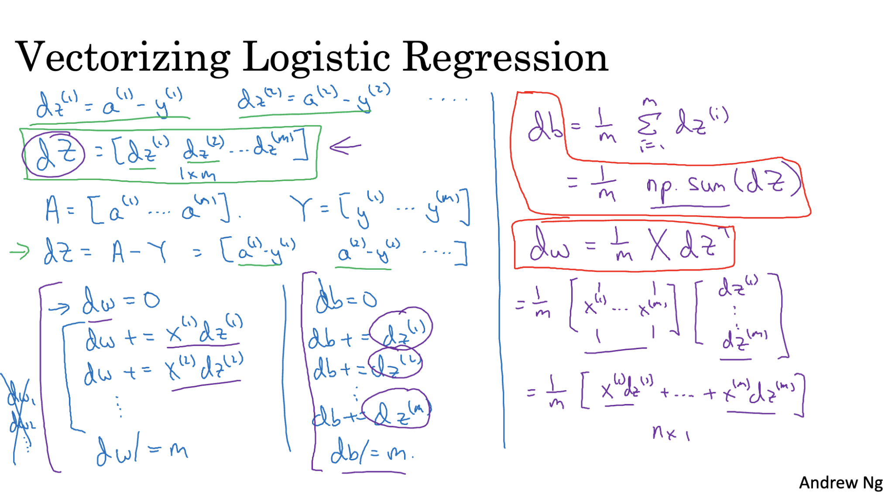

### Implementation of Logistic Regression

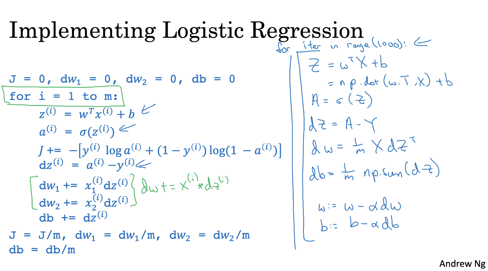

---

# Broadcasting
Broadcasting is a technique used in NumPy to perform operations on arrays of different shapes — without explicitly copying or looping.

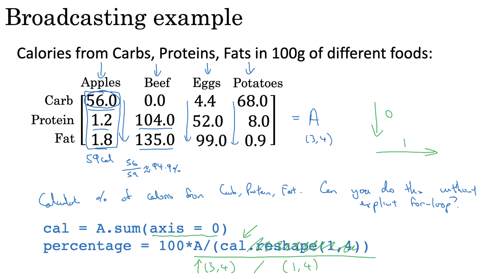

### General Principle of Broadcasting

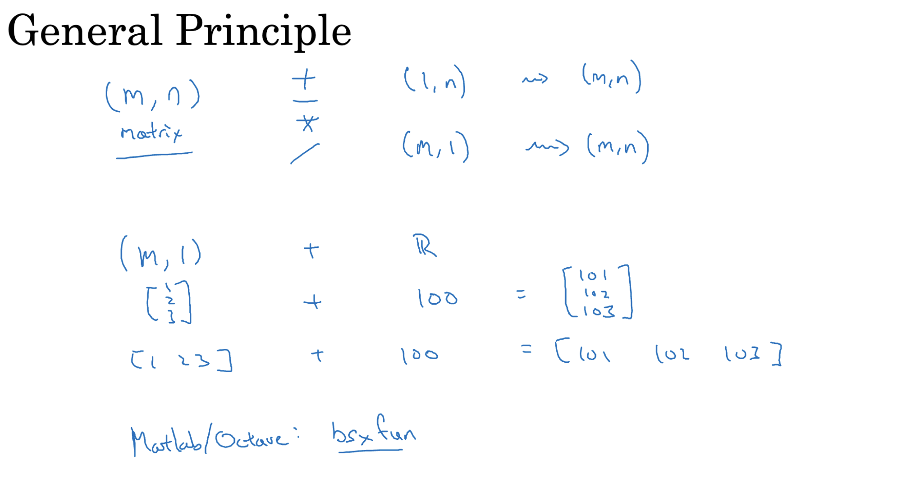

---

