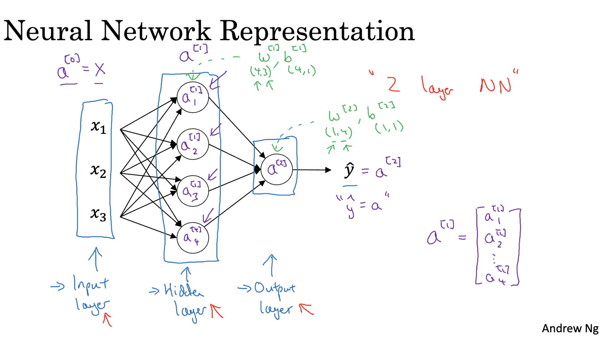
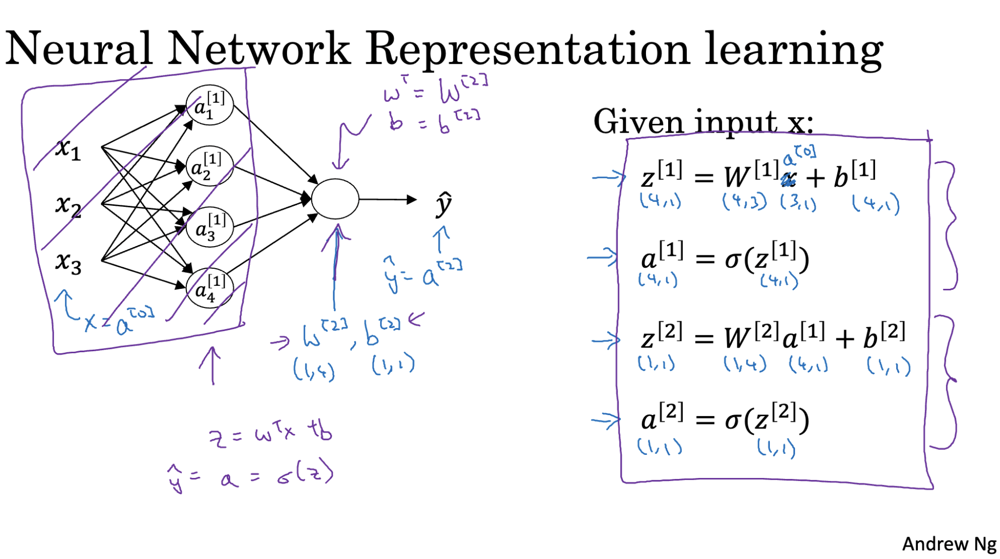
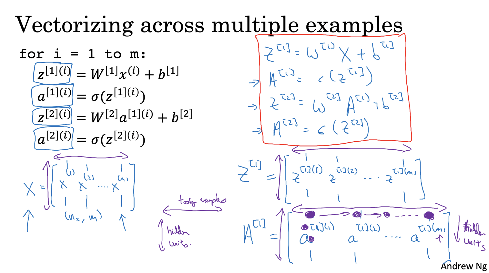
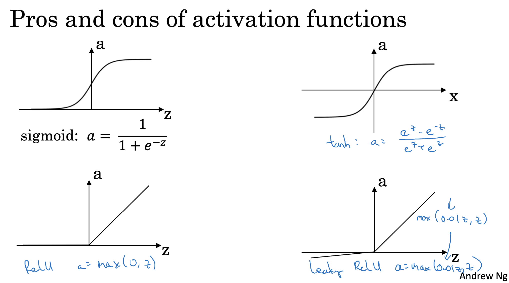
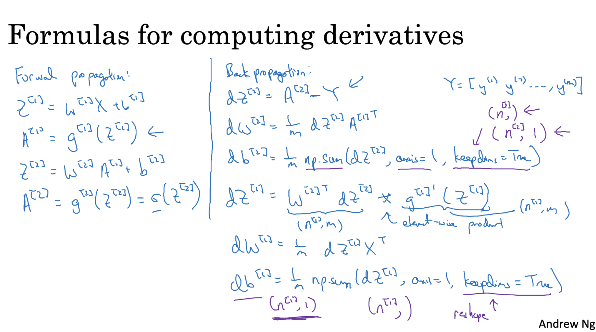

# Neural Network Representation
A neural network is structured in layers that help it learn complex relationships from input data. Here’s how each part plays a role:

- Input Layer: This is the first layer where the data enters the network. Each feature of the data has a corresponding input node.
- Hidden Layers: These intermediate layers carry out most of the learning. They apply mathematical operations (using weights and biases) and activation functions to transform the inputs. The more hidden layers a network has, the deeper it is.
- Output Layer: The final layer produces the network’s prediction. The structure and activation function used in this layer depend on the type of task—classification, regression, etc.

Each layer passes its output to the next layer, forming a network of information flow. These layers, combined with training using data, allow the neural network to learn how to make accurate predictions.

---

# Computing Neural Network Outputs
- Each neuron in a hidden layer carries out two main steps:
 - First, it computes a value z using the inputs from the previous layer, along with that neuron’s own weights and bias. This is a simple linear combination: z = wᵀx + b.
 - Then, this value z is passed through an activation function (like sigmoid or ReLU) to produce the output a for that neuron. This output then becomes input for the next layer of the network.
- Instead of handling each neuron one at a time using loops (which is inefficient), we apply vectorization. That means we handle entire layers at once by representing the weights, biases, inputs, and outputs as matrices. This allows us to compute all the z and a values for a layer in one shot using matrix operations, making the process much faster and cleaner.
- When dealing with multiple neurons in a layer, we stack their parameters and outputs vertically in a matrix form. This organized structure lets us scale up our neural network to handle large datasets more efficiently.

---

# Vectorizing across multiple examples
In practice, we often train neural networks using multiple training examples at once (a technique called batch processing). To make this efficient, we vectorize the computations across all examples instead of processing one example at a time.

---

# Activation Functions
Activation functions decide whether a neuron should be activated or not by introducing non-linearity into the output. Without them, a neural network would behave just like a plain linear model.Each activation function has its own behavior and is useful in different scenarios.

## Why are Activation Functions Needed?
1. To Introduce Non-Linearity

Without activation functions, a neural network would only be able to learn linear relationships. That means no matter how many layers you add, it would still behave like just one big linear equation.

Linear function:

`z=w^Tx+b`

If you stack multiple layers of only linear transformations, it’s still linear. But real-world data (like images, audio, or language) contains complex, non-linear patterns — and we need the model to capture those.

2. To Help the Network Learn Complex Mappings

Imagine trying to classify images of cats vs. dogs. The relationship between pixels and "cat" or "dog" is not something a straight line can represent.

Activation functions like ReLU, sigmoid, or tanh allow the network to bend and curve its decision boundaries — so it can learn more expressive and powerful features.

3. To Make Layers Interact Meaningfully

In a neural network:

- Each layer transforms data before passing it to the next layer.
- Without an activation function, the entire network collapses into something equivalent to just one layer.
- With activation functions, each layer adds a unique transformation, allowing the model to go deeper and more powerful.

## Different Activation Functions
1. Sigmoid

- Formula: `𝜎(𝑧) = 1/1+𝑒^-z`
- Output Range: 0 to 1
- Commonly used in the output layer for binary classification.
- Downside: Can cause gradients to vanish when z is very large or very small.

2. Tanh (Hyperbolic Tangent)

- Formula: tanh(z)= `e^z-e^−z/e^z+e^−z`
- Output Range: -1 to 1
- Better than sigmoid for hidden layers because it's zero-centered, which often helps learning.

3. ReLU (Rectified Linear Unit)

- Formula: `f(z)=max(0,z)`
- Output Range: 0 to ∞
- Most commonly used in hidden layers.
- Simple and efficient, helps solve the vanishing gradient problem.
- Caution: Neurons can "die" if they get stuck outputting 0.

4. Leaky ReLU

- An alternative to ReLU to avoid the dying ReLU problem, where the function allows a small gradient for negative inputs.
- Defined as `Leaky ReLU(x) = max(0.01x, x)`.
- The slope is a small constant (0.01) when `x` is negative.

5. Softmax

- Used in the output layer for multi-class classification.
- Defined as `Softmax(x_i) = e^(x_i) / sum(e^(x_j))` for all `j`.
- Converts raw output scores into probabilities that sum to 1.

### Choice of Activation Function

- Sigmoid is recommended for the output layer in binary classification tasks.
- Softmax is recommended for the output layer in multi-class classification tasks.
- For hidden layers, ReLU is generally the default choice due to its efficiency and effectiveness.
- tanh can be used in hidden layers for zero-centered data.
- Leaky ReLU is useful to mitigate the dying ReLU problem.

###  Derivatives of Activation Function

- Sigmoid Function: `g(z)*(1 - g(z))`
- Hyperbolic Tangent (Tanh): `1 - g(z)^2`
- ReLU and Leaky ReLU: `0 or 1`

# Gradient Descent in Neural Networks

1. **Initialization**:
   - Start with random values for weights and biases:
     - `W1`, `B1` for the hidden layer.
     - `W2`, `B2` for the output layer.

2. **Forward Propagation**:
   - Pass input data through the network to get predictions.
   - Calculate intermediate values and apply activation functions.

3. **Compute Gradients**:
   - Determine how much each weight and bias affects the prediction error.
   - This tells you how to adjust them to reduce error.

4. **Update Weights**:
   - Adjust `W1`, `B1`, `W2`, and `B2` using the computed gradients.
   - Use a learning rate to control the size of the adjustments.

   

### Forward Propagation

1. **Calculate Activations**:
   - **Hidden Layer**:
     - `Z1 = W1 * X + B1`
     - `A1 = Activation(Z1)` (e.g., ReLU, Sigmoid)
   - **Output Layer**:
     - `Z2 = W2 * A1 + B2`
     - `A2 = Sigmoid(Z2)` (For binary classification)

### Back Propagation

1. **Compute Gradients**:
   - **Output Layer**:
     - `DZ2 = A2 - Y` (Error in prediction)
     - `DW2 = DZ2 * A1^T` (Gradient for weights)
     - `DB2 = DZ2` (Gradient for biases)

   - **Hidden Layer**:
     - `DZ1 = (W2^T * DZ2) * Activation'(Z1)` (Error propagated back)
     - `DW1 = DZ1 * X^T` (Gradient for weights)
     - `DB1 = DZ1` (Gradient for biases)

### Training

- **Iterate**:
  - Repeat forward propagation and back propagation.
  - Update weights and biases each iteration to improve network performance.

---

# Random Initalization

- Random initialization helps each neuron learn unique features.
- Avoids symmetry, where all neurons behave the same.
- Keeps activations and gradients in a good range to speed up learning.

---
