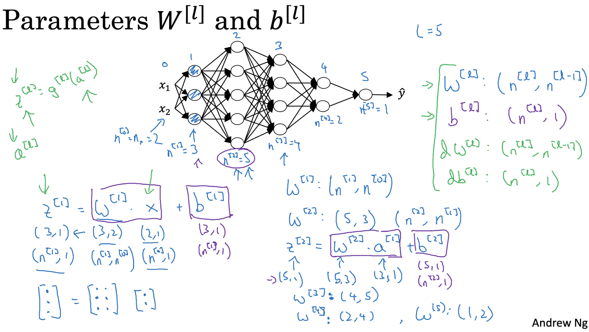
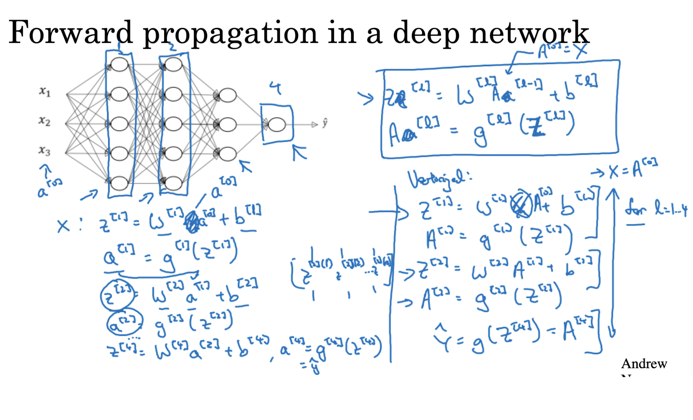
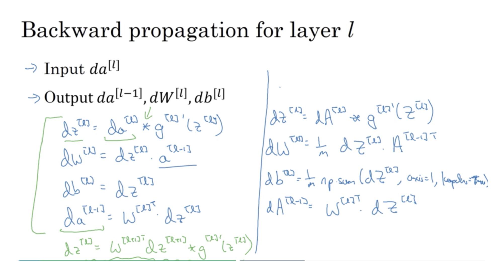
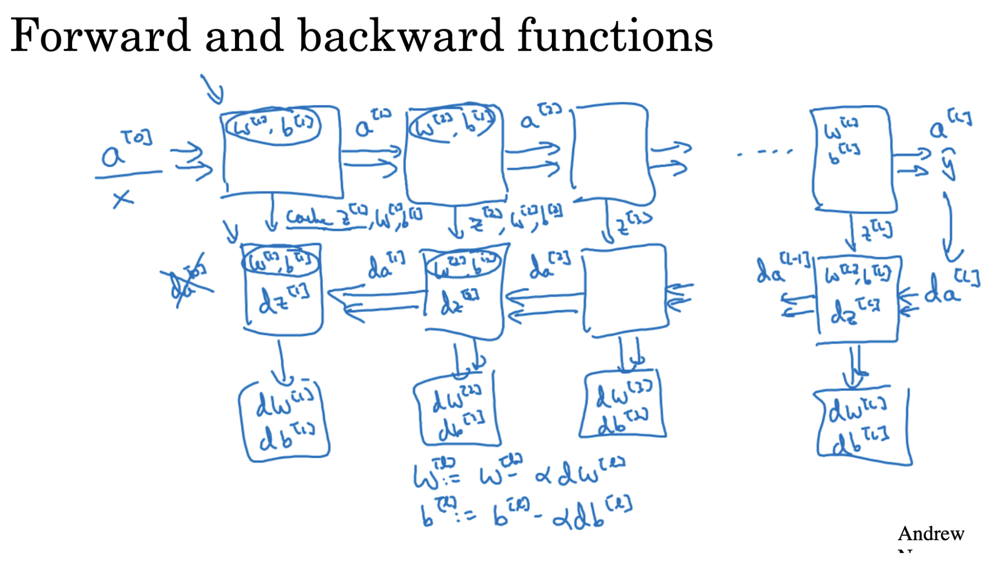

# Deep Neural Networks
- A deep neural network is simply a neural network that has more than one hidden layer between the input and output layers.
- A simple neural network (with only one hidden layer) is sometimes called a shallow network, while networks with 2 or more hidden layers are called deep — hence the term deep learning.

## Notation & Matrix Dimensions in Deep Neural Networks
We use L to represent the total number of layers in the network (including hidden and output, not input).
Let’s say:

You’re working with m training examples

The input feature vector size is n[0]

Each layer l has n[l] neurons

### Layer-wise Symbols and Dimensions

| Symbol | Description                          | Shape (Dimensions)          |
|--------|--------------------------------------|-----------------------------|
| `W[l]` | Weights matrix for layer `l`         | `(n[l], n[l-1])`            |
| `b[l]` | Bias vector for layer `l`            | `(n[l], 1)`                 |
| `Z[l]` | Linear output (before activation)    | `(n[l], m)`                 |
| `A[l]` | Activation/output of layer `l`       | `(n[l], m)`                 |
| `X`    | Input data                           | `(n[0], m)`                 |
| `Y`    | True labels (binary classification)  | `(1, m)`                    |

### Notes:

- `n[l]` = number of neurons in layer `l`.
- `m` = number of training examples.
- The input layer is considered layer `0`, so `n[0]` is the number of input features.
- Activations (`A[l]`) for each layer are computed using:
  - `Z[l] = W[l] * A[l-1] + b[l]`
  - `A[l] = activation(Z[l])`

## Building Blocks of Deep Neural Networks

Building Blocks of a Deep Neural Network involves two key steps: **forward propagation** and **backward propagation**.

Forward Propagation
- Forward propagation is the process of passing input data through the layers of the network to compute predictions.
- At each layer:
  - A **linear operation** is performed: `Z = W * A + b`
  - Then, a **non-linear activation function** is applied: `A = g(Z)`
- This continues until the output layer produces the final prediction.

Backward Propagation
- Backward propagation is the learning step where the network adjusts its weights and biases.
- It begins by calculating the **difference between the predicted output and the actual value** (loss).
- Then, the network computes the **gradient of the loss with respect to each parameter**.
- Finally, the weights and biases are **updated in the direction that reduces the loss**, using an optimization method like **gradient descent**.

### Step-by-Step Workflow of Training a Neural Network

To train a neural network, we follow a sequence of steps that allow the model to learn from the data and improve over time. Here's how it works:

1. Forward Propagation
- This step involves **passing the input data through the network**.
- Each layer performs calculations using the current weights and biases to produce activations.
- These activations move from one layer to the next until the final output is generated.
- The final output is the **model's prediction** for the given input.

2. Compute the Loss
- Once a prediction is made, we **compare it to the actual label** using a loss (or cost) function.
- The loss tells us **how wrong the prediction was**.
- A higher loss means the model is making poor predictions; a lower loss means it's improving.

3. Backward Propagation (Backprop)
This step is where the learning happens — we **calculate how to tweak the parameters** to reduce the loss.

- **Gradient Calculation:** We determine how much each parameter (weights and biases) contributed to the error.
- **Using Derivatives:** The gradients are computed using **partial derivatives** of the loss with respect to each parameter.
- **Chain Rule Application:** Since each parameter influences the final output indirectly through layers, we apply the **chain rule** to trace back the error from the output layer through the network.

## Parameters and Hyperparameters

When working with neural networks, it’s important to understand the difference between **parameters** and **hyperparameters** — both are crucial for model training, but they play very different roles.

### Parameters

- **Parameters are learned during training.**
- They are **internal values** that the neural network updates to reduce the loss and make better predictions.
- Examples:
  - **Weights (W):** These determine how strongly a feature influences the output.
  - **Biases (b):** These allow the activation to shift, adding flexibility to the model.

### Hyperparameters

- **Hyperparameters are set before training begins** — they are not learned from data.
- These are the **external settings** you choose to control the training process and model behavior.

- Common examples:
  - **Learning Rate (α):** How big each update step is during training.
  - **Number of Hidden Layers**
  - **Number of Neurons per Layer**
  - **Batch Size:** Number of training examples used in one iteration.
  - **Number of Epochs:** How many times the model sees the entire dataset.
  - **Activation Functions (e.g., ReLU, Sigmoid)**
  - **Regularization Parameters (like λ)**

---

