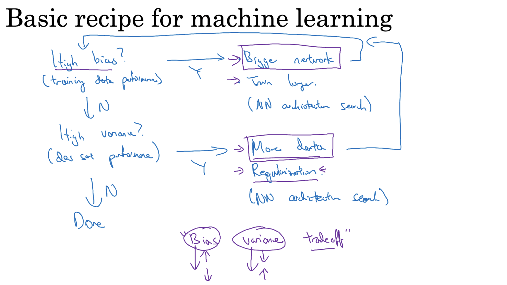
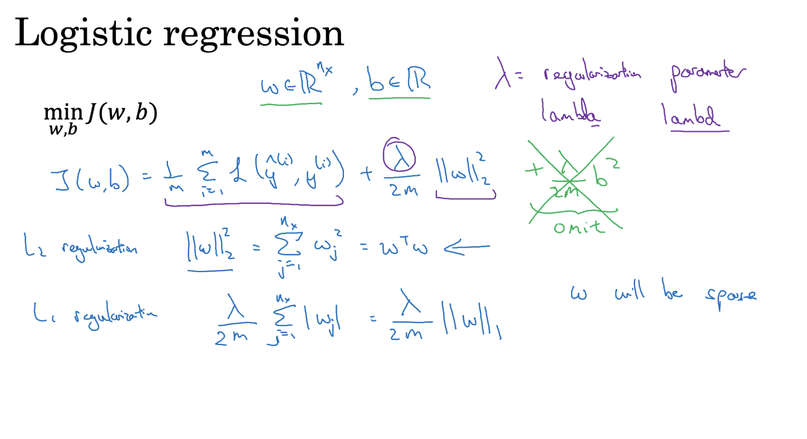
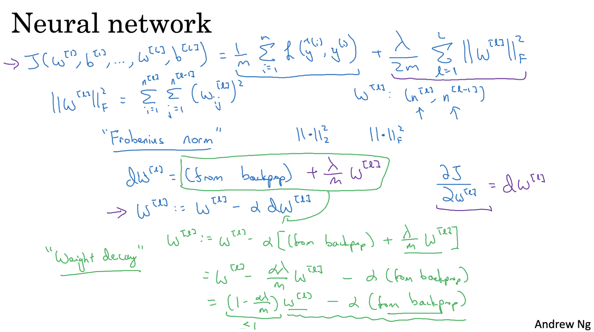
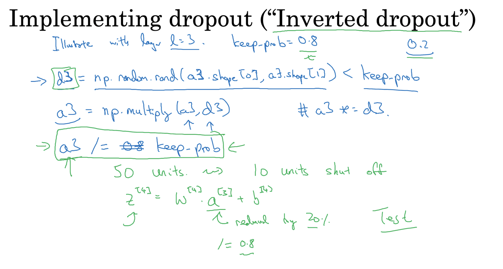
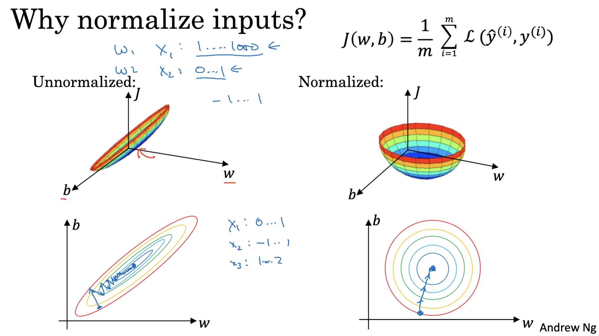
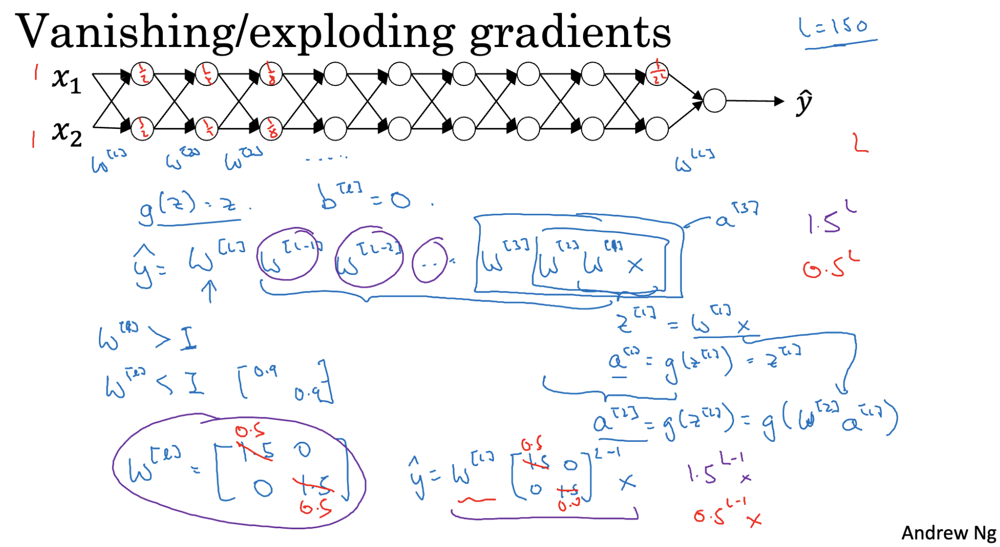
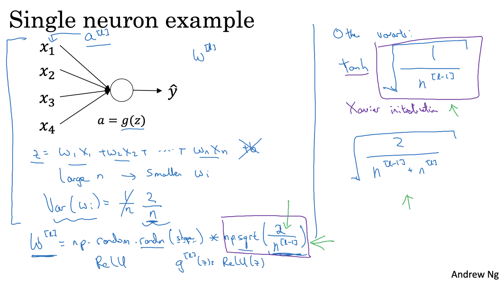
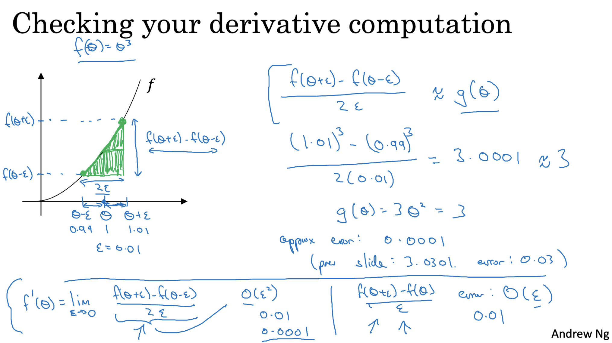
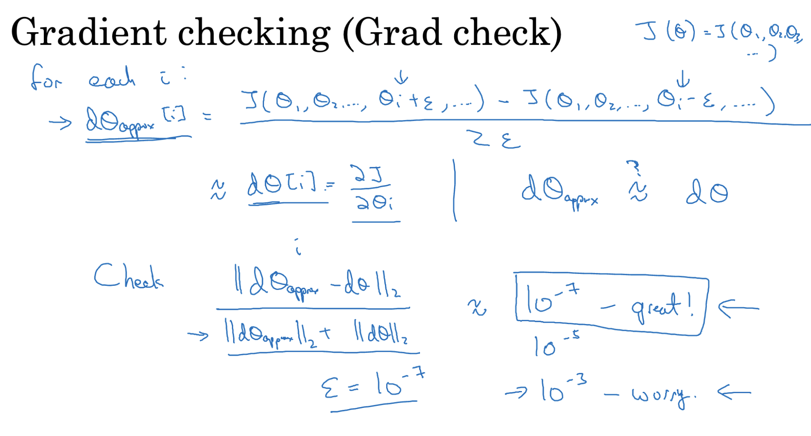

# Train/ Dev/ Test Sets

### Training Set
- Used to train the model.
- Model learns the parameters (weights and biases) from this data.

### Dev Set 
- Used to tune hyperparameters and select the best model.
- Helps evaluate how well the model generalizes to unseen data.

### Test Set
- Used only once after training and tuning.
- Evaluates the final performance of the model.

### Datasets Split Ratio
- The dataset is split into 98% training, 1% development , and 1% test set when we have large datasets.If we have a small dataset the general 60/20/20 split also works as well.
- It is important to make sure that the training set and the dev/test sets are all from the same distribution. For example - If the model is trained on high resolution images but the test set contains low resolution images the model will not work properly.
- It is ok in some cases to not have a test set and only a dev set.

---

# Bias and Variance

### Bias
- Error due to **over-simplified assumptions** in the model.
- High bias -> Model is too simple and misses relevant patterns (underfitting).
- Example: Predicting a curve with a straight line.

### Variance
- Error due to **model sensitivity to small fluctuations** in training data.
- High variance -> Model is too complex and fits noise in the training data (overfitting).
- Example: A very wiggly curve that perfectly fits training points but generalizes poorly.

### Bias-Variance Trade-off
| Scenario          | Bias      | Variance | Model Behavior             |
|-------------------|-----------|----------|----------------------------|
| Underfitting      | High      | Low      | Poor on train & dev        |
| Overfitting       | Low       | High     | Good on train, poor on dev |
| Just Right        | Low       | Low      | Good on train & dev        |

---

# Regularization

### What is Regularization?
- A technique used to **reduce overfitting** in machine learning models.
- It adds a **penalty term** to the loss function to discourage the model from learning overly complex patterns (i.e., large weights).

### Types of Regularization

#### L2 Regularization
- Adds the **sum of squares of weights** to the loss.
- **New Loss Function:** J(w, b) = original_loss + λ * Σ(w²)

- Keeps weights small, smooths the model.

#### L1 Regularization 
- Adds the **sum of absolute values of weights** to the loss.
- Can lead to sparse models (some weights become zero).

### Regularization Term

- **λ (lambda):** Regularization parameter.
- Controls the strength of the penalty.
- Higher λ → more regularization → simpler model.
- Too high λ → underfitting.
- Python Note: While using, λ is often written as lambd to avoid conflicts with Python's lambda.

### Effect of Regularization
| Model Behavior  | Regularization Strength  | Result               |
|-----------------|--------------------------|----------------------|
| Overfitting     | Increase λ               | Reduces variance     |
| Underfitting    | Decrease λ               | Reduces bias         |

### Why does Regularization help with overfitting?
- When a neural network learns not only the underlying patterns in the training data but also the noise, it performs well on training data but poorly on new data.
- Regularization adds a penalty to the cost function to keep the weights small. This helps the model avoid learning the noise and focus on the actual patterns.

### Intuition
- When the regularization strength (`lambda`) is **high**, it **discourages large weights**.
- This keeps the model simple, reducing its capacity to memorize the training data.
- As a result, the network is **less likely to overfit**.

### Cost Function Update
The original cost function is modified to include a regularization term: J(w, b) = (1/m) * Σ Loss(y, ŷ) + (λ / (2m)) * Σ ||W||²

### Impact on Network Behavior

- **Reduced Complexity:** The network becomes less sensitive to small fluctuations in training data.
- **Linear Approximation:** When weights are small, activation functions like `tanh` and `sigmoid` stay in their linear regions, making the network behave more like a linear model.
- **Less Overfitting:** The model learns general patterns instead of memorizing noise.

## Dropout Regularization in Neural Networks

Dropout is a popular regularization technique to prevent **overfitting** in deep neural networks.

### What is Dropout?

- During **training**, dropout randomly turns off a certain percentage of neurons in each layer.
- This means those neurons do **not** participate in the forward or backward pass for that iteration.
- During **testing**, all neurons are active, but their outputs are scaled accordingly.

1. Choose the Dropout Probability
- Define a hyperparameter called `keep_prob`.
- It represents the probability that a neuron is **kept active** during training.
- For example, `keep_prob = 0.8` means each neuron has an 80% chance of staying on.

2. Create a Dropout Mask
- For a layer’s activation matrix `A`, generate a random binary mask `D` of the same shape.
- Each element of `D` is:
  - `1` with probability `keep_prob`
  - `0` otherwise
- This mask determines which neurons are active in the current training step.

3. Apply the Dropout Mask
- Multiply the activation matrix element-wise with the mask: A_dropout = A * D

4. To ensure the overall activation magnitude remains stable, divide by keep_prob: A_scaled = A_dropout / keep_prob

## Other Regularization Methods

### Data Augmentation (for images)

- What it does: Increases dataset diversity artificially by flipping, rotating, scaling, etc.
- Effect: Helps the model generalize better to unseen data.
- Common in: CNNs and image-related models.

### Early Stopping:

- Monitoring the validation error during training and stopping when the error starts to increase, indicating overfitting.
- Prevents overfitting by stopping training before the model starts to memorize the training data.This ensures that it generalizes well to new, unseen data.
- Integrates the cost function with regularization, making the training process more complex.

---

# Normalizing Inputs

Input normalization is the process of scaling the input features so that they have:

- **Zero mean (centered around 0)**
- **Unit variance (standard deviation = 1)**

## Formula
For each feature \( x \): x_normalized = (x - μ) / σ

Where:

- \( μ \) = Mean of the feature (average value)
- \( σ \) = Standard deviation of the feature

## Why Normalize Inputs?

- **Faster Convergence:** Helps gradient descent reach the minimum quicker.
- **Stable Learning:** Prevents weights from getting stuck due to large or uneven feature values.
- **Better Performance:** Models train more efficiently and generalize better.

---

# Vanishing/ Exploding Gradients

- The general idea is that when we are training very deep neural networks sometimes the dervatiives (slopes) can get very big or very small. This makes training the network difficult.
- When the weight matrix 'W' for each layer is initialized to be slightly larger than the identity matrix, the output of the network grows exponentially with the number of layers. This is known as the problem of exploding gradients.If gradients are very large, they can cause numerical instability and make it difficult for the network to to learn and make gradient descent very slow.
- When the weight matrix 'W' for each layer is initialized to be slightly smaller than the identity matrix, the output of the network decreases exponentially with the number of layers. This is known as the problem of vanishing gradients.This means activations and gradients decrease exponentially, making it hard for the network to learn.

To deal with this it is important to be careful when initializing weights in each layer.

# Weight Initalization

In very deep neural networks, gradients can sometimes:
- Become extremely small (vanishing gradients)
- Or grow excessively large (exploding gradients)

### Smart Weight Initialization

Instead of initializing weights randomly without rules, we use specific strategies that help control the scale of the outputs and gradients.

### Gaussian Initialization with Scaled Variance

- Initialize weights using a **Gaussian (normal) distribution**.
- But scale the variance depending on the number of inputs (n) to each neuron.

### Common Strategies:

- If we have a neuron with 4 input features, we can set the variance of the weights to be 1/4
- With the tanh activation function, it has been found that setting the variance of the weights to 1/n
- If we're using a ReLU activation function, it's even better to set the variance to be 2/n, where n is the number of input features.

# Numerical Approximation of Gradients

Gradient checking is an important technique used to verify the correctness of your backpropagation implementation in neural networks. This is done by estimating the gradient numerically and comparing it to the one calculated using backpropagation.

## Two-Sided Difference Method

To numerically estimate the gradient of a function `f` with respect to a parameter `θ`, we use the following formula: `g(θ) ≈ [f(θ + ε) - f(θ - ε)] / (2 * ε)`

Where:
- `θ` is the parameter (like a weight or bias).
- `ε` is a small constant (e.g., `1e-7`).
- `f(θ)` is the cost function evaluated at that parameter.

This method is called the **two-sided difference** and is generally more accurate than the one-sided version.

## Why Two-Sided is Preferred

- **Higher Accuracy:** The error in the two-sided difference method decreases with `ε²`, while in the one-sided difference, it decreases with `ε`.
- **Balanced Estimation:** It looks at changes on both sides of the parameter, which gives a better approximation of the slope.
- **Minimizes Rounding Errors:** Especially important when `ε` is very small.

# Gradient Checking:
- Gradient checking helps ensure that the gradients computed by your backpropagation implementation are correct. It does this by comparing them to numerically approximated gradients.
- Reshape and concatenate:
  - The first step involves reshaping the parameters i.e the weights (W) and biases (B). We convert these to vectors and then concatenate these into a big vector 'θ'.
  - We perform the same operation on the dervatives of W and B and store them in a vector dθ.
  - Cost Function: So instead of the cost function J being a function of the weights and biases it will be a function of θ.
- Approximating the derivatives:
  - We want to check if the derivatives of J with respect to theta (dθ) are correct. To do this,we implement loop and then we compute an approximation of dθ for each component of θ using a two-sided difference as defined above.
- Comparing the vectors:
  - We compare the computed dθ approx with the actual derivative dθ. If they are approximately equal, it means our derivative approximation is likely correct.

## Gradient Checking – Implementation Notes

- Use only for debugging, not during actual training.
- If gradient check fails, inspect each layer/component individually.
- Include regularization terms in both cost and gradient calculations.
- Do not use with dropout – it introduces randomness and breaks consistency.
- Run at random initialization, and optionally after some training steps.

