# Batch vs Mini Batch Gradient Descent
- Batch Gradient Descent computes the gradient using the entire training dataset before updating model parameters. While it's accurate, it can be computationally expensive and slow for large datasets.
- Mini-Batch Gradient Descent is an efficient optimization technique that divides the dataset into small batches, allowing the model to learn faster and make frequent updates.
- Mini-batches enable the use of vectorized operations, which significantly accelerate training and leverage parallel computation on GPUs.

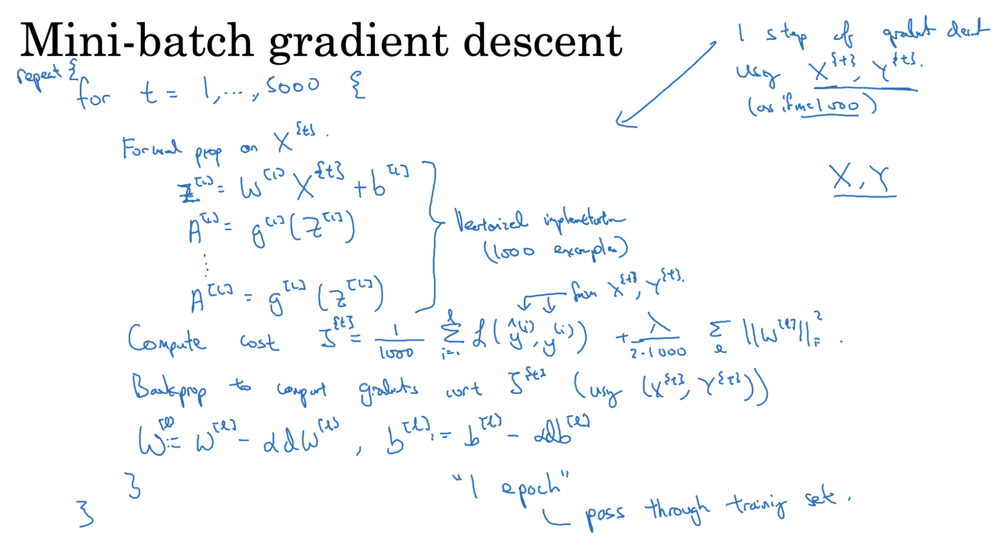

### Processing Mini Batch
- The training data is divided into small batches of fixed size (e.g., 32, 64, 128, 256, 512)
- Each mini-batch is used to:
  - Compute forward propagation
  - Calculate the loss
  - Perform backpropagation
  - Update parameters using gradients

- Steps are repeated for every mini-batch in an epoch, allowing more frequent updates.

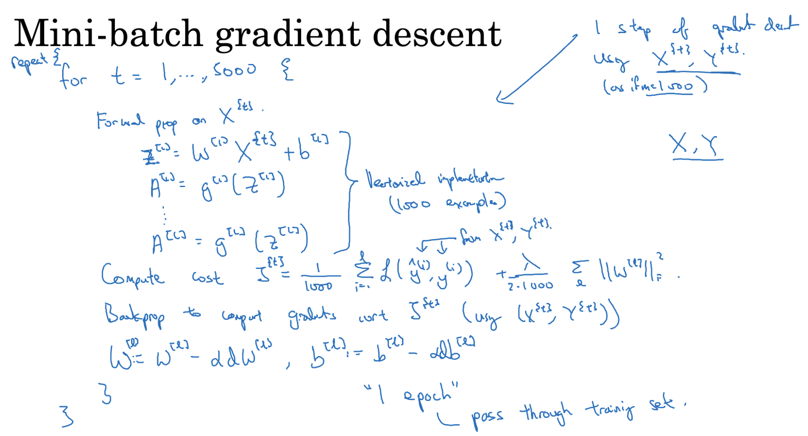

### Choosing Mini Batch Size
- Typical Mini Batch sizes are in 2 power range like 64, 128, 256, 512.
- Types of Gradient Descent by Mini-Batch Size
  - If m = total training set, then it is normal batch gradient descent. It is slow but stable.
  - If m = 1, then it is Stochastic Gradient Descent (SGD). It is fast but noisy.
  - If 1 < m < total size, then it is mini batch gradient descent. It is both fast and stable and it is widely used.

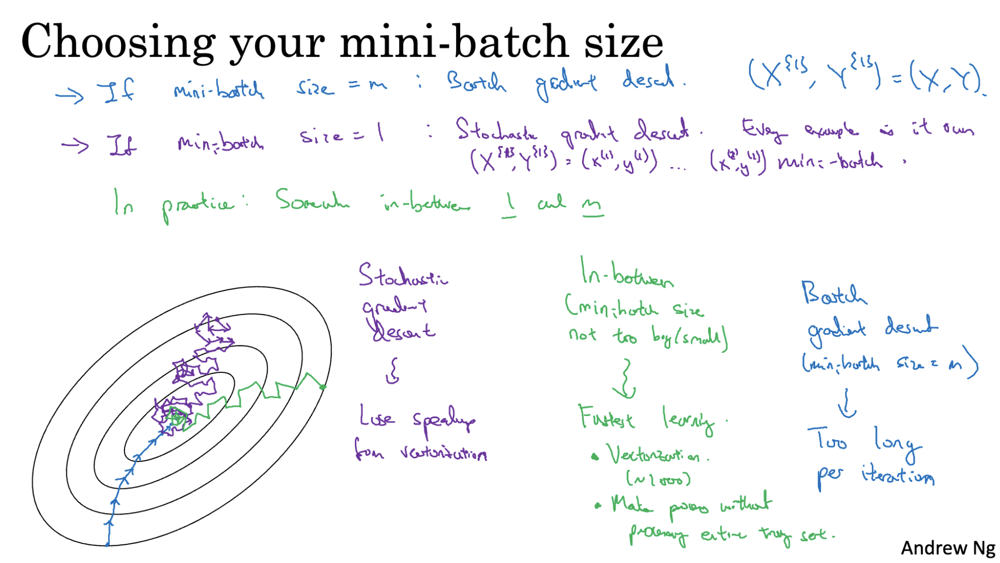

# Exponentially Weighted Averages
- It is an optimazation method to smooth out noisy data or track rends over time.
- It gives more weight to recent values and less to older ones.

vt = βv(t−1)​ + (1−β)θt
​
Where:

- vt = Current Average
- β = Smoothing Factor (usually close to 1 like 0.9 or 0.99)
- θt = Current Data Point
- vt-1 = Previous Average

- High β (e.g., 0.98): Smoother, slower response, less noise.
- Moderate β (e.g., 0.9): Balanced smoothness and responsiveness.
- Low β (e.g., 0.5): Faster response, noisier.

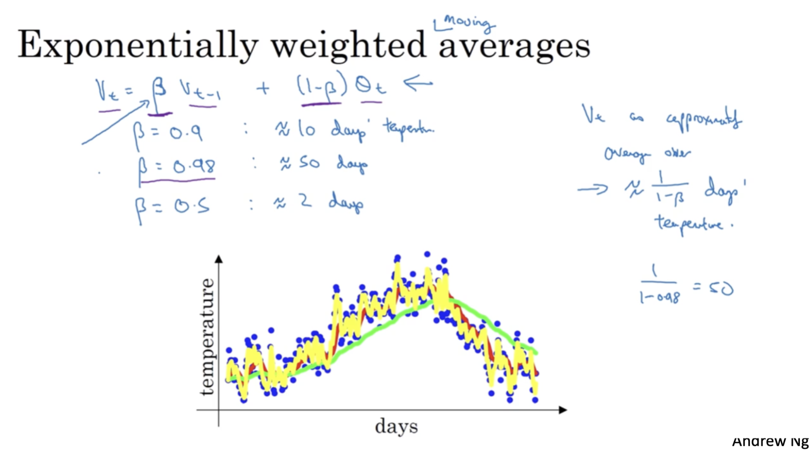

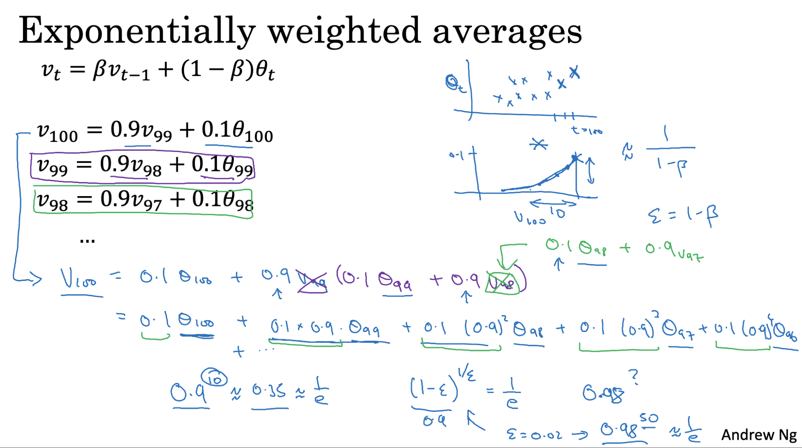

## Bias Correction
- Bias correction is a technique used to improve the accuracy of exponentially weighted averages, especially during the initial phase when the estimate may be skewed or less accurate.
- When you first initialize the exponentially weighted average with zero, the early estimates can be biased low. Bias correction helps adjust these early estimates to be more accurate.
- To correct this bias, you divide the moving average by a correction factor 1 - β^t.
- Bias Correction Formula: Vt_corrected = Vtcorrected = Vt/(1 - β<pow>t</pow>)
- During the initial phase of the moving average, bias correction significantly improves the accuracy of the estimates.
- As t becomes large, the term β^t approaches zero, so the bias correction has less impact.

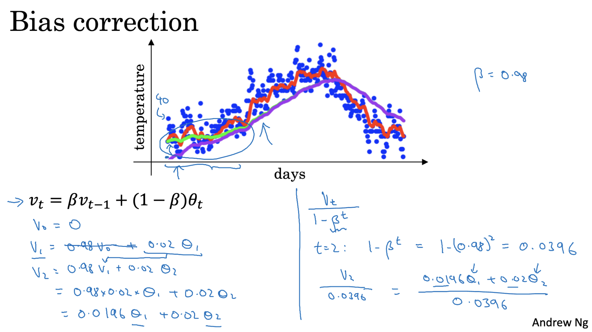

## Gradient Descent with Momentum
Gradient Descent with Momentum is an optimization technique used to accelerate training, especially in deep neural networks.

- Standard Gradient Descent can be slow and may get stuck in local minima.
- Momentum helps the optimizer to build velocity, enabling it to move faster in relevant directions and dampen oscillations.

Let:

- `v` = velocity (accumulated gradient)
- `β` = momentum hyperparameter (typically 0.9)
- `θ` = parameters (weights)
- `α` = learning rate
- `∇J(θ)` = gradient of the cost function

### Step-by-step:
1. **Initialize**: `v = 0`
2. **Update velocity**:  `v = β * v - α * ∇J(θ)`
3. **Update parameters**:  `θ = θ + v`

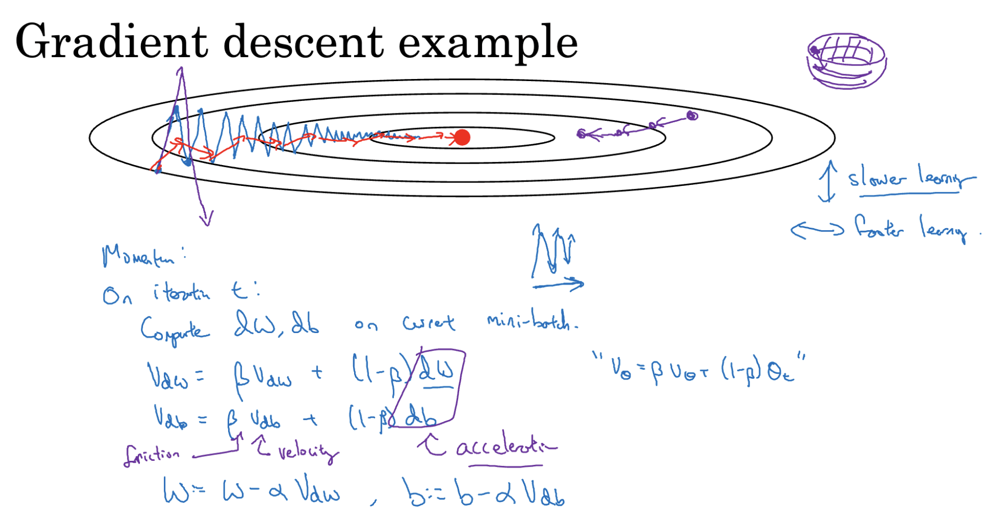

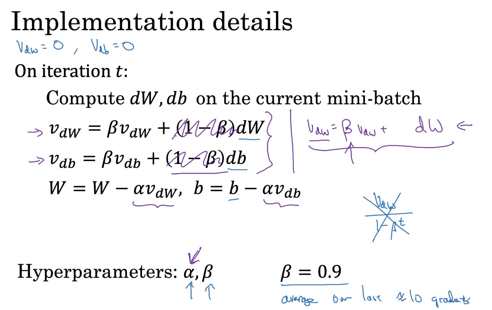

# RMSprop : Root Mean Square Propogation
- RMSprop is an adaptive learning rate optimization algorithm that improves convergence by controlling oscillations during training.
- In standard Gradient Descent, the same learning rate is applied to all parameters.
- This can cause instability when the gradients vary in scale, especially in directions with steep curvature (vertical oscillations).
- RMSprop adapts the learning rate for each parameter, helping the algorithm stabilize and converge faster.

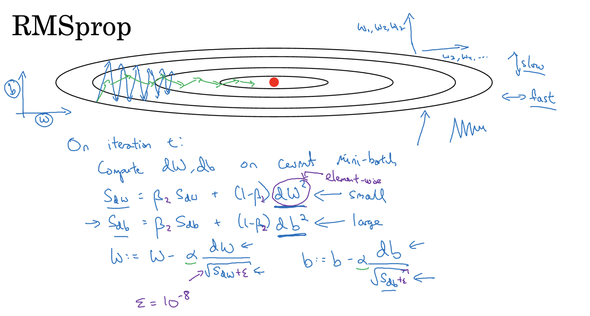

# Adam Optimizer (Adaptive Moment Estimation)
- Adam is a powerful optimization algorithm that combines the benefits of both **Momentum** and **RMSprop** to provide fast and efficient convergence in deep learning models.
- Momentum helps keep your training moving in the right direction by remembering the direction of your previous steps. This helps smooth out the path and prevents getting stuck.
- RMSprop adjusts your step size based on the terrain of the loss function. It prevents steps from being too large in steep areas and too small in flat areas.
- How Adam Works :
  - Adam initializes two moving averages: one for the gradients and one for the squared gradients. During each iteration:
  - It updates these moving averages with the current gradients.
  - It adjusts the parameters using both the moving averages and the original gradients.
  - This combination allows Adam to adapt the learning rate for each parameter

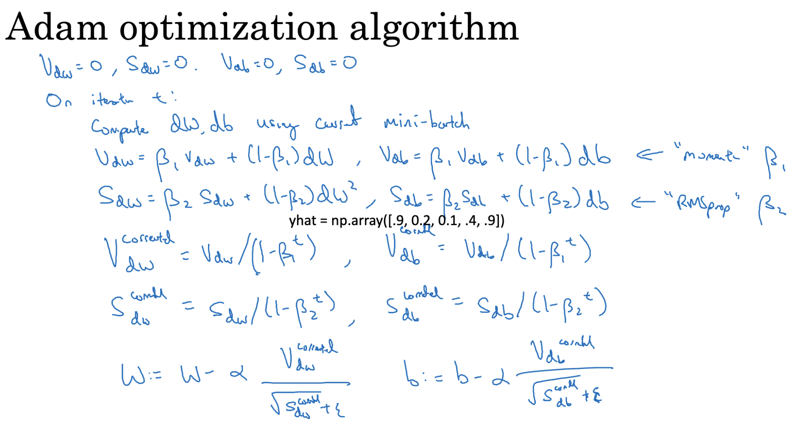

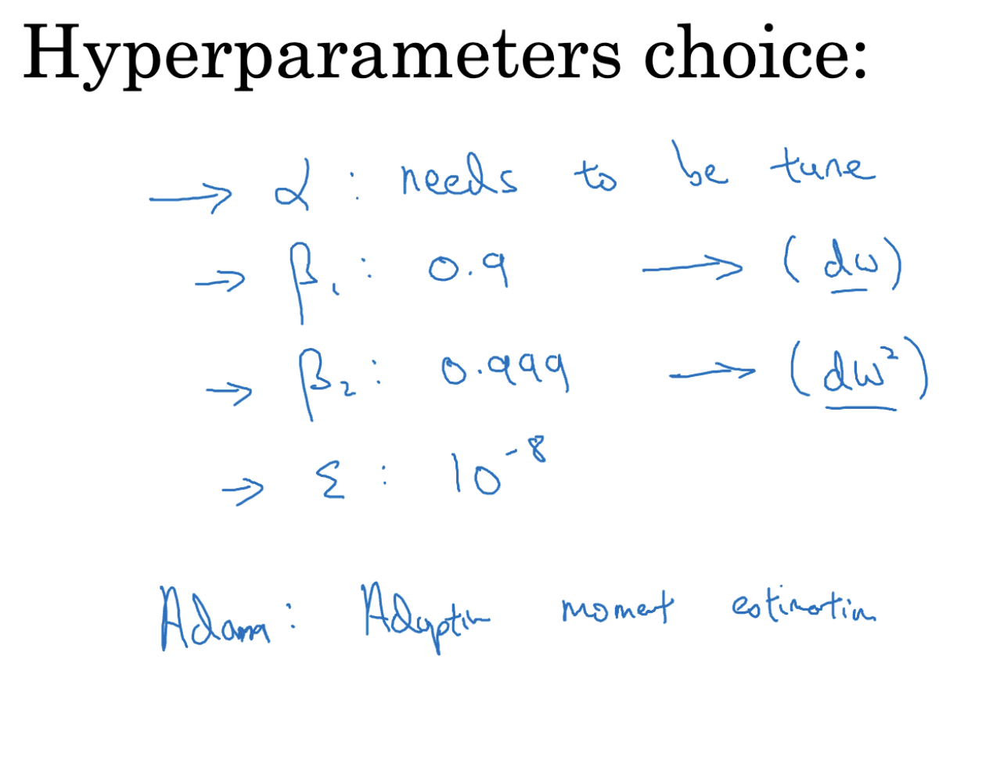

## Learning Rate Decay
- Learning rate decay is a technique that helps speed up training by gradually reducing the learning rate over time.
- Begin training with a high learning rate to enable the model to learn quickly and explore various solutions. As training progresses, gradually reduce the learning rate.
- This approach allows the model to make smaller, more refined updates to its parameters. By doing so, the model can fine-tune its learning and is less likely to get trapped in poor solutions.
α = (1 / (1 + decay_rate * epoch_num)) * 𝛼(0)

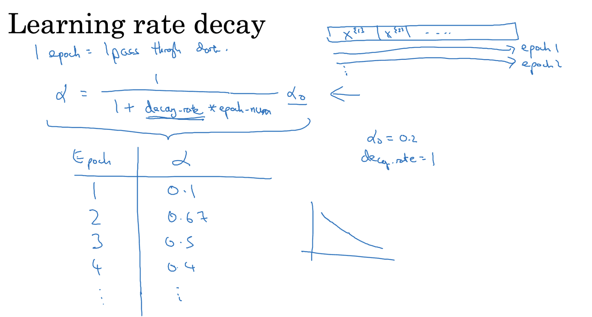

#### Other learning rate decay

1. `α = constant / sqrt(epoch_num) * α(0)`
2. `α = α(0) * e^(-decay_rate * epoch_num)`
3. `α = α(0) * decay_rate^(floor(epoch_num / decay_steps))`

