# Hyperparameters
Hyperparameters are configuration settings that guide both the training process and the architecture of a neural network. Unlike model parameters (such as weights `w` and biases `b`), they are not learned from the training data — instead, they are chosen beforehand and can be tuned to improve performance.

They influence how the model’s parameters are updated during training. Among them, the learning rate is often considered the most critical, as it controls how fast the network adapts to the data.

Other important hyperparameters include:
- Momentum term – helps accelerate training and reduce oscillations.
- Mini-batch size – determines the number of examples processed before each parameter update.
- Regularization parameters – such as L2 penalty or dropout rate to prevent overfitting.
- Network architecture choices – number of hidden layers, number of neurons per layer.
- Activation function selection – e.g., ReLU, sigmoid, tanh, etc.

## Tuning Process
In earlier machine learning workflows, a common approach to hyperparameter tuning was grid search — selecting evenly spaced points in the parameter space and testing each combination. While this method works for a small number of hyperparameters, it becomes inefficient as their number grows.

## Random Sampling
Rather than testing points on a fixed grid, random sampling picks values from the parameter space at random. This often covers more possibilities and is more efficient, especially when it’s unclear which hyperparameters will have the greatest impact.

## Coarse-to-Fine Search
Begin with a broad exploration across a wide range of values, identify promising regions, and then refine the search by testing more values in that smaller range.

By systematically exploring hyperparameter settings in this way, we can discover the combination that best optimizes the network’s performance.

## Using the Right Scale for Hyperparameters
Choosing the correct scale for hyperparameters is crucial, as it can significantly influence the training process and final performance of a model.

- For hyperparameters with a narrow range (e.g., number of hidden units: 50–100, number of layers: 2–4), uniform scaling works well — each value within the range is equally likely to be selected.
- For hyperparameters with a wide range (e.g., learning rate α, exponential decay rates β), uniform scaling is inefficient because it tends to over-sample certain regions while ignoring others. In these cases, logarithmic scaling is more effective.

Example:

If α ranges from 0.0001 to 1, uniform sampling would concentrate most values between 0.1 and 1, skipping much of the lower end.
With logarithmic scaling, you sample more evenly across magnitudes:

R = -4 * np.random.rand()  # Random number between -4 and 0
α = 10 ** R                # Learning rate between 10^-4 and 1

This approach ensures finer sampling near extreme values (especially close to 1), where small changes can have a big impact.

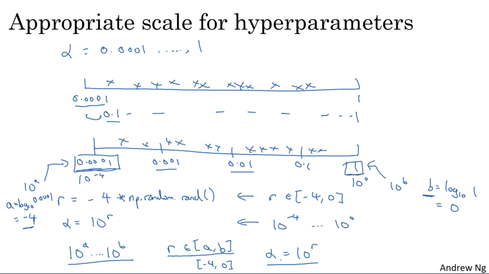

## Approaches to Hyperparameter Tuning

1. Babysitting Approach
Train a single model at a time, adjust the hyperparameters, and closely monitor performance after each run.
  - Best suited for scenarios with limited computational resources.
  - Allows for careful observation and manual fine-tuning.

2. Parallel Training
Train multiple models simultaneously, each with different hyperparameter settings, and compare their results to identify the best configuration.
  - Suitable when ample computational resources are available.
  - Speeds up the search process and is useful for large-scale tuning.

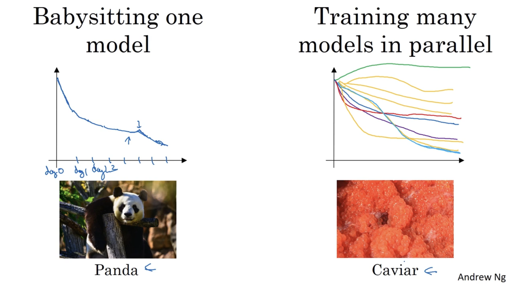

# Batch Normalization
When training a neural network, normalizing input features (subtracting the mean and dividing by the standard deviation) helps speed up learning and improve training stability. Batch Normalization extends this concept to hidden layers — adjusting their activations so that they maintain a controlled mean and variance during training.

### How it works (per mini-batch):

1. Compute Mean
- For all activations Z in a given layer, calculate the mean across the mini-batch.
2. Compute Variance
- Calculate the variance of these activations to measure how much they deviate from the mean.
3. Normalize Activations
- Subtract the mean from each activation (centering them around zero).
- Divide by the standard deviation (√variance + small constant ε for numerical stability) so they have unit variance.
4. Scale and Shift 
- Multiply by a learnable parameter γ (gamma) to control the spread of the activations.
- Add a learnable parameter β (beta) to shift the mean as needed.

This process helps stabilize and accelerate training, reduces sensitivity to weight initialization, and can even have a regularizing effect.

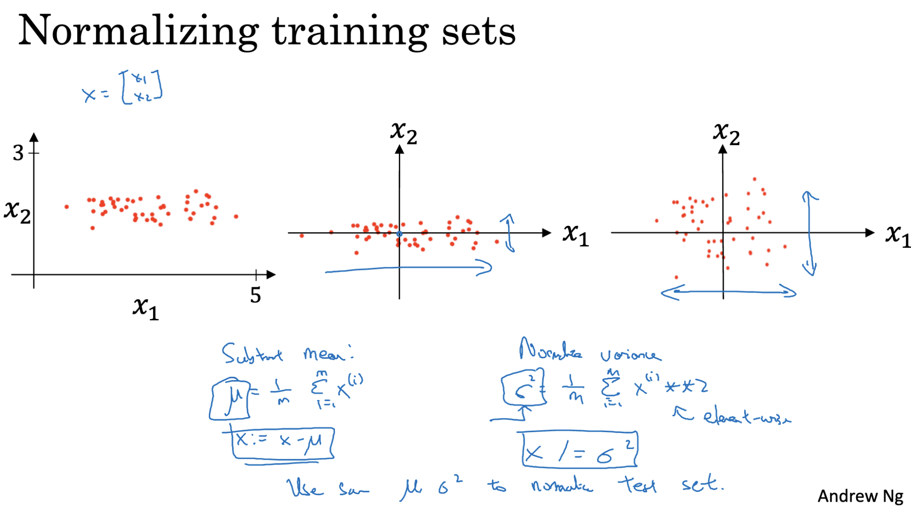

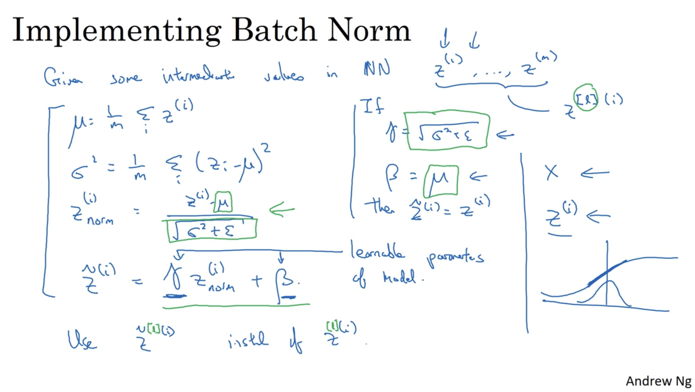

## Fitting Batch Normalization into a Neural Network
1. Batch Normalization Step
- Normalize the activations using the procedure described earlier (mean, variance, scaling, and shifting).
- After normalization, apply the activation function (e.g., ReLU, Sigmoid) to the adjusted values.
2. Forward Propagation
- Pass the activated outputs through each layer of the network.
- Apply Batch Normalization at each layer to keep the inputs to that layer at a consistent mean and variance. 
3. Backpropagation
- Compute the gradients of the loss with respect to both the weights W and the Batch Norm parameters γ (gamma) and β (beta).
- No gradients are computed for the bias term b, as it is effectively canceled out during normalization.
4. Parameter Updates
- Update W, γ, and β using their respective gradients.
- Use optimization algorithms such as Gradient Descent or Adam for efficient updates.
5. Training Iterations
- Repeat the forward and backward passes, continually refining the parameters to minimize the loss function.

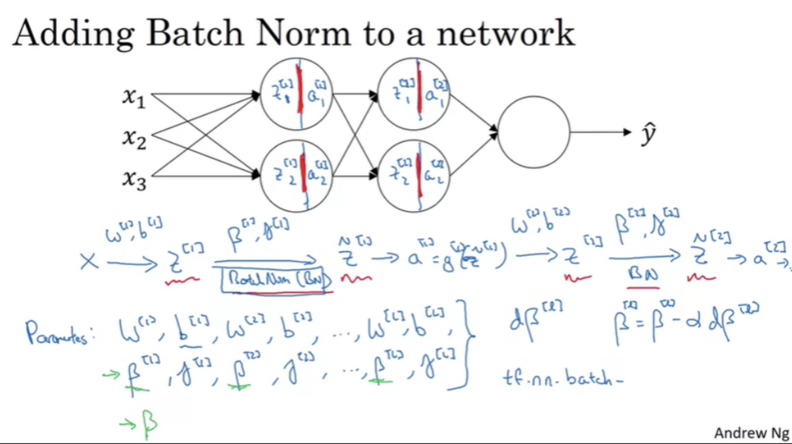

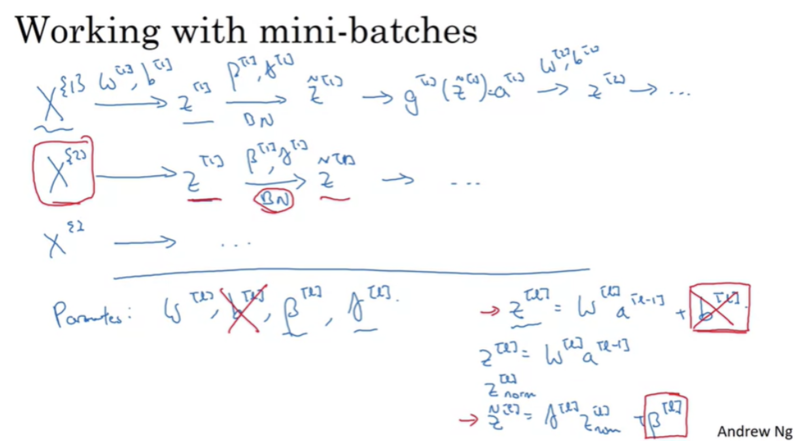

### Implementing Gradient Descent using Batch Normalization

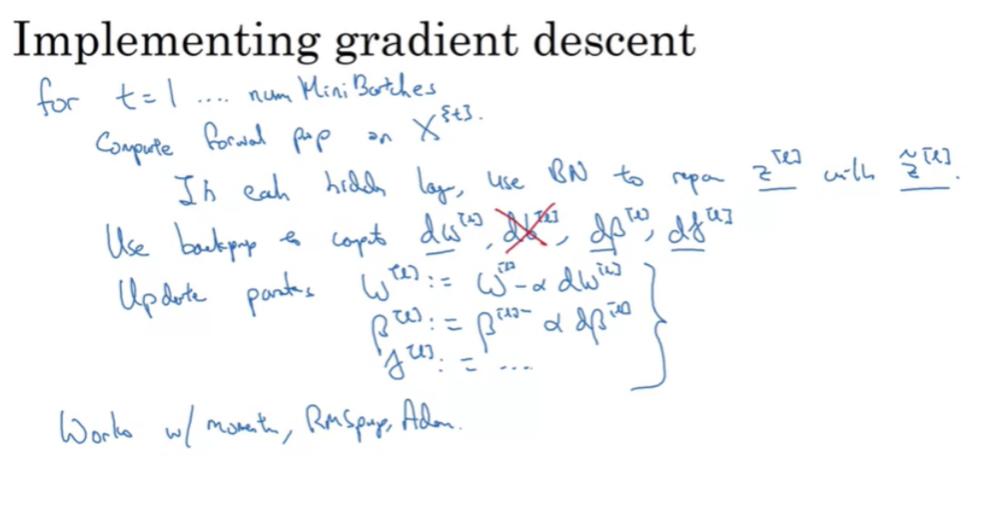

## Why Batch Normalization Works
1. Normalizing Inputs and Hidden Layers
- Batch Normalization scales input features to a consistent range, allowing the network to learn faster.
- It also normalizes activations within hidden layers, keeping their distributions stable.

2. Reducing Covariate Shift
- By controlling the distribution of hidden layer activations, Batch Norm prevents drastic shifts between layers.
- This stabilization means changes in earlier layers have less disruptive effects on later layers.

3. Improved Robustness
- Helps the model adapt better to variations in data distribution (e.g., recognizing colored cats after training on black cats).
- Reduces sensitivity to input shifts.

4. Regularization Effect
- Introduces small amounts of noise during training (from batch-to-batch variations), which can reduce overfitting.
- This effect is minor compared to dropout and becomes weaker with large batch sizes.

5. Training vs. Testing Behavior

- Training: Uses the mean and variance of the current mini-batch for normalization.
- Testing: Uses running averages of mean and variance collected during training for consistent results.

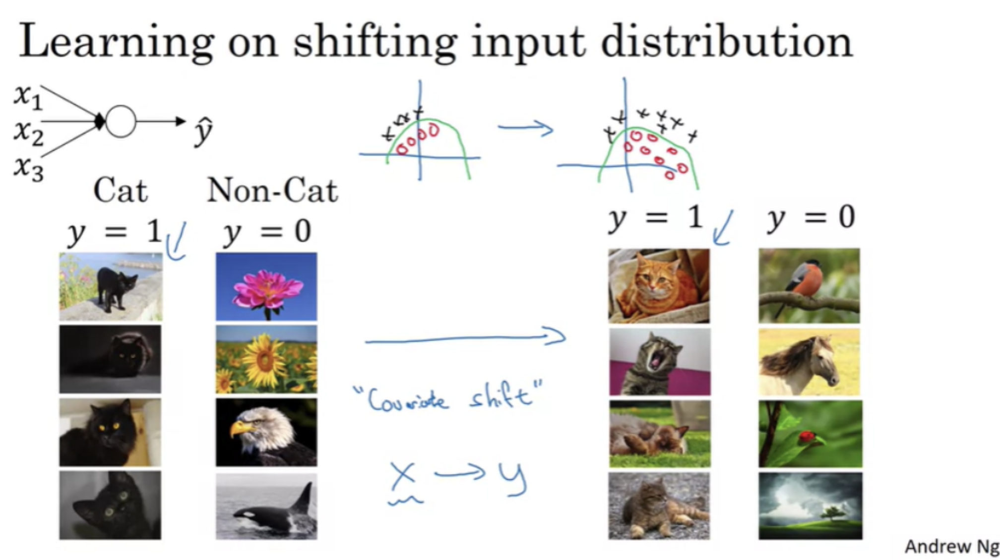

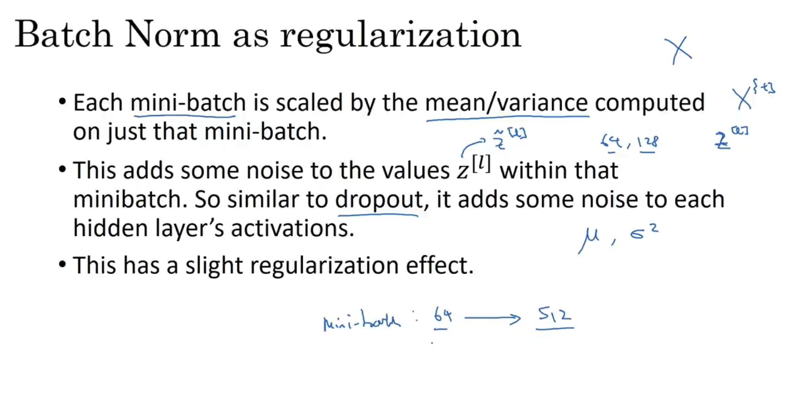

### Batch Normalization During Testing
- Training Phase
  - For each mini-batch, compute the mean and variance of the activations.
  - Normalize using these statistics, then scale and shift with the learnable parameters γ (gamma) and β (beta).

- Testing Phase
  - Since predictions are often made on single examples, use the mean and variance calculated during training instead of per-batch statistics.
  - Maintain running (exponentially weighted) averages of the mean and variance during training.
  - At test time, apply these stored averages to normalize inputs, ensuring consistent results.

- Practical Note
  - Modern deep learning frameworks (e.g., TensorFlow, PyTorch) handle the tracking and application of running statistics automatically.
  - Any reasonable method for estimating these averages will generally produce stable performance.

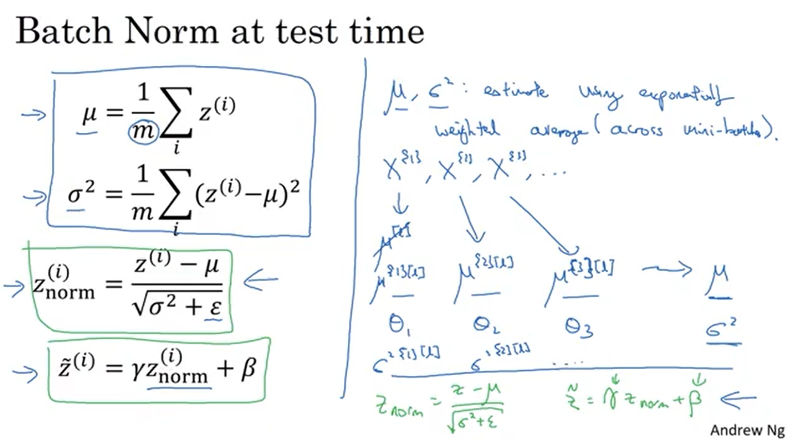

### Multi-Class Classification
- Binary classification uses logistic regression to predict one of two possible outcomes for a given input. Here, the dependent variable has exactly two classes (e.g., 0 or 1).
- When there are more than two possible classes, we use Softmax Regression (also called multinomial logistic regression).
- Softmax outputs a probability for each class, with all probabilities summing to 1.
- The class with the highest probability is chosen as the prediction.

## Softmax Regression
Softmax regression is used to classify inputs into one of C possible classes.
- The output layer contains C units, each representing a class.
- Each unit outputs the probability of the input belonging to its class.
- These probabilities always sum to 1.
- The Softmax activation function is used to convert raw scores into probabilities.

How it works:

1. Raw Score Calculation

For the final layer, compute:

`Z=W⋅(activation from previous layer)+b`

where W is the weight matrix and b is the bias vector.

2. Exponentiation

For each score Z(i), calculate:

`T(i)=e^Z(i)`
 
3. Normalization (Softmax Function)

Convert scores into probabilities:

`a(i) = e^Z(i)/Σ(e^Z(j))`
  
where a(i) is the probability of class i, and the denominator is the sum of exponentiated scores for all C classes.

The class with the highest probability is chosen as the prediction.

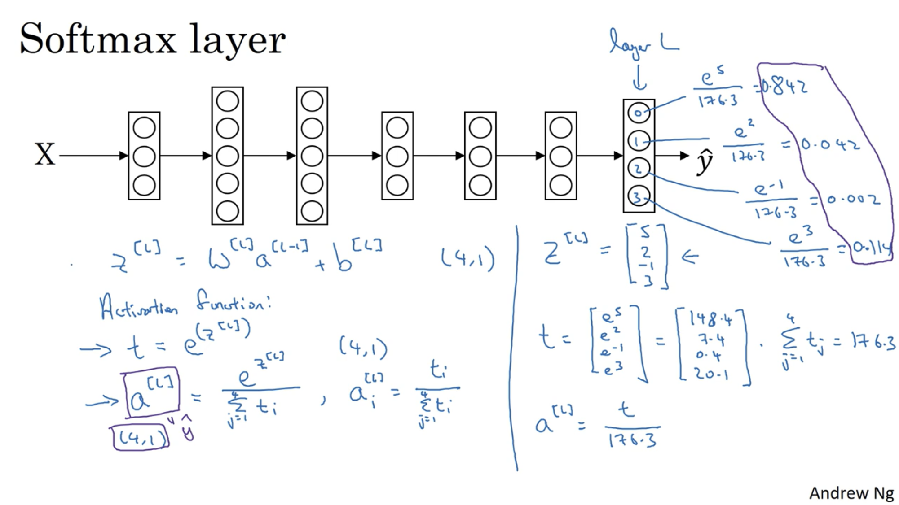

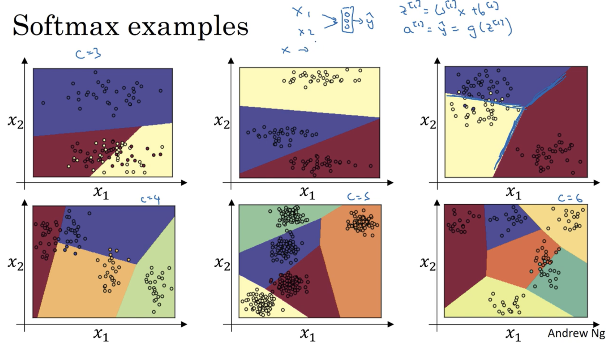

### Training a softmax classifier:
- Softmax vs. Hard Max:
  - Softmax assigns probabilities based on input values.All probabilities sum to 1.
  - Hard Max Strictly assigns a 1 to the category with the highest value and 0 to all other categories.
- How Softmax Classifier is trained:
  - 1. Input to Output Layer:
       - Raw Scores (Z) Calculation:
         - Compute Z for the final layer:
         - `𝑍=𝑊⋅activation of previous layer+𝑏`
         - Where W is the weight matrix and b is the bias vector.

  - 2. Apply Softmax Activation Function:
        - We calculate a temporary variable called `T` by taking the exponential of the values in the output layer.
        - Compute element-wise exponentiation: `T(i) = e^Z(i)`.
        - Then we apply normalization to all exponentiated values T in the output layer such that they add up to 1. This gives us the probabilities for each category.
        - The normalization means the probablity of each T(i) value in output layer which is :
           - `a(i) = e^Z(i)/Σ(e^Z(j))` where j ranges from 1 to C.
           - Where a(i) is the probability for class i and the denominator is the sum of exponentiated scores for all classes. 

  - 3. Define Loss Function:
   - Use the cross-entropy loss function for softmax classification.
     - For a single training example with target class `y` and predicted probabilities `p`, the loss is:
       - `L = -log(p(y))`
     - For the entire training set, the loss function is the average cross-entropy loss over all examples:
       - `J = -1/m Σ (y * log(p))` where `m` is the number of training examples.

  - 4. Compute Gradients:
    - Compute the gradients of the loss function with respect to the weights and biases.
    - The derivative of the cost with respect to `Z` at the last layer is:
     - `∂J/∂Z = Y_hat - Y`
     - Where `Y_hat` is the predicted probabilities and `Y` is the one-hot encoded true labels.

  - 5. Update Parameters:
   - Use gradient descent or a variant (such as SGD, Adam, etc.) to update the weights and biases.
   - The parameters are updated as follows:
     - `W = W - learning_rate * ∂J/∂W`
     - `b = b - learning_rate * ∂J/∂b`

  - 6. Iterate Until Convergence:
    - Repeat steps 1-5 for a number of iterations or until the loss converges to a minimum value.
    
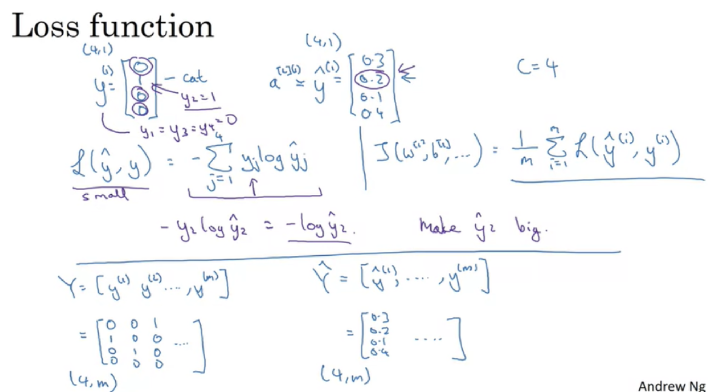

