# Convolution in CNNs

**Concept:**  
In Convolutional Neural Networks, *convolution* is the process of applying a small matrix (filter or kernel) across an image to detect specific patterns. Each filter is designed to respond strongly to certain features — for example, vertical or horizontal edges, textures, or patterns.

**Feature Hierarchy:**  
- **Early layers:** Detect simple patterns like straight edges or color contrasts.  
- **Deeper layers:** Combine simpler patterns into more complex features, like shapes or object parts.  

**Example:**  
Imagine a **6×6 grayscale image** (one channel). To detect vertical edges, you could design a **3×3 filter** such as: 

`1  0 -1`

`1  0 -1`

`1  0 -1`

**Convolution Steps:**  
1. **Filter Placement:** Start with the filter aligned to the top-left of the image.  
2. **Multiply & Sum:** For each position, multiply the filter’s values with the overlapping image values, then sum them to get one output value.  
3. **Slide the Filter:** Move it horizontally by 1 pixel, repeat, then move down one row and continue.  
4. **Output Matrix:** Store each sum in a new output grid.  

**Output Shape Example:**  
- For a 6×6 input and 3×3 filter, without padding and with a stride of 1, the output will be **4×4**.  
- Positive and negative values in the output indicate the presence and orientation of edges.

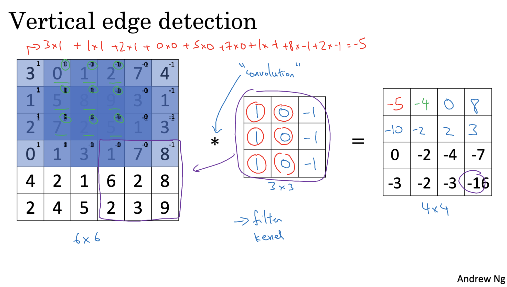

## Edge Detection in CNNs

**Concept:**  
Edge detection is a fundamental step in understanding the structure of an image. It aims to identify boundaries between different regions, which can help in recognizing shapes, textures, and objects.

**Role in CNNs:**  
- Typically occurs in the **early layers** of a CNN.  
- Detects simple features such as **vertical** or **horizontal** edges.  
- Provides the foundation for detecting more complex features in deeper layers.

**Example - Vertical Edge Detection:**  
- A vertical edge filter might have values that respond strongly to changes in pixel intensity from left to right.  
- Applying such a filter to an image highlights vertical boundaries.

**Learning Filters with Backpropagation:**  
- Instead of manually designing filters, CNNs **learn filters from data**.  
- Filter weights (parameters) are adjusted during training using **backpropagation**.  
- This allows the network to detect not only vertical and horizontal edges, but also:  
  - Edges at various angles  
  - Complex textures  
  - Detailed patterns relevant to the task

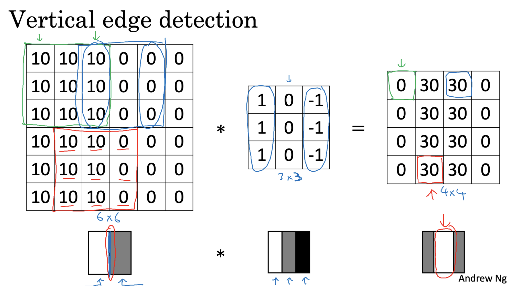

## Padding in Convolutional Neural Networks (CNNs)

**Concept:**  
Padding is the process of adding extra pixels around the border of an image before applying convolution. It helps preserve the spatial dimensions of the input and reduces information loss from the edges.

**Problems Without Padding:**

1. **Image Shrinkage:**  
   - Example: Convolving a **6×6** image with a **3×3** filter produces a **4×4** output.  
   - Reason: The filter can only be placed in positions where it fully fits inside the image.  
   - Formula (no padding):  
    (n - f + 1) * (n - f + 1)
      
    where:
       - n = input size  
       - f = filter size  

2. **Loss of Edge Information:**  
   - Edge and corner pixels appear in fewer receptive fields during convolution.  
   - Central pixels are used in more filter regions, giving them more influence.  
   - This causes important boundary details to be lost.

**Padding Solution:**  
- Add extra pixels (often zeros) around the image border before convolution.  
- Benefits:  
  - Preserves the original input size after convolution.  
  - Ensures that edge pixels contribute equally to the output.

**General Formula (with padding \(p\)):**  
(n + 2p - f + 1) * (n + 2p - f + 1)
  
where:
- p = number of padding pixels on each side  

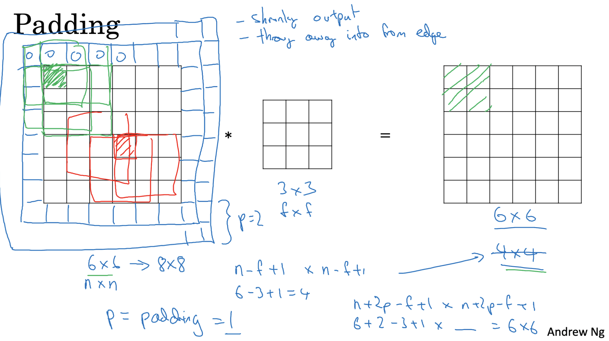

## Types of Padding in CNNs

**1. Valid Convolution:**  
- **No padding** is applied.  
- Output size formula:  
  Output size = (n - f + 1) × (n - f + 1)  
- Results in **image shrinkage** after convolution.  

**2. Same Convolution:**  
- Padding is applied so that the **output size equals the input size** (n × n).  
- For an **odd-sized filter** (f), the padding (p) needed is:  
  p = (f - 1) / 2  
- Ensures spatial dimensions are preserved.  

**3. Use of Odd-Sized Filters:**  
- Filters like **3×3** or **5×5** have a **central pixel**, making it easier to position and interpret.  
- Odd-sized filters allow **symmetric padding** on all sides.  
- Commonly used in CNN architectures for better alignment and feature extraction.

## Strided Convolutions in CNNs

**Concept:**  
Strided convolutions reduce the spatial dimensions of the input while still extracting important features. Instead of moving the filter one pixel at a time, it is shifted by more than one pixel (the stride) during convolution.

**Example:**  
- Input: 7×7 image  
- Filter: 3×3  
- Stride (S): 2  

Steps:  
1. Place the filter at the top-left corner of the image.  
2. Move it **2 pixels to the right** after each computation.  
3. Once the row is done, move the filter **2 pixels down** and repeat.  
4. This produces a **3×3 output** instead of the usual 5×5 output with stride 1.  

**Why Use Strided Convolutions?**  
- Reduces the size of the image/feature map.  
- Lowers computational cost.  
- Can help create more efficient neural networks without explicitly using pooling layers.  

**Formula for Output Size:**  
Output Size = ((N + 2P - F) / S) + 1  

Where:  
- **N** = input size (height or width)  
- **F** = filter size  
- **P** = padding  
- **S** = stride  

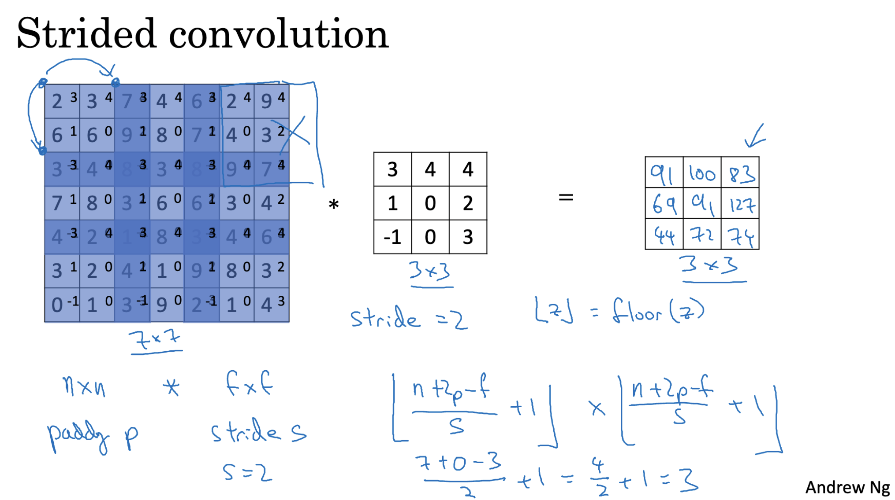

## Convolutions Over Volumes

**Concept:**  
Images often have multiple channels. For example, an RGB image has **three channels** — Red, Green, and Blue. In CNNs, filters extend across all channels of the input to capture combined spatial and depth information.

**Example:**  
- Input: RGB image (Height × Width × Depth = 3 channels)  
- Filter: 3×3×3 (3×3 spatial area, depth matches the number of channels)  

**How It Works:**  
1. Place the 3D filter over a small region of the image so that it covers **all color channels**.  
2. Multiply each filter value with the corresponding image value in the same position and channel.  
3. Sum all these products to get **one output value** for that position.  
4. Move the filter across the height and width of the image.  

**Output:**  
- The result is a **2D feature map** that highlights patterns detected across all channels.  
- Multiple filters can be used to produce multiple feature maps, each detecting different types of features.

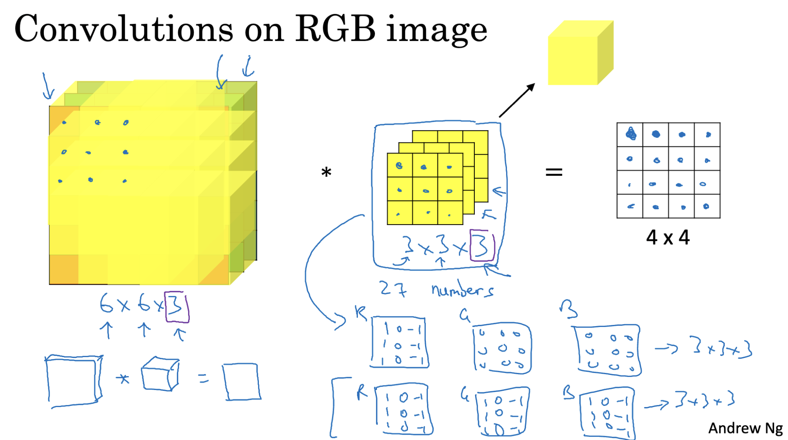

## Multiple Filters in CNNs

**Concept:**  
Using multiple filters allows a CNN to detect a variety of features in the same input — for example, edges at different angles, textures, or specific patterns.

**How It Works:**  
1. Each filter scans the input independently and produces its own **feature map**.  
2. These feature maps are **stacked** along the depth dimension.  
3. The result is a new **volume** where:  
   - Height and width are determined by the convolution parameters (filter size, stride, padding).  
   - Depth equals the number of filters used.

**Benefits:**  
- Enables the network to capture multiple types of features at the same layer.  
- Provides richer and more informative representations for deeper layers to process.

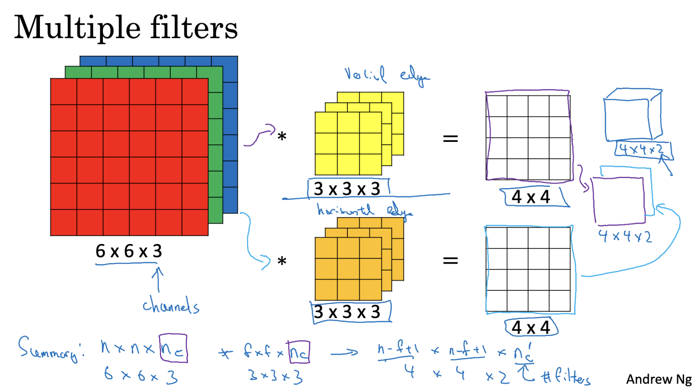

## One-Layered Convolutional Network

- Start with a 3D input (height × width × depth).  
- Convolve with multiple filters → each filter makes a 2D feature map.  
- Add a bias (same value to all elements of that filter’s output).  
- Apply activation (e.g., ReLU) to introduce non-linearity.  
- Stack all feature maps along depth → final output is a volume (e.g., 4×4×2 for 2 filters).

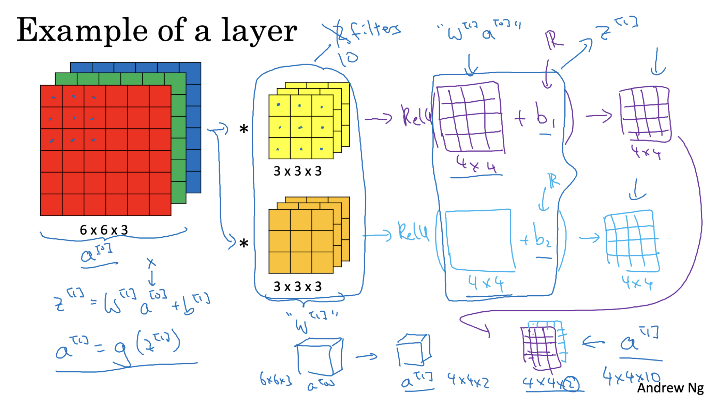

## Notation (CNNs)

- f[l] = filter size  
- p[l] = padding  
- s[l] = stride  
- nc[l] = number of filters  
- Each filter: f[l] × f[l] × nc[l-1]  
- Activation size: a[l] = nh[l] × nw[l] × nc[l]  
- Weights: f[l] × f[l] × nc[l-1] × nc[l]  
- Bias: nc[l] (shape 1×1×1×nc[l])  
- Output size formula: n[l] = ((n[l-1] + 2p[l] - f[l]) / s[l]) + 1  
- Input size: nh[l-1] × nw[l-1] × nc[l-1]  
- Output size: nh[l] × nw[l] × nc[l]  

**Example:** 10 filters, each 3×3×3 → 27 params + 1 bias = 28/filter.  
Total = 28 × 10 = 280 params.  
Params don’t depend on input size → helps avoid overfitting.

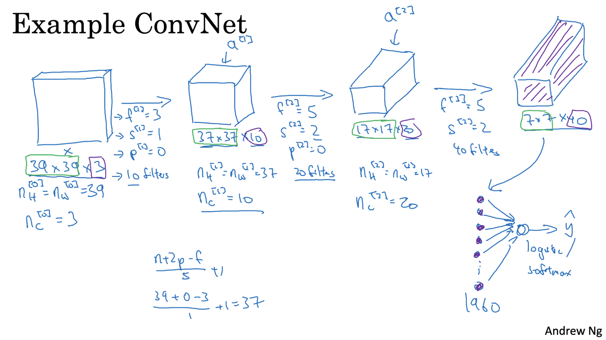

## Pooling Layers (Max Pooling)

- Max pooling → take the max value in each region → keeps strongest feature.  
- Reduces dimensions but keeps important info.  

**Example:**  
4×4 input, 2×2 filter, stride = 2 → split into 2×2 blocks, take max from each → smaller output.

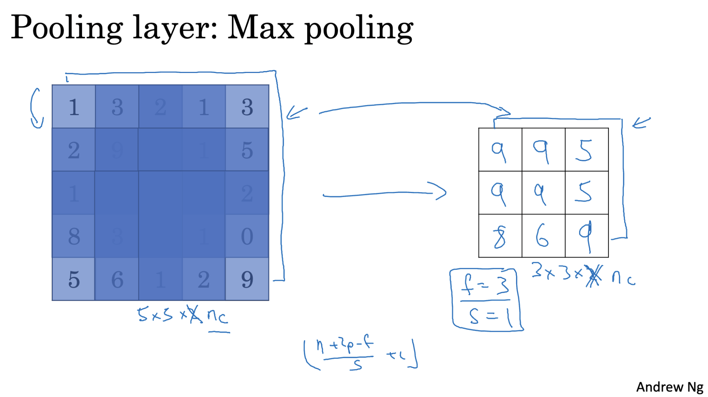

## Pooling Layers (Average Pooling)

- Takes the average value in each region instead of the max.  
- Reduces effect of outliers, smooths features.  
- Often used in deeper layers to shrink feature maps.  

**Example:**  
2×2 region → compute average → use as output.

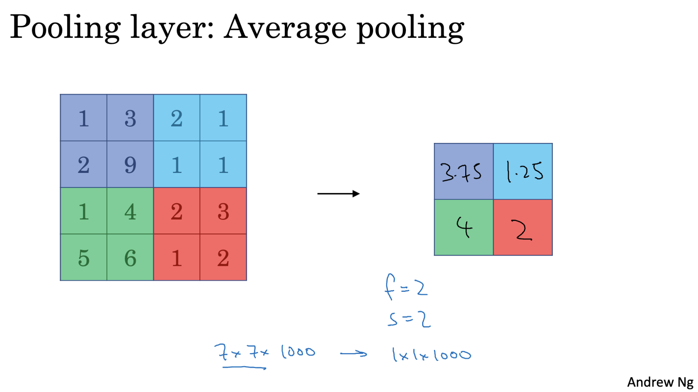

#### Hyperparameters (Pooling)

- **Filter Size (F):** region size for pooling.  
- **Stride (S):** step size for moving the filter.

## CNN Example

**Input:**  
- Start with a 32×32 image having 3 color channels (RGB).

**Convolutional Layer:**  
- Apply a 5×5 filter to extract features.  
- Use 6 filters → output size becomes 28×28×6.  

**Pooling Layer:**  
- Apply max pooling with 2×2 filter, stride = 2.  
- Reduces size to 14×14×6.

**Repeat:**  
- Can stack more convolution + pooling layers to capture deeper features and further reduce spatial size.

**Fully Connected Layer:**  
- Flatten the pooled output.  
- Connect to fully connected layers for classification.  
- Example: Classify into 10 digits (0–9).

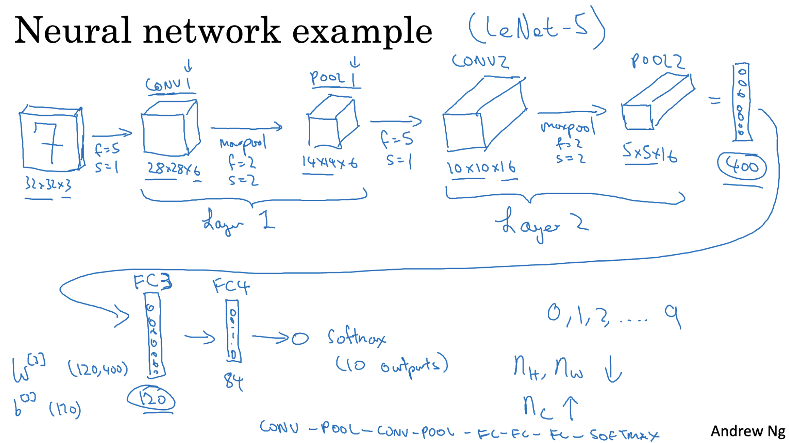

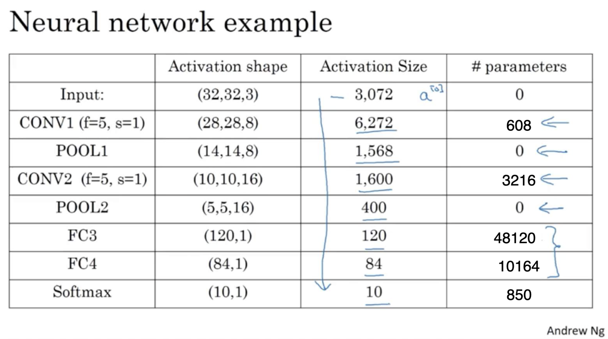

## Why Convolution?

**Parameter Sharing:**  
- A feature detector (e.g., edge detector) can work in multiple parts of the image.  
- Same filter weights are reused at different positions → fewer parameters.

**Sparsity of Connections:**  
- Each filter looks only at a small local region of the input.  
- This reduces the number of parameters compared to fully connected layers, making the model more efficient.

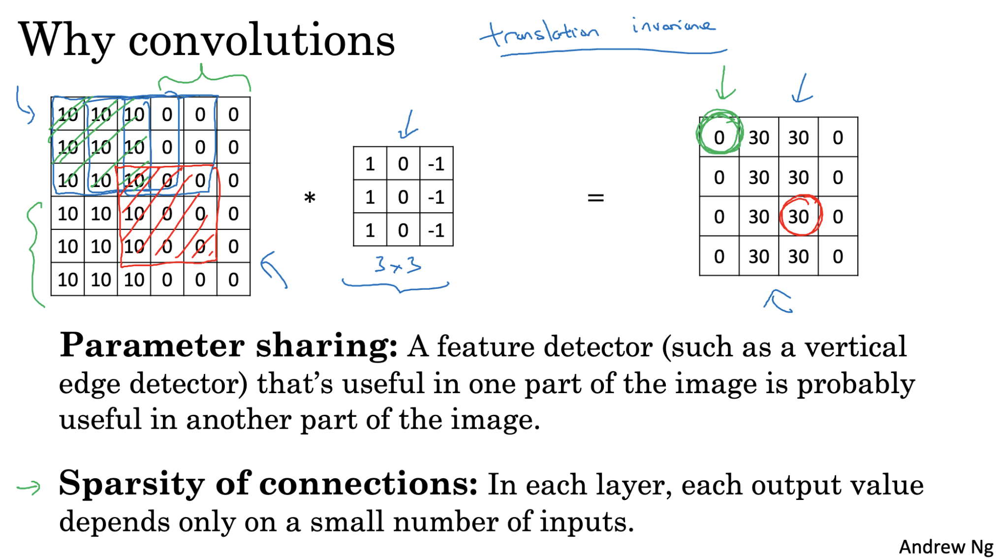

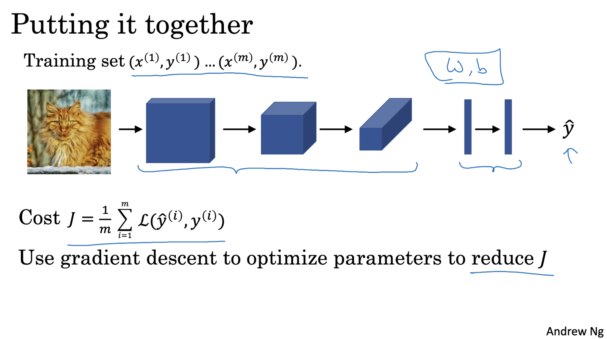

