# Classic Neural Network Architectures

1. LeNet-5  
- **Purpose:** Handwritten digit recognition (MNIST).  
- **Input:** 32×32 grayscale image.  
- **Layers:**  
  1. Conv: 6 filters (5×5) → output 28×28×6.  
  2. Avg Pool: 2×2 → reduces to 14×14×6.  
  3. Conv: 16 filters (5×5) → output 10×10×16.  
  4. Avg Pool: 2×2 → reduces to 5×5×16.  
  5. FC: Flatten → 400 → 120 → 84 → 10 outputs (digits 0–9).

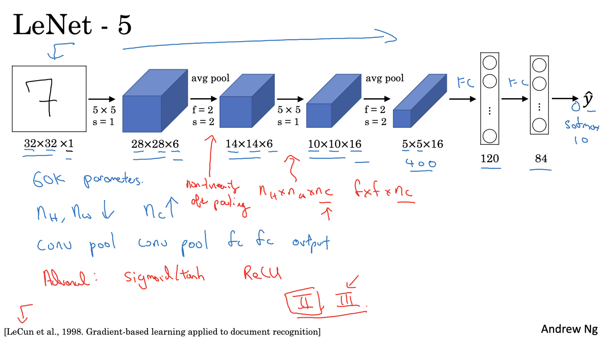

2. AlexNet  
- **Purpose:** General image classification (ImageNet).  
- **Input:** 227×227 RGB image.  
- **Layers:**  
  1. Conv: 96 filters (11×11), stride 4 → output 55×55×96.  
  2. Max Pool: 3×3 → reduces to 27×27×96.  
  3. Conv: 256 filters (5×5) → output 13×13×256.  
  4. Max Pool: 3×3 → reduces to 6×6×256.  
  5. FC: Flatten → 9216 → 4096 → 4096 → softmax for 1000 categories.

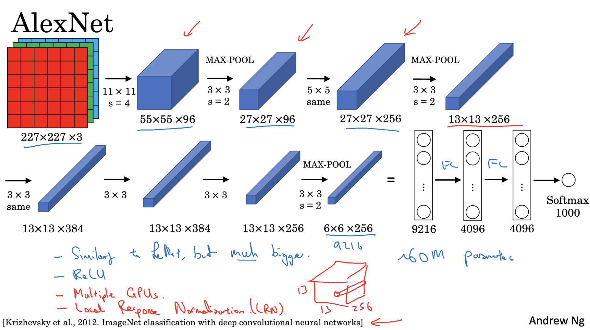

3. VGG-16  
- **Purpose:** Simplified deep image classification.  
- **Input:** 224×224 RGB image.  
- **Layers:**  
  1. Conv: 64 filters (3×3) → output 224×224×64.  
  2. Max Pool: 2×2 → reduces to 112×112×64.  
  3. More Conv layers: Increase filters to 128, 256, 512, each block followed by pooling (halves dimensions).  
  4. FC: Flatten → 4096 → 4096 → softmax for 1000 categories.

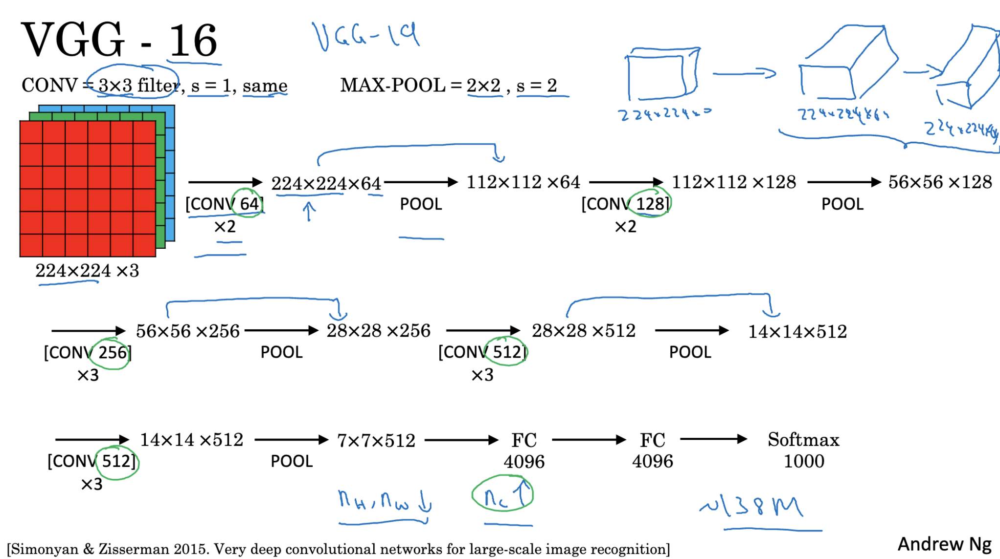

# ResNets (Residual Networks)

- **Traditional Networks:** Data flows layer by layer.  
  Example: Start with activation `a(L)` → processed → becomes `a(L+1)` → then `a(L+2)`.

- **Idea of ResNet:** Introduce **skip connections** (shortcuts) that bypass one or more layers.  
  - These connections allow the original activation `a(L)` to be **added directly** to a deeper layer’s output.  
  - Helps avoid problems like vanishing gradients and makes training deep networks easier.

- **Example:**  
  - Traditional: `a(L+2) = g(Z(L+2))` (where `g` is a non-linearity).  
  - ResNet: `a(L+2) = g(Z(L+2) + a(L))` (original activation added before non-linearity).

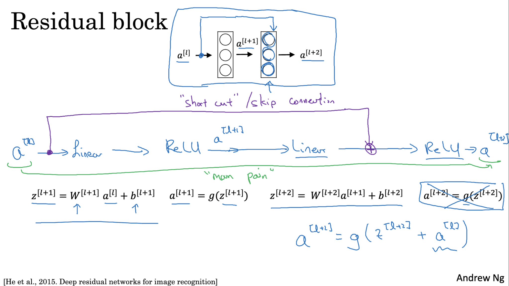

## Building ResNets

- **Original Path:**  
  - Start with activation `a(L)`.  
  - Pass it through layers:  
    1. **Linear transformation:** Multiply by weight matrix + add bias.  
    2. **Non-linearity:** Apply an activation function (e.g., ReLU).

- **Residual Path:**  
  - Use **Residual Blocks**: stack multiple blocks, each with a **skip connection**.  
  - Skip connection adds the **original activation** directly to a deeper layer’s output (without going through all intermediate layers), then applies the non-linearity.

- **Network Depth:**  
  - ResNets can be **hundreds or thousands of layers deep**.  
  - Skip connections make training deep networks possible by reducing problems like **vanishing gradients**.

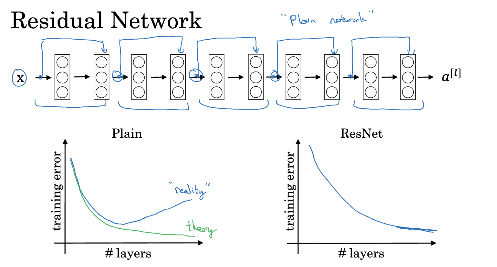

## Why ResNets Work

- **Skip connections** add the input directly to the output of deeper layers.  
  - This lets the network learn that some layers can just pass the input unchanged if needed.  

- **Easier training:**  
  - Layers that aren’t useful can be skipped, so even very deep networks train better.  

- **Matching dimensions:**  
  - Input and output must have the same shape for skip connections.  
  - If not, use operations like **1x1 convolutions** to match dimensions.  

- **Safe extra layers:**  
  - If added layers have weights = 0, output `a(L+2)` = `a(L)`.  
  - Extra layers won’t hurt performance and can even help.

- **Key idea:**  
  - ResNets make learning the **identity function** easy, so adding layers doesn’t harm performance.

# Network in Network – 1×1 Convolution

- **What it is:**  
  - A convolution with filter size **1×1**.  
  - Covers **one pixel at a time** spatially, but spans **all channels** of the input.  

- **Effect:**  
  - Works like a neuron that takes all channel values at a pixel and outputs a single value.  
  - Can **reduce (shrink) the number of channels**.  

- **Example – Multi-channel input:**  
  - For a `6×6×32` input:  
    - Each pixel position has **32 values** (one per channel).  
    - A 1×1 filter processes all 32 values for that pixel.  

- **Multiple filters:**  
  - Each 1×1 filter produces **one output channel**.  
  - E.g., **32 filters** → output shape = `6×6×32`.  
  - Filters combine all input channels for each location.

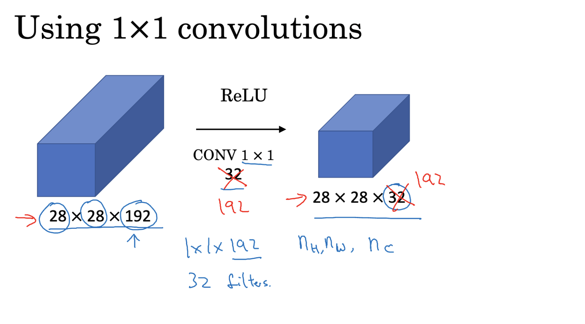

## How It Works – 1×1 Convolution

- **Element-wise Multiplication:**  
  - At a given pixel location, the 1×1 filter multiplies each of the channel values by its corresponding weight.  

- **Summation:**  
  - The multiplied values are **summed up** to produce a single number for that pixel.  

- **Non-linearity:**  
  - A non-linear activation function (e.g., **ReLU**) is applied to the sum to introduce non-linearity into the network.

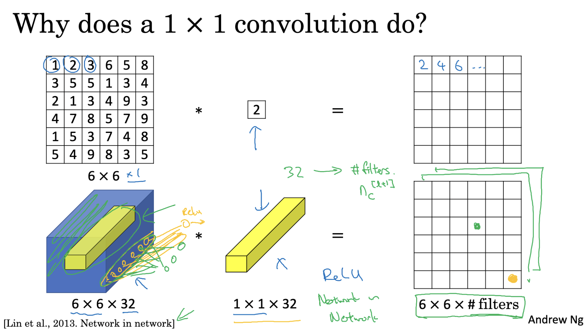

# Inception Network

- **Idea:**  
  - Instead of picking a single filter size (like 1×1, 3×3, or 5×5) or pooling for a layer, the Inception Network uses **all of them in parallel**.  
  - Outputs from these filters are **concatenated** to form the final output.

- **Problem with Large Filters:**  
  - Using a 5×5 filter directly is **computationally expensive** (more multiplications & additions).  
  - This increases training time and requires more resources.

- **Solution – 1×1 Convolutions:**  
  - Apply **1×1 convolutions** before large filters to **reduce the number of channels**.  
  - These act as **bottlenecks**, cutting cost while keeping performance intact.

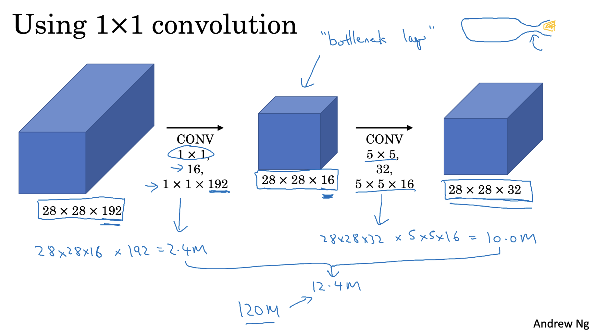

## Inception Module

- **Input:**  
  - Takes the output from the previous layer.  
  - Runs **different convolution types** in parallel to capture different details.

- **Variety of Convolutions:**  
  - Uses filters of **different sizes & depths** to get features at multiple levels.  
  - Captures fine details as well as bigger patterns.

- **Concatenation:**  
  - Outputs from all these convolutions are **combined** into a single output.  
  - This lets the network see features at **different scales**.

## Inception Network

- **Repeated Blocks:**  
  - Made up of **multiple Inception modules** stacked together.  
  - This creates a deep network that can learn complex patterns.

- **Side-Branches:**  
  - Extra branches take hidden layer outputs and make **intermediate predictions**.  
  - This helps **regularize** the network and reduce overfitting.

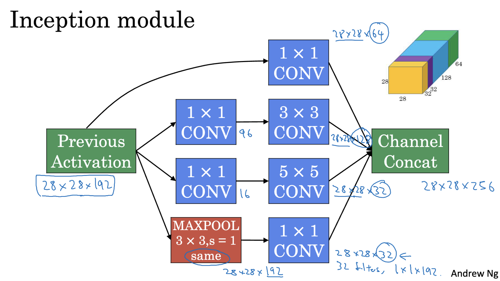

# MobileNet

- **Purpose:**  
  - Designed for efficient CNN performance on low-power devices (like mobile phones).  
  - Achieves speed and efficiency using **depthwise separable convolutions**.

- **Normal Convolution:**  
  - One filter operates across **all channels** of the input.  
  - The filter slides over the image, performing multiplications and additions.  
  - Computationally heavy.

- **Depthwise Separable Convolution:**  
  - **Step 1 – Depthwise:** Apply a separate filter to **each channel** individually.  
  - **Step 2 – Pointwise (1×1 convolution):** Combine outputs from all channels.  
  - Significantly reduces computation while keeping performance high.

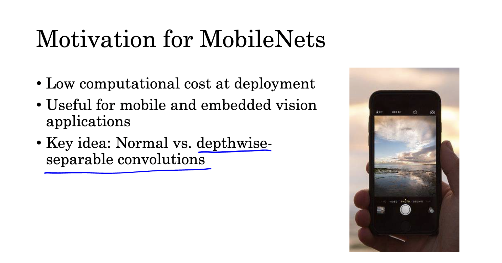

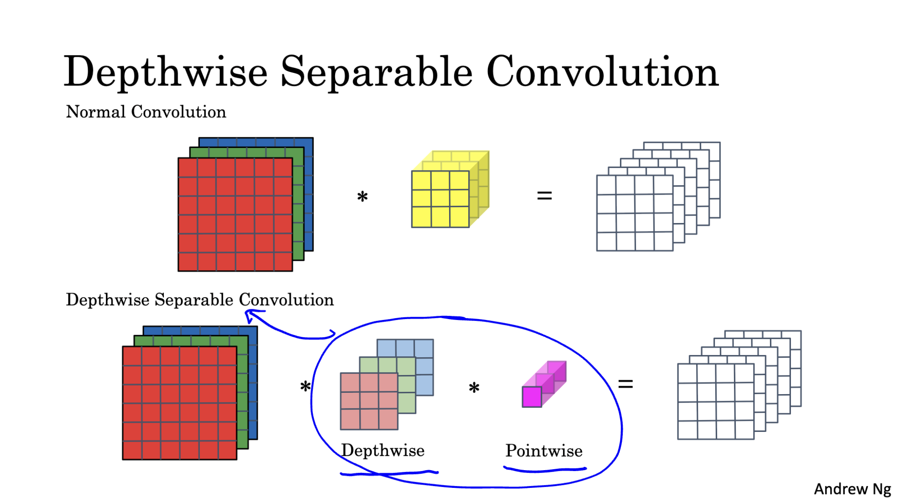

## Depthwise Separable Convolution

- **Idea:**  
  - Break a standard convolution into **two steps** to reduce computation.

- **Step 1 – Depthwise Convolution:**  
    - **Example Input:** 6 × 6 × 3  
    - **Filter:** f × f (e.g., 3 × 3)  
    - **Number of Filters:** Equal to number of input channels (**n_c**).  
    - Each filter works **only on its corresponding channel**.  
    - Computations = (number of filter positions) × (filter size) × (number of channels).  

- **Benefit:**  
  - Processes each channel separately, greatly lowering the total number of multiplications compared to a normal convolution.

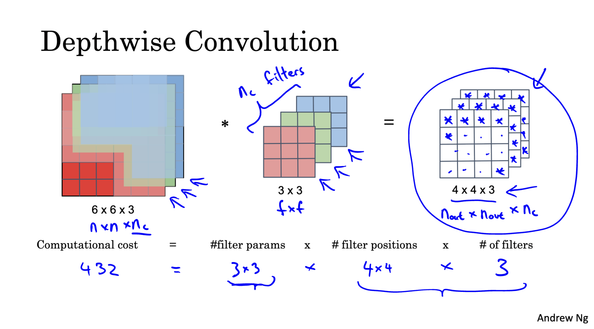

## Pointwise Convolution

- **Purpose:**  
  - Combine the outputs from the **depthwise step** into new feature maps.

- **Input (from Depthwise Step):**  
  - Example: 4 × 4 × 3  

- **Filter:**  
  - Size: 1 × 1 × 3  
  - Number of Filters: **n_c'** (e.g., 5)  

- **How it Works:**  
  - Each **1 × 1 filter** takes all channel values at a pixel and produces **one output value**.  
  - Multiple filters = multiple output channels.  

- **Computation:**  
  - Total Computations = (number of positions) × (filter size) × (number of filters).  

- **Result:**  
  - Efficiently combines per-channel information from the depthwise step into the final feature maps.

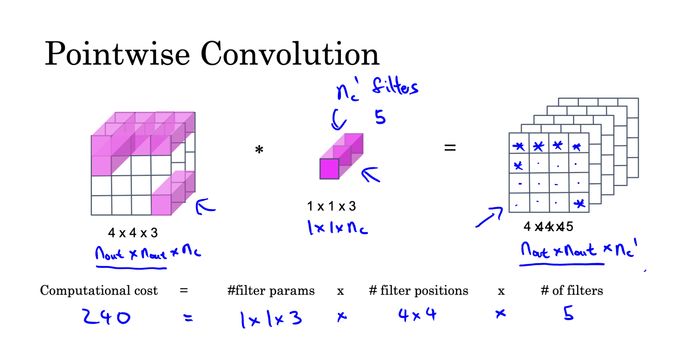

## MobileNet Architecture

### MobileNet v1
- **Core Idea:**  
  - Uses **Depthwise Separable Convolutions** in multiple blocks.  
- **Structure:**  
  - 13 such layers → pooling → fully connected layer → softmax for classification.  
- **Advantage:**  
  - Greatly reduces computational cost compared to standard convolutions.

### MobileNet v2
- **Key Additions:**  
  - **Residual Connections:** Like in ResNet, skip connections pass input directly to the next block, helping gradients flow better.  
  - **Bottleneck Blocks:** Each block has three steps:  
    1. **Expansion:**  
       - 1×1 convolution increases dimensions.  
       - Example: 6×6×3 → 6×6×18.  
    2. **Depthwise Separable Convolution:**  
       - Depthwise + pointwise convolution on expanded features.  
       - Maintains output size with padding.  
    3. **Projection:**  
       - 1×1 convolution reduces back to original dimensions.  
       - Example: 6×6×18 → 6×6×3.  
- **Repetition:**  
  - Bottleneck block is repeated **17 times**, then followed by pooling → fully connected layer → softmax.  

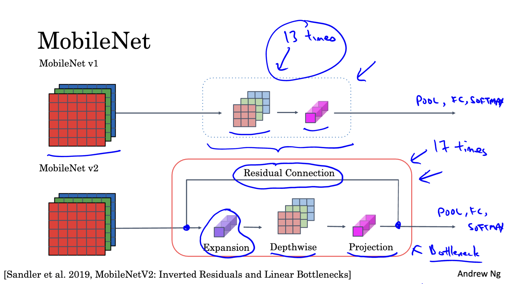

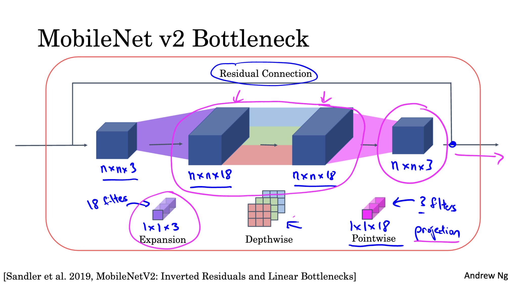

## EfficientNet

- **Purpose:**  
  - Automatically scales a network’s **depth**, **width**, and **resolution** based on available computational resources.  

- **Why Useful:**  
  - Works efficiently across devices with different compute power,  
    e.g., high-end servers, mid-range phones, low-power edge devices.  

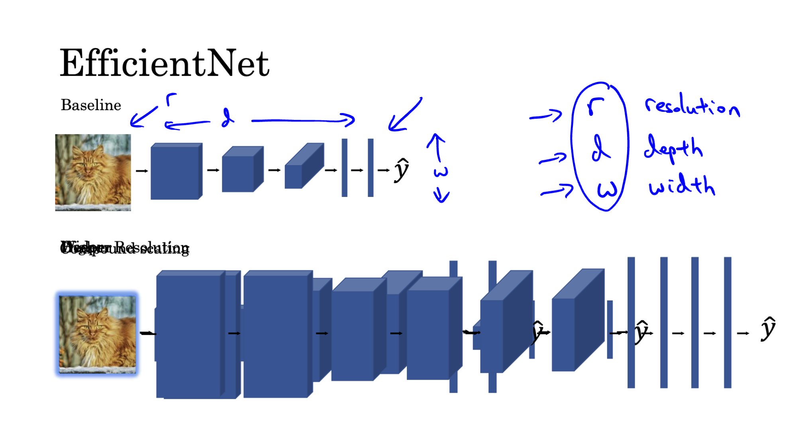

# Practical Advice on Using ConvNets

### 1. Transfer Learning
- **Idea:** Use a pre-trained network trained on a large dataset as a starting point.  
- **Why:** Saves time and computation by reusing learned features instead of training from scratch.  
- **When to Use:** Works well when your dataset is smaller but similar to the one the model was trained on.  

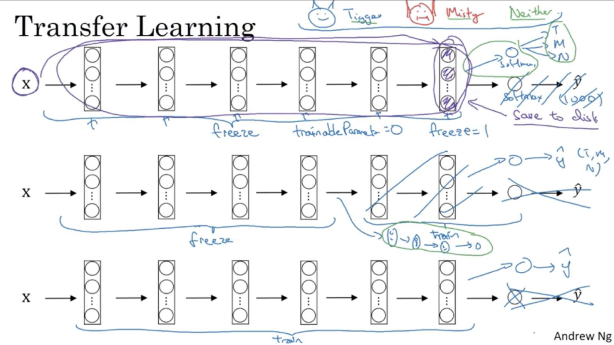

### 2. Data Augmentation
- **Purpose:** Increases data variety when you have limited samples, improving model performance.  
- **Common Techniques:**
  - **Mirroring:** Flip images horizontally if it doesn’t change the object’s meaning.  
  - **Random Cropping:** Crop random sections of an image to make the model learn from different regions.  
  - **Color Shifting:** Adjust RGB channel values to handle lighting or color variations.  

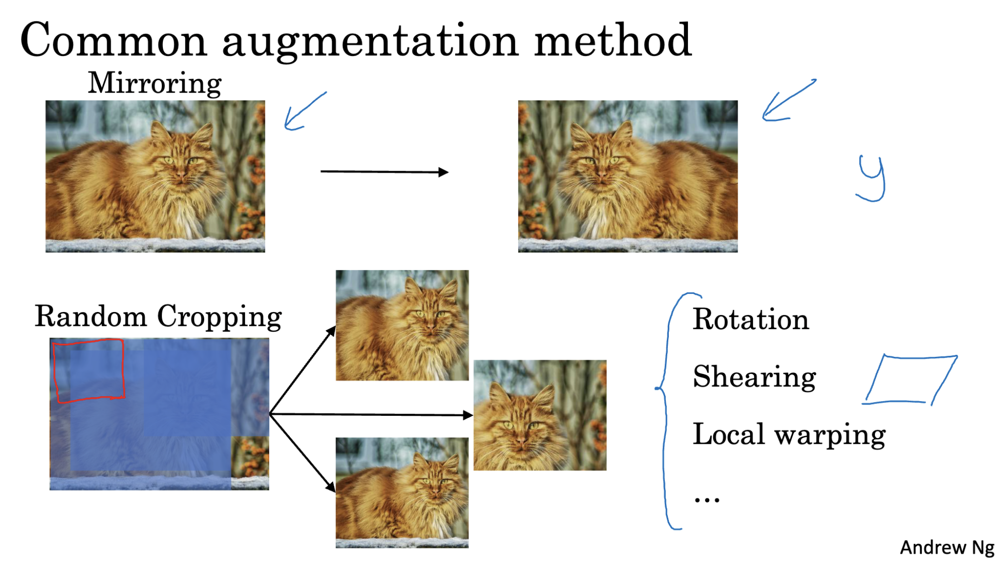

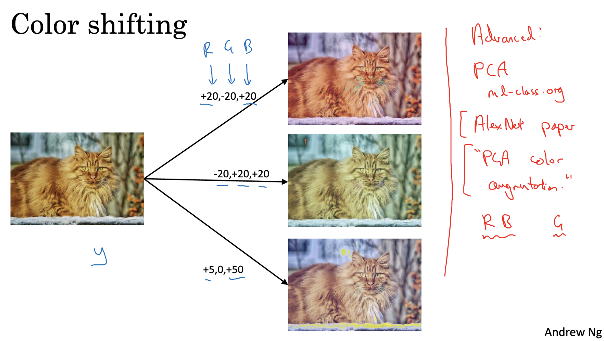

