## Object Localization

### 1. Image Classification
- **Definition:** The network takes an image and predicts a class label (e.g., "car").  

### 2. Classification with Localization
- **Extension:** Predicts both the object’s class and its position in the image.  
- **Bounding Box:** Uses coordinates to specify where the object is located.  

### 3. Importance
- **Why it matters:** Understanding localization is key to advancing into more complex object detection tasks that involve multiple objects.

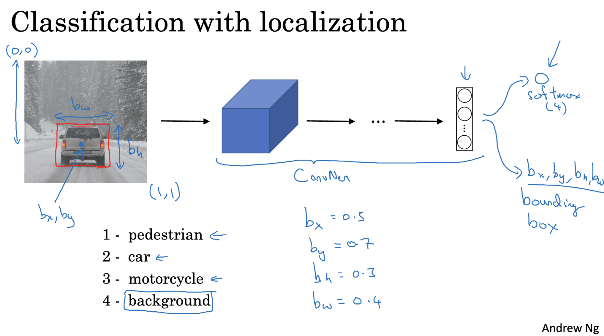

## Parameters and Training for Object Localization

### 1. Bounding Box Parameters
- **B_x:** X-coordinate of the bounding box center  
- **B_y:** Y-coordinate of the bounding box center  
- **B_h:** Height of the bounding box  
- **B_w:** Width of the bounding box  

### 2. Neural Network Outputs
- **P_c:** Probability that an object is present  
- **B_x, B_y, B_h, B_w:** Bounding box dimensions  
- **C_1, C_2, C_3, …:** Class labels (e.g., pedestrian, car, motorcycle)  

### 3. Target Labels (Y)
- **With object:** `[P_c, B_x, B_y, B_h, B_w, C_1, C_2, C_3]`  
- **Without object:** `[P_c, ?, ?, ?, ?, ?, ?, ?]`  
  - `?` means “don’t care” when **P_c = 0** (no object present)  

### 4. Loss Function
- **If object present (P_c = 1):** Minimize loss for all output components  
- **If object absent (P_c = 0):** Minimize loss only for **P_c**

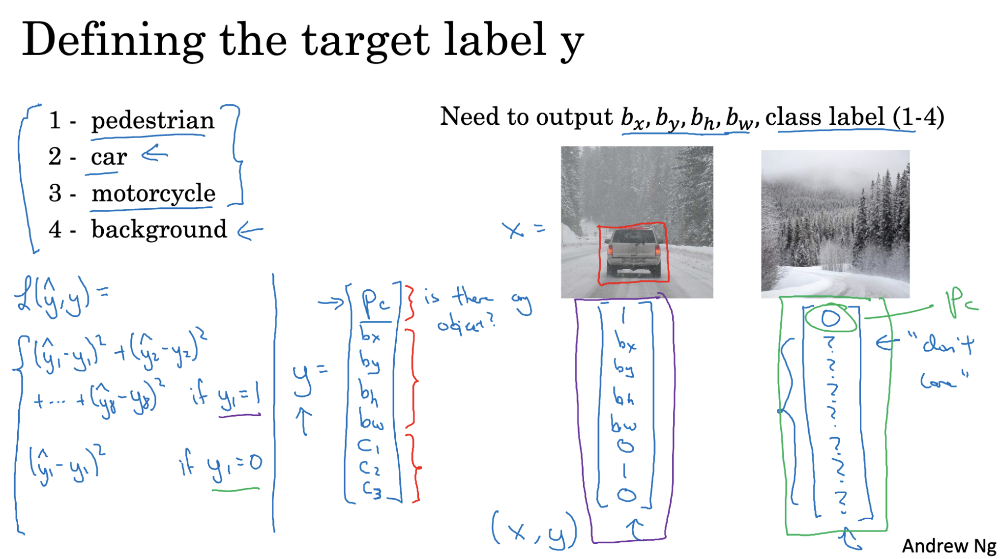

## Landmark Detection

Landmark detection trains a neural network to predict the coordinates of specific key points (landmarks) in an image.  
These landmarks highlight important features or parts of objects (e.g., eyes, mouth corners, joints).  

### 1. How It Works
- A CNN or similar model is used to process the input image.  
- The network outputs the **x** and **y** coordinates for each landmark.  
- The model is trained with labeled data where each landmark is marked with its coordinates.  

### 2. Training the Network
- **Dataset:** Requires images with landmarks annotated (x, y coordinates).  
- **Annotation:** Often done manually to ensure accuracy.  
- **Loss Function:** Minimizes the difference between predicted and actual landmark positions.  

### 3. Applications
- Face recognition  
- Emotion recognition  
- Pose detection  
- Augmented reality (AR) effects

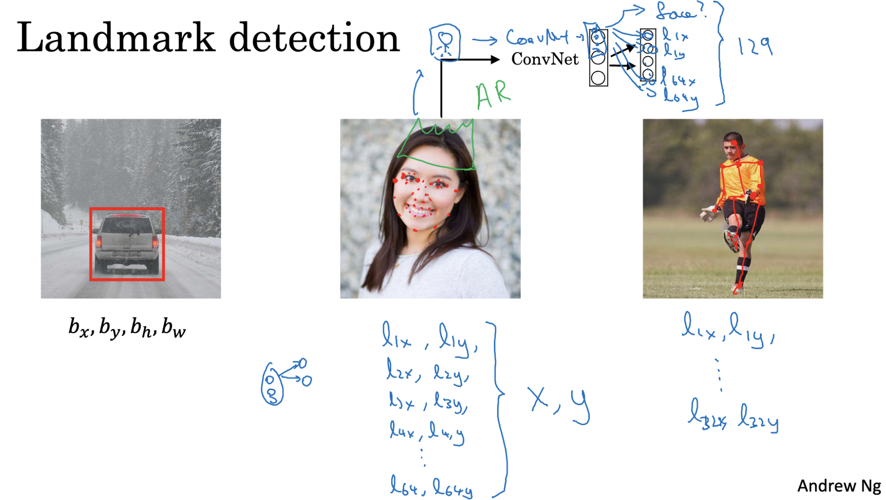

## Object Detection — Sliding Windows

### 1. Idea
Detect objects by scanning the image with a small window, classifying each region to check for the object.

### 2. Steps
- **Create Training Set:** Include images with and without the object.  
- **Train Classifier:** Learn to distinguish between object and non-object regions.  
- **Slide Window:** Move a fixed-size window across the image, classifying each position.  
- **Multi-Scale:** Repeat with larger windows to detect bigger objects.  
- **Record Detections:** Save positions where the classifier predicts an object.

### 3. Challenges
- **Speed:** Requires checking many windows across multiple scales.  
- **Stride Size:**  
  - Small stride → better accuracy but slower.  
  - Large stride → faster but can miss objects.

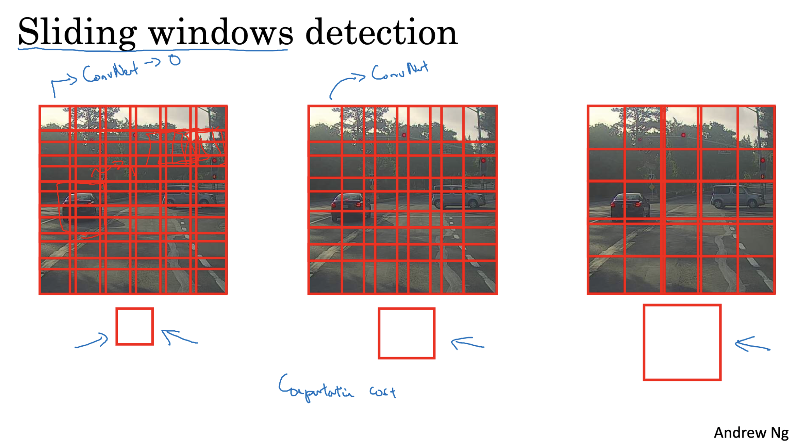

## 1.1 Convolutional Sliding Windows
**Old Method:** Crop small patches (e.g., 14×14) from the image, run each through the network. Works but is slow since the network runs many times.  

**Conv Implementation:**  
- Process the whole image at once using convolutional layers.  
- Feature maps are generated, then pooled and passed through more conv layers.  
- Final 1×1 conv outputs class probabilities for all sliding windows in one go.  
- **Advantage:** Shared computation for overlapping regions → much faster.  

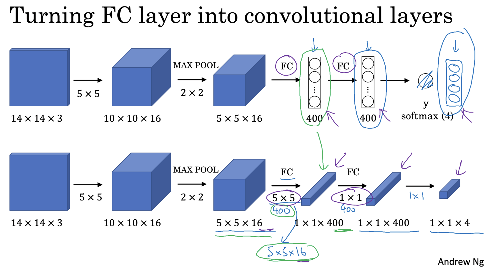

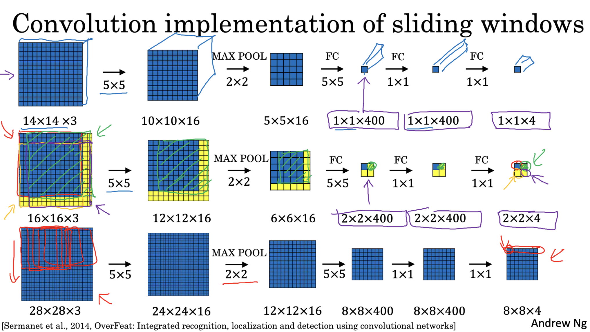

## 1.2 Bounding Box Predictions (YOLO)
- **Idea:** Divide the image into a grid (e.g., 3×3 or larger like 19×19).  
- Each grid cell predicts:  
  - `P_c`: Object probability  
  - `B_x, B_y, B_h, B_w`: Bounding box center, height, width (relative to cell)  
  - Class probabilities (`C_1, C_2, …`)  
- **Training:** Network learns to predict object presence, class, and bounding box for each cell.  
- **Test time:** One forward pass → all detections at once (fast and accurate).

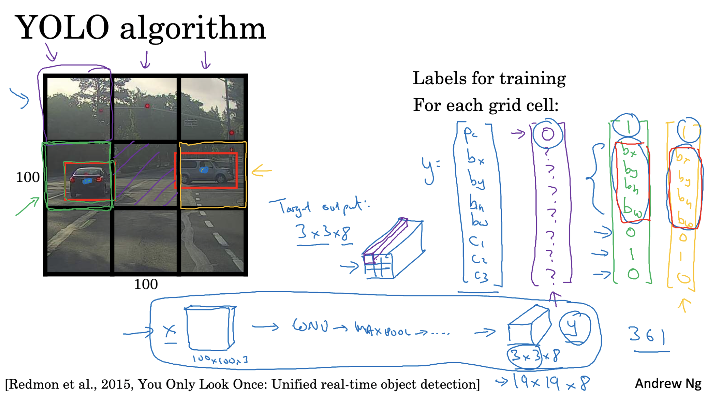

## Intersection over Union (IoU)  
- **Used for:** Measuring how well a predicted bounding box matches the ground truth box.  
- **Ground Truth Box:** Actual location of the object.  
- **Predicted Box:** Location given by the model.  
- **Intersection:** Overlapping area of both boxes.  
- **Union:** Total area covered by both boxes.  
- **Formula:**  
  `IoU = Intersection Area / Union Area`  
- **Values:**  
  - `IoU = 1` → Perfect match  
  - `IoU > 0.5` → Acceptable  
  - `IoU = 0` → No overlap  

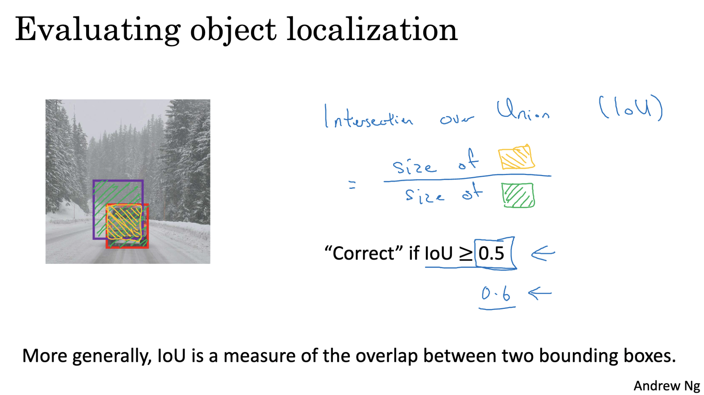

## Non-Max Suppression (NMS)  
- **Problem:** Object detection may produce multiple overlapping boxes for the same object.  
- **Goal:** Keep only the best box for each object.  

**Steps:**  
1. Remove boxes with **low confidence** (e.g., `P_c < 0.6`).  
2. Pick the **box with the highest probability**.  
3. Compare it with remaining boxes:  
   - If **IoU > 0.6**, remove that box (too much overlap).  
4. Repeat with the next highest probability box.  
5. Keep only non-overlapping boxes for clean results.  

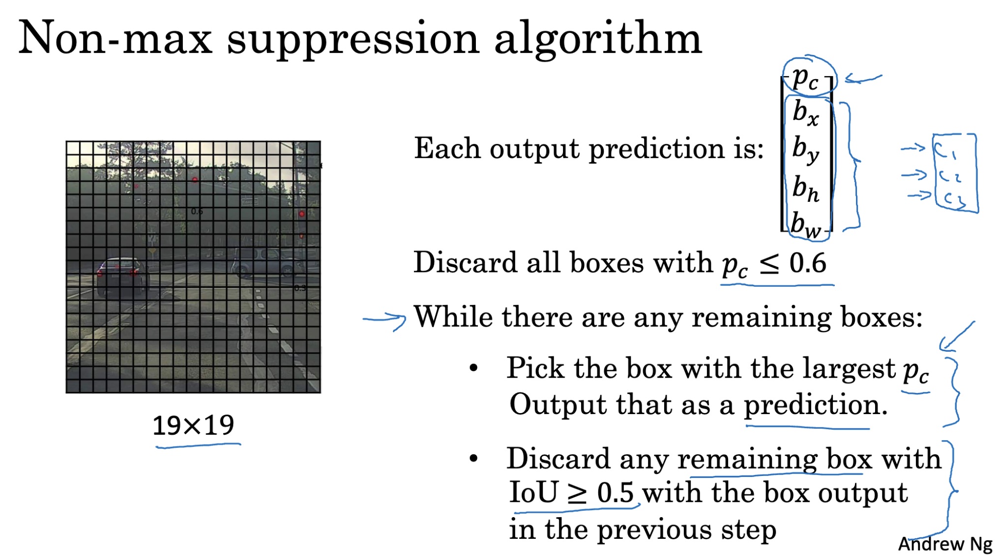

## Anchor Boxes  
- **Problem:** Multiple objects can be close together or overlap, making detection harder.  
- **Solution:** Use **predefined shapes** (anchor boxes) to allow **multiple detections per grid cell**.   

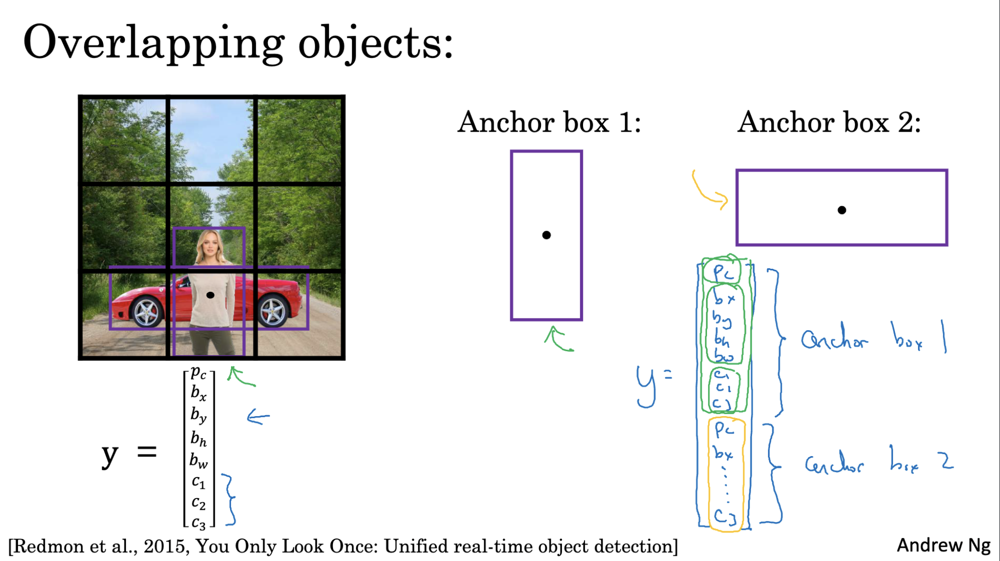

### How it Works (Anchor Boxes)  
- **Each grid cell** outputs a vector **per anchor box**.  
- Example (2 anchor boxes):  
  `[PC1, BX1, BY1, BH1, BW1, C1_1, C1_2, C1_3, PC2, BX2, BY2, BH2, BW2, C2_1, C2_2, C2_3]`  
- **Instead of one object per cell**, each object is linked to the **anchor box** that best matches its shape.  
- Objects are assigned to the **grid cell containing their center point**.  

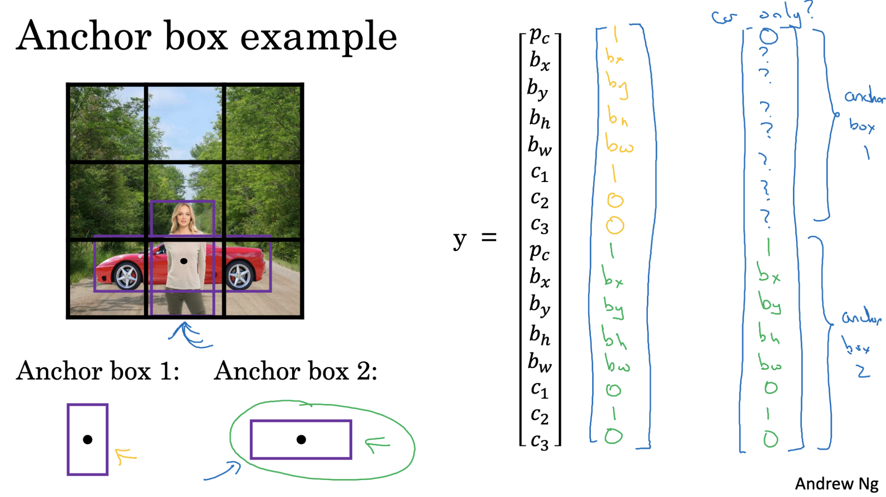

## YOLO Algorithm

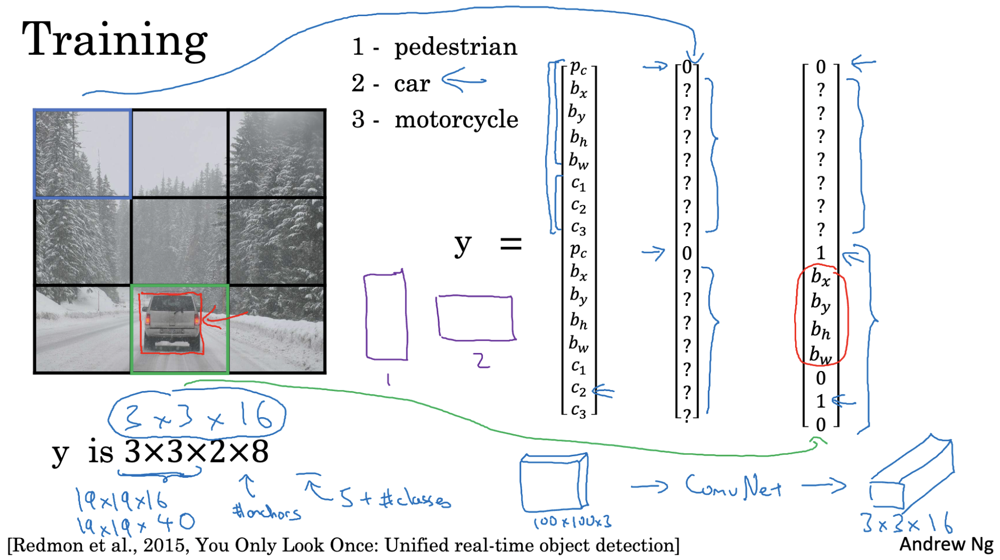

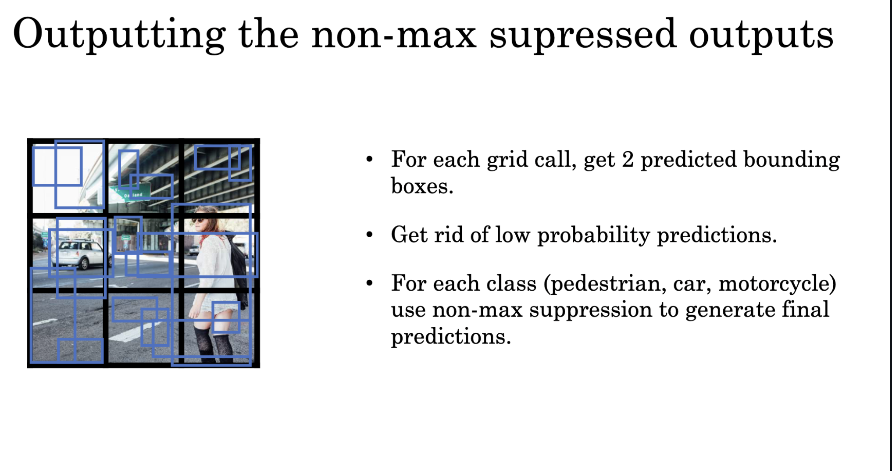

## Semantic Segmentation with U-Net  
- **Goal:** Label every pixel in an image with its object class.  
- **Goes beyond** object detection — no bounding boxes, just per-pixel classification.  
- **Per-Pixel Class Labeling:** Assign a class to each pixel for detailed, precise segmentation.  

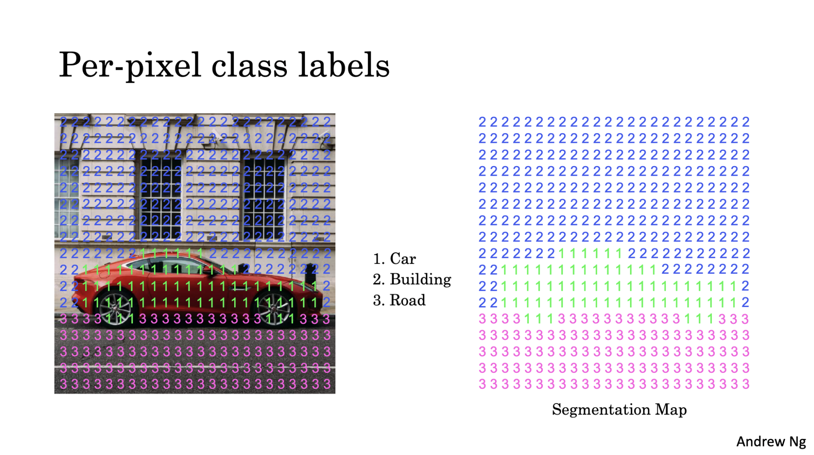

## Transpose Convolution  
- **Key Parameters:** Filter size (f), Padding (p), Stride (s).  
- **Steps:**  
  1. Start with an empty output grid (size depends on input, f, p, s).  
  2. Slide the filter across the output grid in steps of stride.  
  3. Multiply filter values with input values and add to output positions.  
  4. Sum overlapping values if filter regions overlap.  

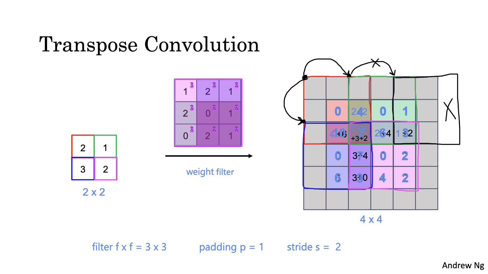

## U-Net

U-Net is a neural network architecture designed for **semantic segmentation**, where the goal is to label every pixel in an image.

## How It Works

1. **Input**
   - Takes an RGB image (3 color channels) as input.

2. **Convolution Layers**
   - Uses filters to extract features from the image.
   - Starts by detecting simple patterns (edges, textures) and moves to more complex features as depth increases.

3. **Activation Functions**
   - Applied after each convolution to help the network learn non-linear relationships.

4. **Max Pooling**
   - Reduces the size of the image while keeping the most important features.
   - Makes the network more efficient.

5. **Transpose Convolutions**
   - Upscales the reduced image back to its original size.
   - Helps in reconstructing the spatial details.

6. **Skip Connections**
   - Connects earlier layers (before downscaling) to later layers (during upscaling).
   - Preserves important details that might otherwise be lost.

7. **Output**
   - A 1×1 convolution creates the segmentation map.
   - Each pixel in the map is assigned to a specific class.

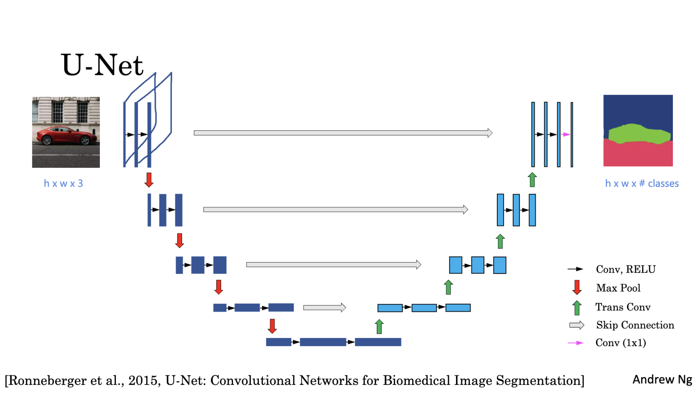

