# One-Shot Learning in Face Recognition

One-shot learning is a technique in **face recognition** where the goal is to identify a person using only **one reference image**.

## Example
- We have a database with **one image per employee**.
- When a new image is provided, the system must determine:
  - If it’s the **same person** as one in the database.
  - Or a **new person** not in the database.

## Traditional Approach
- **Method:** Use a Convolutional Neural Network (ConvNet) to classify the input image.
- **Problems:**
  - Requires a **large dataset** for training.
  - Adding new people means **retraining the entire network**, which is inefficient.

## The One-Shot Learning Approach
- Instead of direct classification, we **learn a similarity function** `d`.
- The similarity function compares **two images** and outputs a **measure of difference**.
- The decision is made based on how small (or large) the difference is.

## Key Advantage
- Can recognize new people **without retraining**—just compare the new image to the stored one.

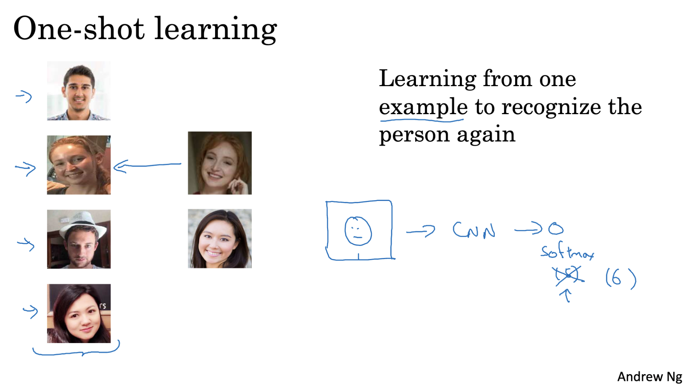

## How One-Shot Learning Works

- The network learns a **similarity function** `d` that tells how different two images are.  
- **Same person → small d**, **different person → large d**.

### Recognition
- For a new image, compare it with each image in the database using `d`.  
- If `d` is below a threshold `τ`, the image is considered the same person.  
- Adding new people is easy: just add their image, no retraining needed.

### Why It's Useful
- Works with **just one image per person**.  
- **Fast and flexible** compared to traditional classification CNNs.

- **Flexible**: Works without retraining the entire network.

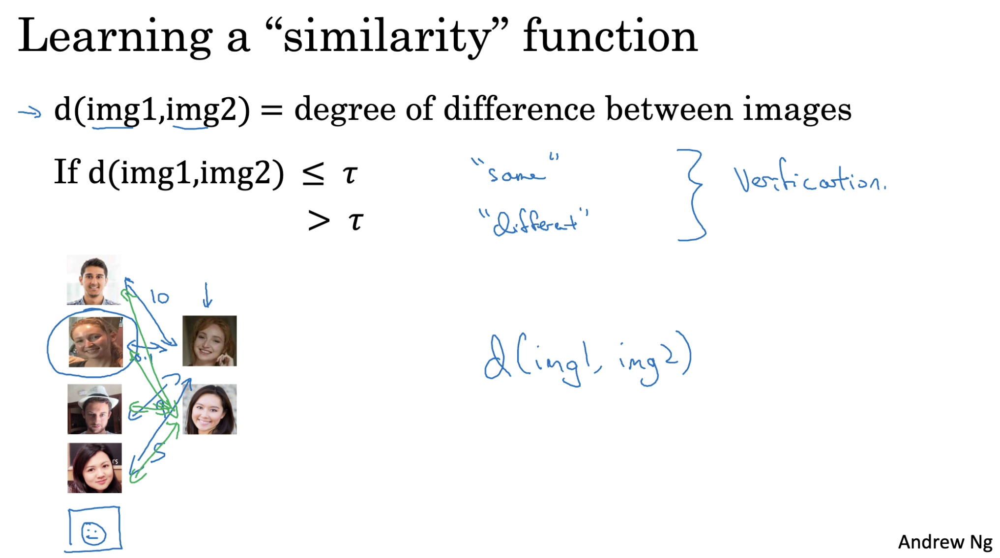

## Siamese Network

### Architecture
- Consists of **two identical CNNs** that take two images as input.  
- Each CNN produces a **128-dimensional feature vector** (encoding) representing the image.  
- Goal:  
  - **Same person → small distance** between encodings.  
  - **Different person → large distance** between encodings.  

### Function `d`
- Measures the **distance** between the two feature vectors.  
- Training adjusts the network so that `d` is **small for same person** and **large for different people**.  

### Training
- Use **backpropagation** to update CNN parameters:  
  - Minimize distance for similar images.  
  - Maximize distance for different images.  

### Logistic Regression
- Applied on the **absolute difference of the encodings**.  
- Output `y_hat` is sigmoid:  
  - `y_hat = 1` → same person  
  - `y_hat = 0` → different people  
- Logistic regression parameters are updated during training to improve classification accuracy.

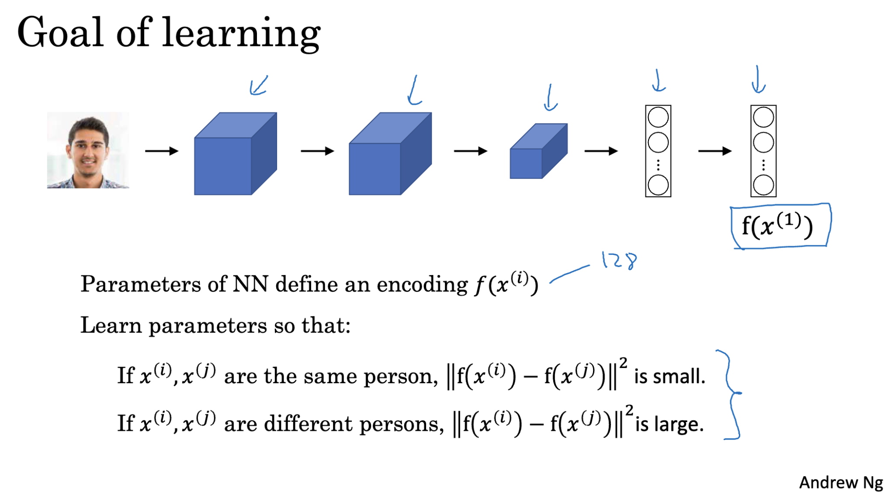

## Triplet Loss

### Overview
- Triplet loss is used to train networks to generate **good encodings**, especially for **face recognition**.  
- Works by comparing **three images at a time**:  
  - **Anchor (A)**: the reference image  
  - **Positive (P)**: same person as anchor  
  - **Negative (N)**: different person  

### Goal
- Ensure the distance between **anchor and positive** is **smaller** than the distance between **anchor and negative** by at least a margin `α`.  
- Margin `α` prevents trivial solutions (like all encodings being equal) and ensures clear separation between different persons.  

### Mathematical Formulation
- Distance function `d`:  
d(A, P) ≤ d(A, N) - α
d(A, P) - d(A, N) ≤ -α

- Triplet loss function:  
L(A, P, N) = max(0, d(A, P) - d(A, N) + α)

- Minimizing this loss ensures that **same-person encodings are closer** and **different-person encodings are farther apart**.

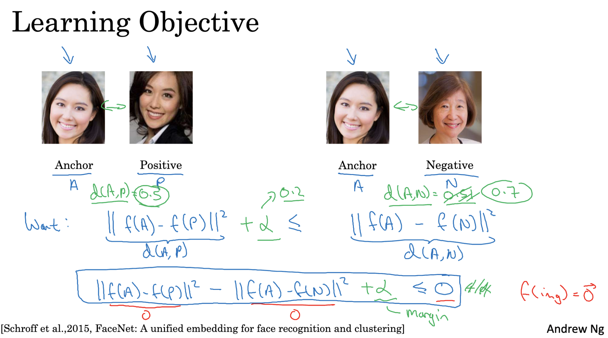

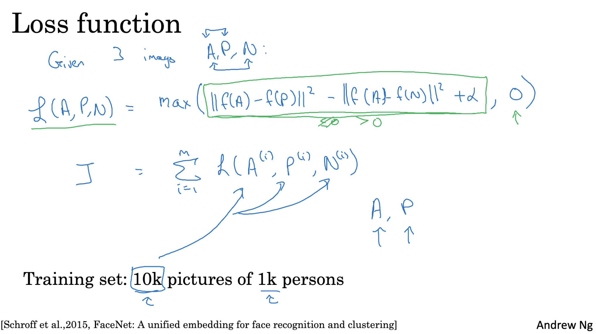

## Choosing Triplets for Training

### Why Triplet Selection Matters
- **Random triplets** often create easy examples that don’t help the network learn much.  
- **Hard triplets** are more effective. These are triplets where the distance between anchor and positive `d(A,P)` is **close** to the distance between anchor and negative `d(A,N)`.  
- Hard triplets force the network to learn **robust features** to distinguish similar faces.

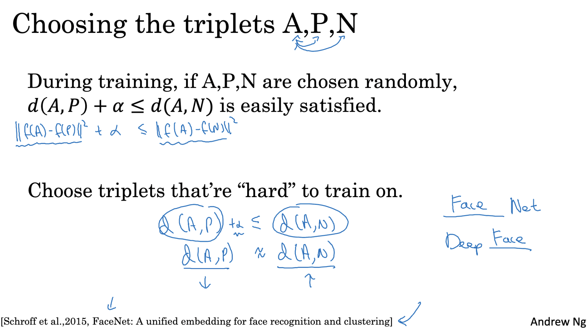

### Training Steps
1. **Dataset**
   - Multiple images per person to form anchor-positive pairs.  
   - Large and diverse dataset ensures better encodings.

2. **Implementation**
   - Generate triplets `(A, P, N)` from the dataset.  
   - Compute the **triplet loss** for each triplet.  
   - Minimize total loss using **gradient descent** and **backpropagation**.

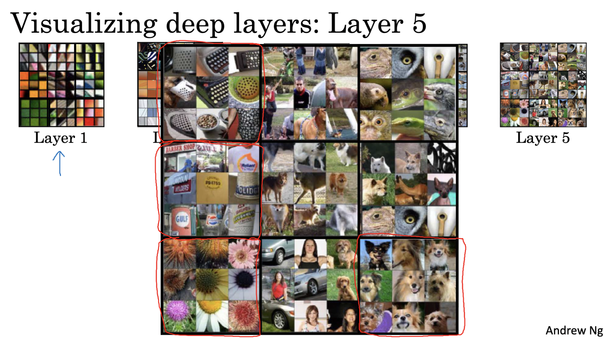

## Neural Style Transfer Cost Function

The cost function for neural style transfer, **J(G)**, has two main components: content cost and style cost. Here we focus on **Content Cost**.

### Content Cost

The **content cost** measures how well the generated image **G** preserves the content of the original image **C**.

**Formula:** J_content(C, G) = 1/2 * ∑(a[l][C] - a[l][G])^2

- **a[l][C]**: Activations of layer **l** for the content image **C**  
- **a[l][G]**: Activations of the same layer for the generated image **G**  

The idea is to make the activations of **G** at layer **l** as close as possible to those of **C**, so that **G** retains the original content structure.

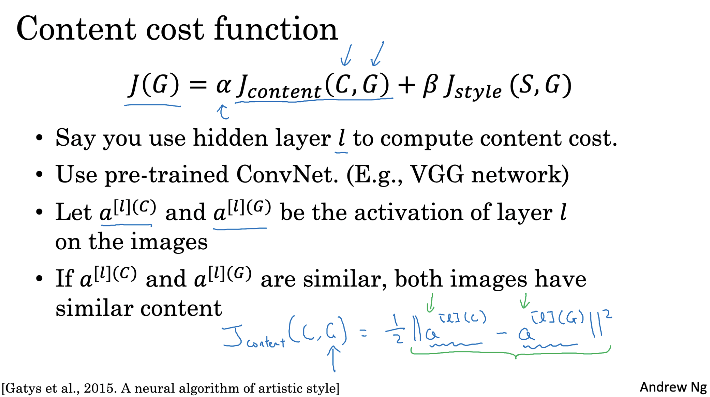

## Style Cost

The **style cost** measures how well the generated image **G** captures the style of the style image **S**. It makes sure patterns, textures, and colors from **S** appear in **G**.

**Formula:**  J_style(S, G) = ∑∑(S^[L](k, k') - G^[L](k, k'))^2

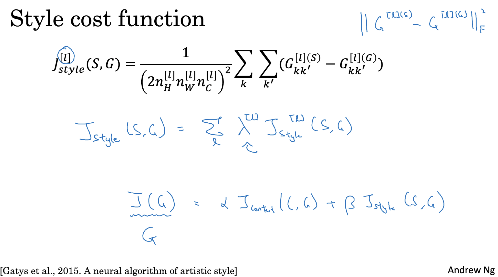

## Neural Style Transfer Cost Function

The total cost function combines **content** and **style**:

**Formula:**  J(G) = α * J_content(C, G) + β * J_style(S, G)

- **α**: weight for content (how much the generated image resembles the content image **C**)  
- **β**: weight for style (how much the generated image adopts the style of **S**)  

### How It Works

1. Initialize **G** as a random image or a copy of **C**.  
2. Compute **J(G)** using current **G**.  
3. Use **gradient descent** to update **G** and reduce **J(G)**.  
4. Repeat until **G** looks like content of **C** in the style of **S**.  

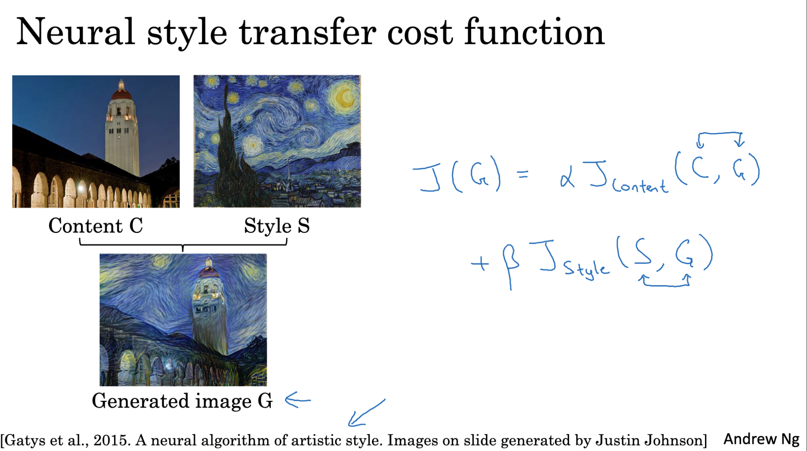

## Style Matrix

The **style matrix** (also called Gram matrix) helps capture the style of an image by looking at correlations between different feature channels in a layer **L** of a neural network.

- It's a **nc × nc** matrix, where **nc** is the number of channels in that layer.  
- Each element **G^L(k, k')** measures how similar or correlated channel **k** is with channel **k'**.

### How It's Computed

1. Take the activations of layer **L** for an image.  
2. For each pair of channels (k, k'), multiply their activations at each spatial location (i, j) and sum over all positions.  

**Formula:**  G^L(k, k') = ∑∑ activation(i, j, k) * activation(i, j, k')

- This captures how features in one channel relate to features in another.  
- The resulting matrix encodes the **style** of the image, like textures or patterns, independent of spatial arrangement.

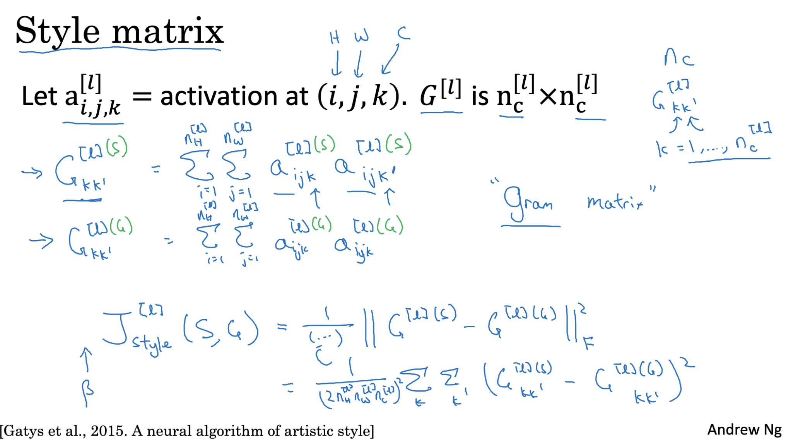

