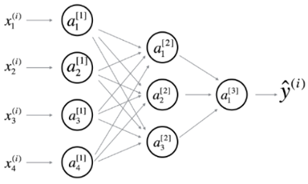
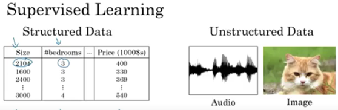
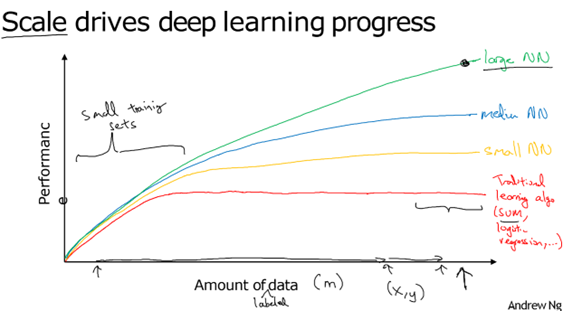

# NEURAL NETWORK

A neural network is a type of machine learning model inspired by the structure and function of the human brain. It consists of interconnected neurons (also called nodes) that are designed to recognize patterns and relationships in data.

It consists of three layers:

- **Input Layer** – Takes the input `X`, which can consist of multiple parameters such as `{x1, x2, x3, x4}`.
- **Hidden Layer** – Performs computation on the input `X` using interconnected neurons and parameters. It applies weights and biases to learn patterns in the data. There can be multiple hidden layers.
- **Output Layer** – Generates the final output `Y` based on the input and features learned in the hidden layer by neurons.

## Neural Network Types

1. **CNN (Convolutional Neural Network)** – Specialized for processing grid-like data (e.g., images).
2. **RNN (Recurrent Neural Network)** – Designed for processing sequential data (where output depends on previous inputs).
3. **LSTM (Long Short-Term Memory)** – A type of RNN that can learn long-term dependencies.

## Supervised Learning

Supervised learning is a type of machine learning where the model is trained using labeled data. For every input `X`, the correct output `Y` is provided so the model learns to map inputs to outputs — i.e., it learns from example (input, output) pairs for accurate future prediction on unseen data.

## Scale Drives Deep Learning

- We need a **large amount of data** to train a neural network effectively.
- More data helps the model learn better patterns, which leads to **higher accuracy** in outputs.

