# Representation of Image in Computer

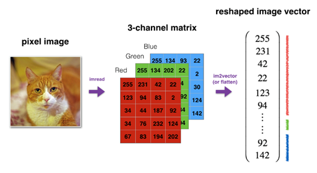

An image is represented in a computer as a grid of numbers (pixel) . This grid can be converted into a vector by flattening all pixel values into a single column. The resulting image vector becomes the feature vector of the image of size nₓ (e.g., for a 64×64 RGB image, nₓ = 64 × 64 × 3 = 12288). 

---

## Binary Classification

Binary classification is a type of supervised machine learning task where the model predicts one of two possible classes (outputs either 0 or 1, yes or no, true or false).

---

# Notation

- An example is represented by `(x, y)` where `x` is input feature vector described above and `y` output label is binary (0 or 1), used in binary classification.
- `X ∈ ℝⁿˣ x m`: Is an input matrix where each column is an input feature vector with `nₓ` features, and there are `m` examples in total.  
  `X.shape = (nₓ, m)`
- `Y ∈ ℝ¹ × m`: Is a row vector containing all labels.  
  `Y.shape = (1, m)`
- **m training examples**: A set of `m (x, y)` pairs used to train the model.
- **m test examples**: A separate set of test `(x, y)` pairs, forming the test set, used to evaluate model performance.

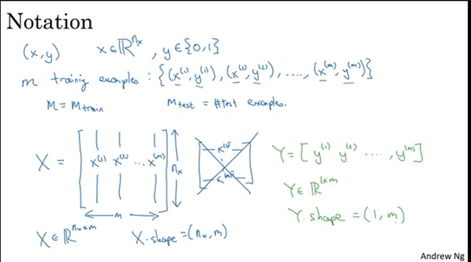

---

# Logistic Regression

Logistic regression is used for binary classification problems — where the output label `y ∈ {0, 1}`.

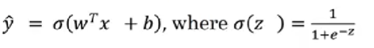

Where:
- `ŷ` is the probability that the output label `y = 1`, given the input `x`.
- `x` is the input feature vector.
- *Sigmoid function* is the activation function used to bound the value between 0 to 1.
- `w` is a vector representing weights assigned to each input feature and `b` (bias term) are the parameters for logistic regression.
These parameters and bias term are adjusted during the learning process to make our predictions as accurate as possible.

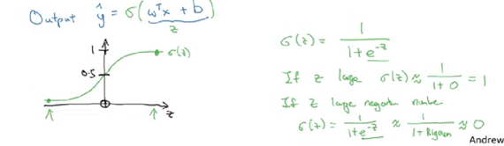

## Cost and Loss Function in Logistic Regression

To train the parameters `w` and `b` we need a cost function.

- **Loss Function**: Defined for a single training example, it measures the difference between the predicted and desired output and computes the error.

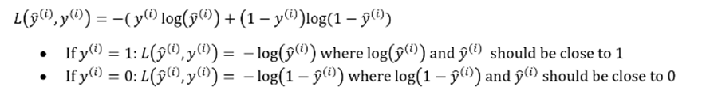

- The cost function we use in logistic regression is called the **negative log likelihood loss function**.

- **Cost Function**: For the entire training set, we require the average of the loss function, i.e., cost function.

We adjust the values of the parameters `w` and `b` to minimize the cost function `J(w, b)` using techniques like **gradient descent**.

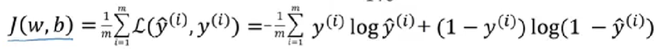

## Gradient Descent

Gradient Descent is an algorithm used to minimize a cost function (error) by finding the direction of the steepest descent.

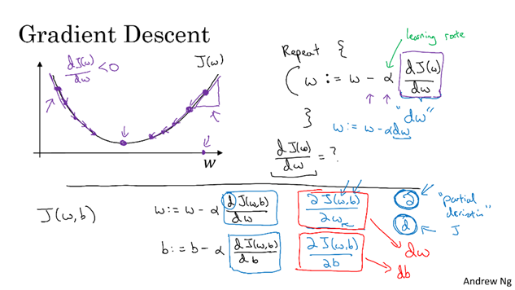

---

## Computation Graph and Computing Derivative

Computation of a neural network can be divided into **forward propagation** and **backward propagation**.

- A **computation graph** is a graphical representation of all the operations and variables involved in computing a function and helps us understand how to compute the function step by step during the forward pass.

- During the **backward pass**, the graph is used to efficiently compute derivatives using the chain rule. These derivatives tell us how one variable affects another and thus are essential for minimizing error and updating model parameters during training.

---

# Logistic Regression Derivatives

Main idea is to find the values of parameters (weight `w` and bias `b`) to minimize the loss function `J(w, b)` in logistic regression and improve the model’s accuracy.

- We start with random initial values for the parameters `w` and `b`.
- Compute the predicted output using forward pass and evaluate the cost function `J(w, b)`.
- Perform the backward pass to calculate derivatives:
  1. Computing the derivative of the loss w.r.t the prediction.
  2. Compute the derivatives of the loss w.r.t the parameters (`w`, `b`) using the chain rule.
- Then we update the parameters by multiplying the derivatives by the learning rate and then subtracting it from the current parameter values.
- We repeat the process until the changes in parameters become very small or negligible.

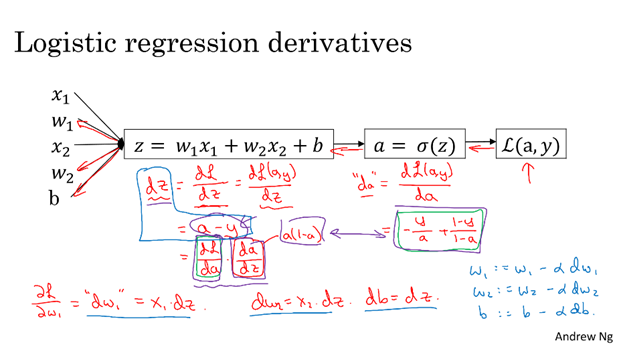

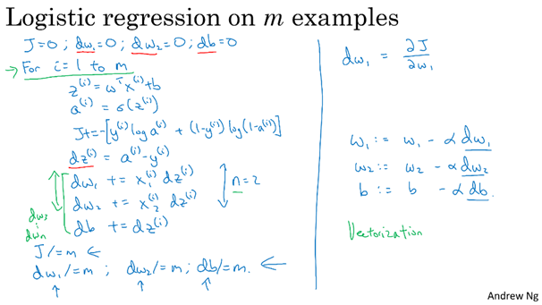

When working with `m` training examples and multiple input features, we require two nested loops: one loop to iterate over all `m` examples and another loop to iterate over the `nₓ` input features of each example.

This approach becomes inefficient and slow, especially for large datasets, as it increases computation time significantly. To overcome this, we use **vectorization**.

---

# Vectorization

- It is used to eliminate explicit loops in the code and allows us to perform operations on entire vectors or matrices at once.
- Deep learning models often deal with large datasets and to train efficiently, we need to speed up computations and thus we use vectorization.
- In a vectorized implementation, we directly compute the dot product (without using a for loop) by using built-in functions like `np.dot()` in Python or NumPy.

### Vectorizing and Implementing Logistic Regression

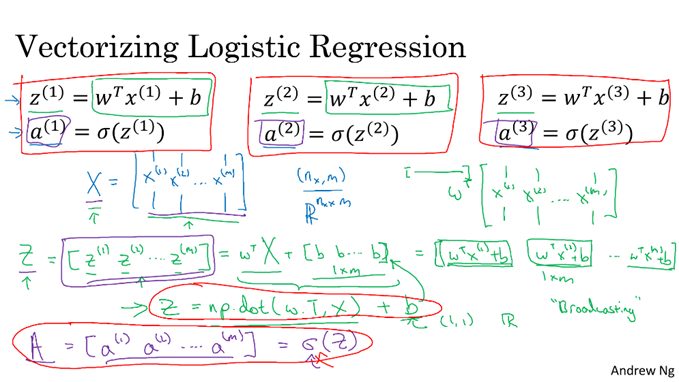  

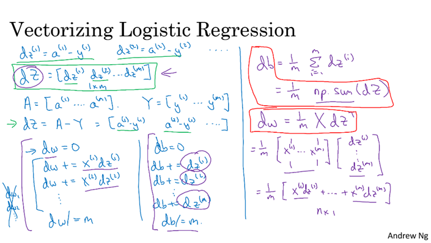 
 
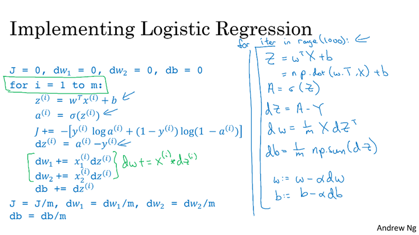

---

## Broadcasting

**Broadcasting** is a powerful feature in NumPy that allows arithmetic operations between arrays of different shapes without explicitly replicating data.

### General Principle of Broadcasting

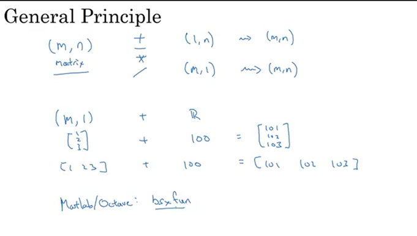
