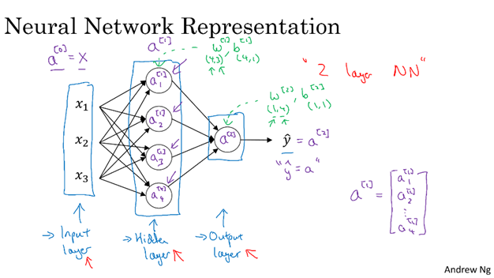
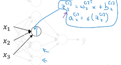
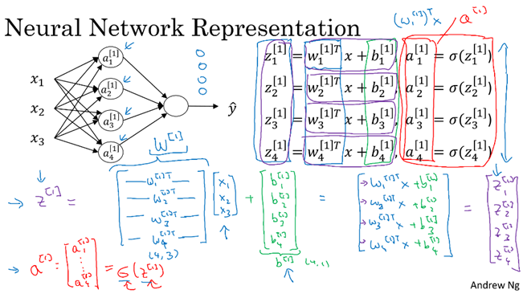
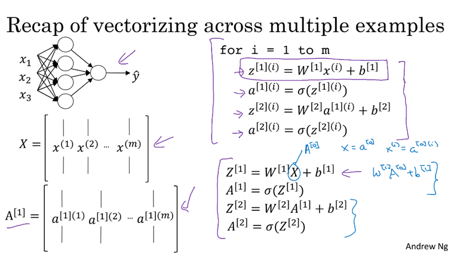
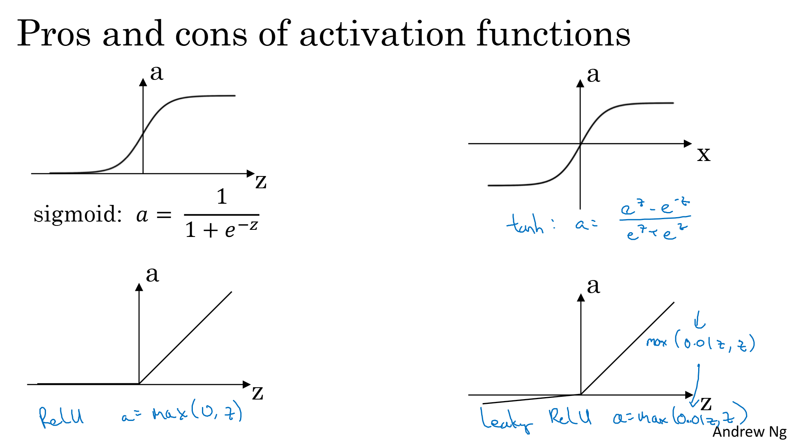
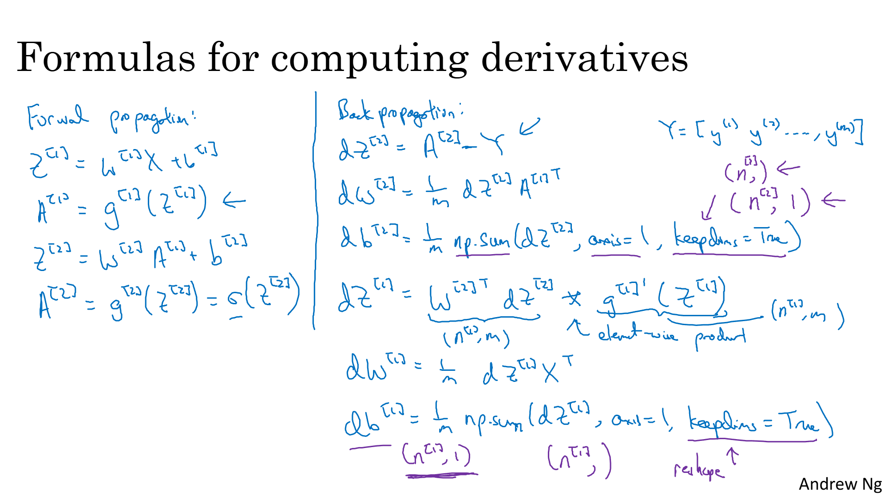

# Neural Network Representation

A neural network is a type of machine learning model inspired by the structure and function of the human brain. It consists of interconnected neurons (also called nodes) that are designed to recognize patterns and relationships in data.

It consists of three layers:

- **Input Layer** – Takes the input `X`, which can consist of multiple parameters such as `{x1, x2, x3, x4}`.
- **Hidden Layer** – Performs computation on the input `X` using interconnected neurons and parameters. It applies weights and biases to learn patterns in the data. There can be multiple hidden layers.
- **Output Layer** – Generates the final output `Y` based on the input and features learned in the hidden layer by neurons.

- The training set consists of input values `X` and output values `Y`, which are used to train the hidden layer parameters of the neural network.

---

# Computing Neural Network Outputs

Each node in the hidden layer of a neural network performs two main computations.  
• First, it calculates the linear combination z using the input values along with the corresponding weights and biases.  
`z[l] = w[l] * a[l-1] + b[l]`  
• Second, it passes this z value through an activation function g() to produce the activated output a.  
`A[l] = activation(Z[l])`  
This output then becomes input for the next layer of the network.

• To make these computations faster and more efficient, especially when dealing with large datasets and multiple nodes and layers, we use vectorization instead of using explicit for-loops.  
• That means we handle entire layers at once by representing the weights, biases, inputs, and outputs as matrices.  
• When dealing with multiple neurons in a layer, we stack their parameters and outputs vertically in a matrix form and thus apply vectorization.

For a two-layer neural network (1 hidden layer + 1 output layer), forward propagation is done as follows:

**Hidden Layer (Layer 1):**
- Stack all weights into a matrix: `W[1]`  
- Stack all biases into a vector: `b[1]`  
- Compute:  
  - `Z[1] = W[1] · X + b[1]` (Linear combination)  
  - `A[1] = σ(Z[1])` (Activation using sigmoid or ReLU)

**Output Layer (Layer 2):**
- Compute:  
  - `Z[2] = W[2] · A[1] + b[2]`  
  - `A[2] = ŷ = σ(Z[2])` (Final prediction)

In a neural network, the output computation can be seen as **iterative applications of logistic regression** at each layer, including the output layer.

---

# Vectorizing Across Multiple Examples

We majorly train our neural networks on multiple training examples at once (batch processing). 
To make this efficient, we vectorize the computations across all examples instead of processing one example at a time and using the loop structure

---

# Activation Functions

- Activation functions introduce **non-linearity**, enabling neural networks to learn complex patterns.
- They decide whether a neuron should be activated or not by applying a nonlinear transformation to the input.
  
## Why Are Activation Functions Needed?

1. **Introduce Non-Linearity**  -  Without activation functions a neural network behaves like a linear model and cannot learn complex data representations.

2. **Enable Learning of Complex Patterns**  -  They allow the network to capture complex patterns and relationships in the data.

3. **Facilitate Meaningful Layer Interactions**  -  Activation functions ensure each layer performs a transformation on the data. Without them, the network would collapse into a single linear transformation

## Different Types of Activation Functions

### 1. Sigmoid
- Formula: 𝜎(𝑧) = 1 / (1 + 𝑒^(-z))
- Range: 0 to 1
- Derivative: g(z) * (1 - g(z))
- Commonly used: In the output layer for Binary Classification.
- Cause gradients to vanish when z is very large or very small.

### 2. Tanh (Hyperbolic Tangent)
- Formula: tanh(z) = (e^z - e^−z) / (e^z + e^−z)
- Range: -1 to 1
- Derivative: 1 - g(z)^2
- Commonly used in hidden layers because it's zero-centered, which helps learning.

### 3. ReLU (Rectified Linear Unit)
- It is a popular activation function.
- Defined as ReLU(x) = max(0, x)
- Derivative is 1 for x > 0 and 0 for x < 0. Derivative at x = 0 is not well-defined (we either assume it to be 1 or 0)
- Commonly used in hidden layers due to its efficiency and effectiveness.

### 4. Leaky ReLU
- An alternative to ReLU where the function allows a small gradient for negative inputs.
- Leaky ReLU(x) = max(0.01x, x)
- The slope is a small constant (0.01) when x < 0.

### 5. Softmax
- Used for multi-class classification problems.
- Defined as Softmax(x_i) = e^(x_i) / ∑(e^(x_j)) for all j
- Recommended for the output layer in multi-class classification tasks.

# Gradient Descent for Neural Networks

**Step 1 : Initialization**  
We start with random initialization for weights and biases  
`W1` and `B1` for the hidden layer, whereas `W2` and `B2` for the output layer.

**Step 2 : Forward Propagation**  
Pass input data through the network to get predictions and calculate intermediate values and apply activation functions.

**Calculate Activations:**

**Hidden Layer:**  
`Z1 = W1 * X + B1`  
`A1 = Activation(Z1)`

**Output Layer:**  
`Z2 = W2 * A1 + B2`  
`A2 = Sigmoid(Z2)`

**Step 3 : Back Propagation and Computing Gradients**  
Determining how much each weight and bias affects the prediction error and calculate gradient using chain rule.

**Step 4 : Update Weights**  
Adjusting the values of `W1`, `B1`, `W2`, and `B2` using the computed gradients.  
Use a learning rate (hyperparameter) to control the size of the adjustments.

**Output Layer:**  
`DZ2 = A2 - Y`  
`DW2 = DZ2 * A1^T`  
`DB2 = DZ2`

**Hidden Layer:**  
`DZ1 = (W2^T * DZ2) * Activation'(Z1)` (Error propagated back)  
`DW1 = DZ1 * X^T` (Gradient for weights)  
`DB1 = DZ1` (Gradient for biases)

**Step 5 : Training which involves iteration**  
Repeat forward propagation and back propagation.  
Update weights and biases each iteration to improve network performance.

 

# Random Initialization

•   Random weight initialization is essential as it helps to break symmetry between neurons. 
•   This ensures that neurons can learn different patterns; otherwise, they behave identically and end up learning the same thing.

It is safe and common to initialize all biases to zero.

Choosing the right scale for random weights is important:
- **Too small** → leads to slow learning (vanishing gradients).
- **Too large** → leads to unstable learning (exploding gradients).

**Proper initialization results in faster and more stable training.**
