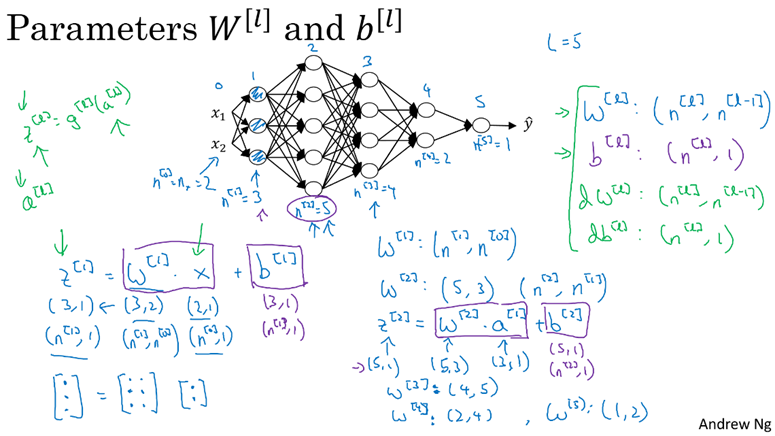
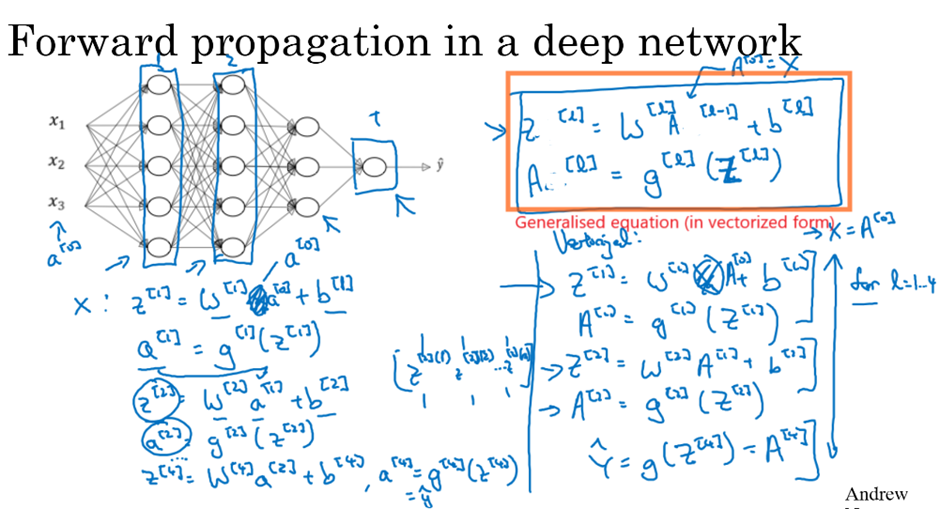
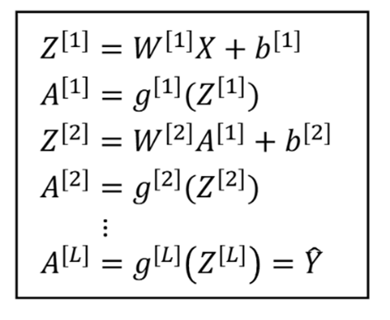
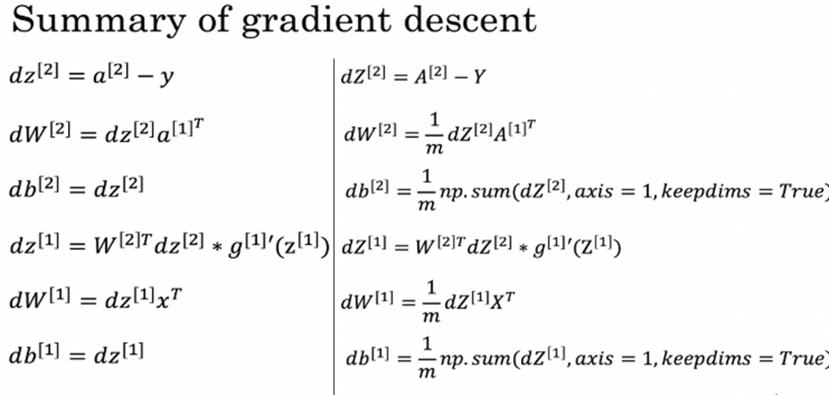
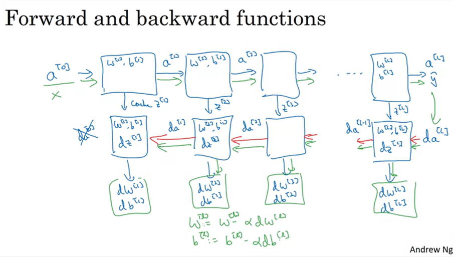

# Deep Layer Neural Network

• A Deep Layer Neural Network a type of neural network that contains multiple hidden layers between the input and output layers. Each layer consists of nodes (or neurons) that perform computations on the data and pass the output to the next layer.

• A Shallow Neural Network is a neural network that has only one hidden layer between the input and output layers Like in Logistic Regression.

---

## Notation and Matrix Dimension

Some Notation:

• **L** = Total number of layers in the network (only hidden and output layers)  
• **n[l]** = Number of neurons in layer l. (For ex. n[1] = 5 neurons in layer 1)  
• **a[l]** = Activation (output) of layer l  
• **W[l]** = Weight matrix for layer l (used to compute z[l])  
• **b[l]** = Bias vector for layer l  
• **g[l]** = Activation function to be used. (Sigmoid / ReLU) `A[l] = activation(Z[l])`  
• **z[l]** = Linear component for layer l computed as: `z[l] = w[l] * a[l-1] + b[l]`

• The general rule: For any layer l, the weight matrix W[l] has shape (n[l] × n[l−1]), the bias vector b[l] has shape (n[l] × 1), and the linear output Z[l] = W[l]A[l−1] + b[l] also has shape (n[l] × 1)

• Example: For the 2nd hidden layer in the neural network, the dimension of the weight matrix will be (5 × 3) as it depends on the number of neurons in the current layer and the number of neurons in the previous layer. The dimension of the bias vector will be (5 × 1) matching the number of neurons in the current layer. The input feature vector x has a dimension of (2 × 1) as there are two input features.

---

## Building Blocks of Deep Neural Network

Building Blocks of a Deep Neural Network involves Two Steps:  
**Forward Propagation** and **Backward Propagation**.

### 1. Forward Propagation in Deep Neural Network

• Forward propagation in a deep neural network is the process where input data is passed through the network layer by layer to compute the final output.  
• It starts with the input `a[0] = x`, each layer computes a linear operation `z[l] = W[l]a[l−1] + b[l]`, followed by a non-linear activation `a[l] = g[l](z[l])`. This continues until the final output layer, where the activation `a[L]` becomes the prediction `yhat`.

  

### 2. Backward Propagation in Deep Neural Network

• Backward Propagation is a method used to improve a neural network by updating its parameters (weights and biases) to minimize the cost function.  
• It begins by calculating the error between the predicted output and the actual value. Then it computes the gradient of the cost function w.r.t each parameter.  
• Using these gradients, it updates the weights and biases in the opposite direction of the gradient (using gradient descent), gradually reducing the error and improving the model’s accuracy.

---

## Training a Deep Neural Network (Step-by-Step)

Training a deep neural network involves four main steps:

### 1. Forward Propagation

• Input data flows through the network (from input layer to output via multiple hidden layers).  
• At each layer activations are computed using weights, bias, and activation functions (like ReLU or Sigmoid).  
• These activated outputs are passed to the next layer, and the final output becomes the model's prediction.  
• Outputs of each layer are stored for use in backpropagation.

### 2. Loss Calculation

• The model’s prediction is compared to actual values using a loss function.  
• This loss measures the error between predicted and true values. (Smaller the loss better is the model’s performance)

### 3. Backward Propagation

• In this step learning takes place and determine how much each parameter (weights and biases) contributed to the error.  
• Gradients (partial derivatives) of the loss w.r.t each parameter are computed using the *chain rule*.  
• These gradients flow back from output to input through the network to evaluate how each parameter affects the loss.

### 4. Parameter Update

• Once the gradients are computed, the model updates its weights and biases using gradient descent.  
• Each parameter is slightly adjusted in a direction that reduces the loss.

This process is repeated over many batches of data and over many iterations to gradually improve the model's performance.

---

## Parameters and Hyperparameters

• **Parameters** are the internal variables of a model  
• Are learned from the training data and are updated during the training process using forward and backward propagation.  
• Examples: Weights (W) and Biases (b)

• **Hyperparameters** are external variables that control how the model learns.  
• They are not learned from the data but are provided before training begins.  
• Common hyperparameters include:  
  - Learning rate (α)  
  - Number of iterations  
  - Number of layers and units per layer  
  - Activation functions  
  - Batch size  
  - Regularization parameters

There’s no fixed rule to choose the best hyperparameters. Instead, we try various combinations to find what performs best. This trial-and-error process is called **hyperparameter tuning**. It is crucial because it helps to achieve higher accuracy and helps in improving training efficiency.
