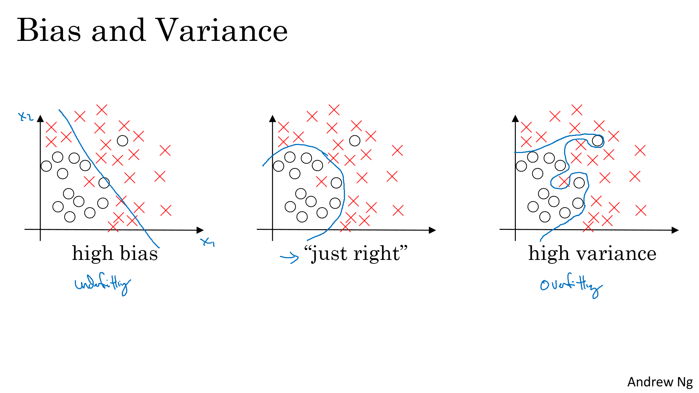
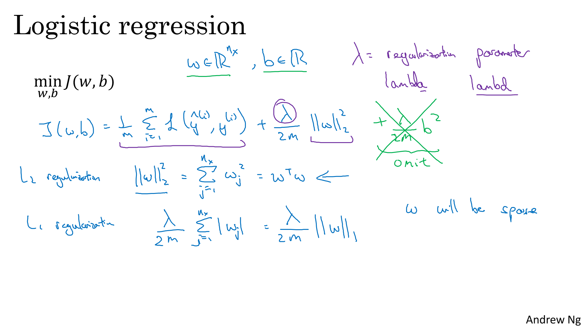
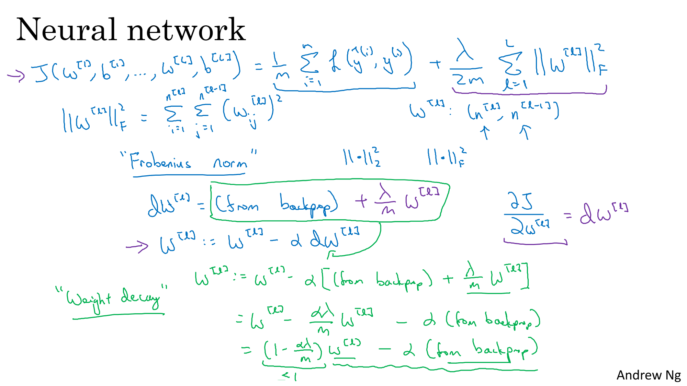
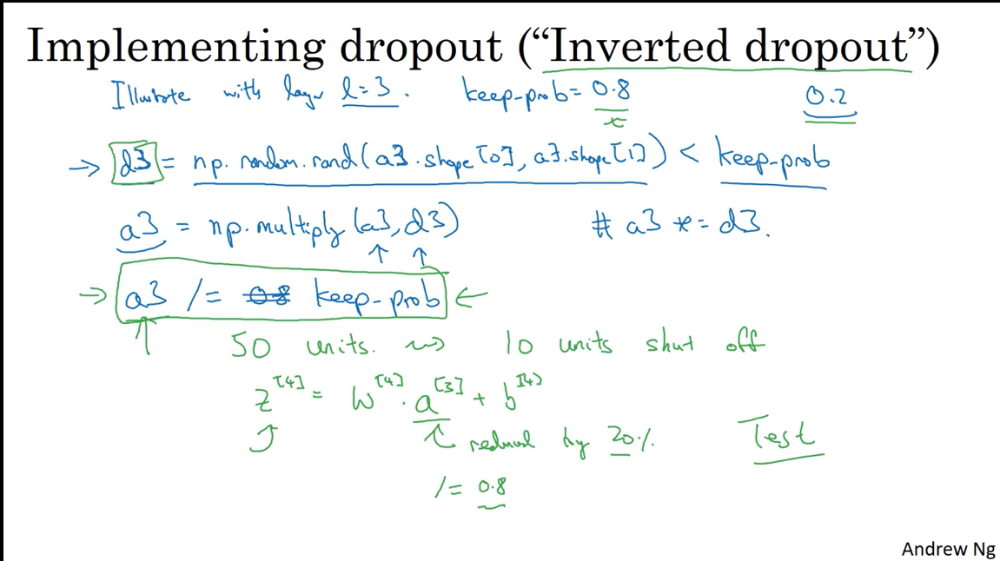
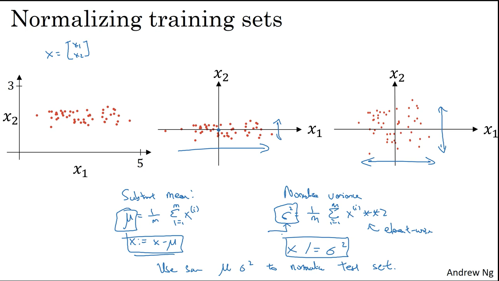
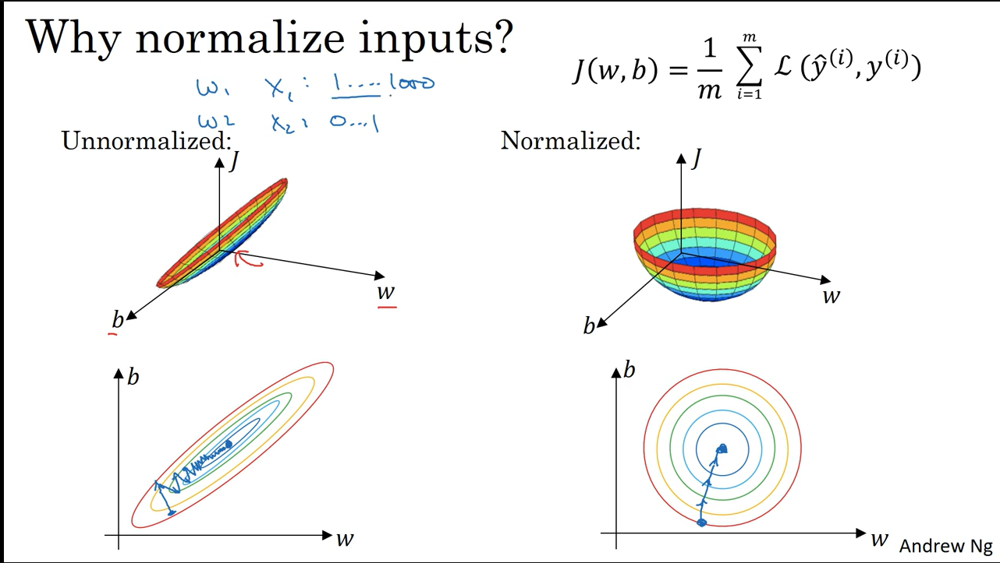
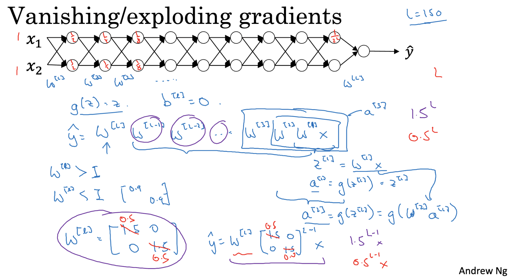
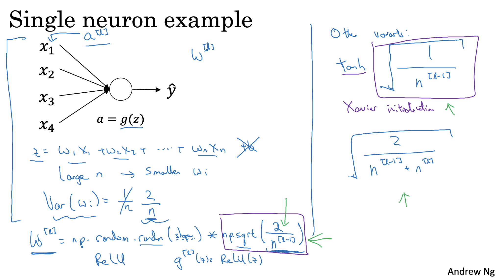
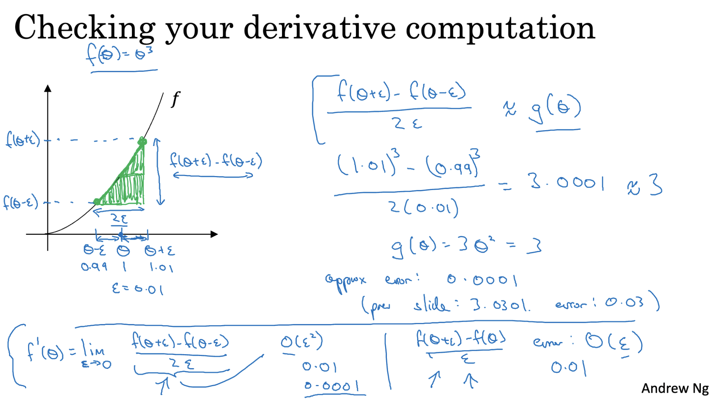
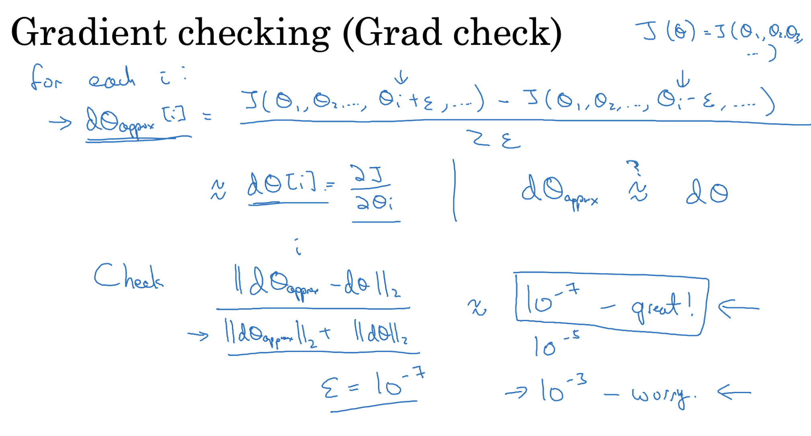

## Train/Dev/Test Sets

Dataset are split into three sets : 
- **Training Set** – Used to train the model and learn parameters.
- **Development (Dev) Set** – Used to tune hyperparameters and compare which model works best.
- **Test Set** – Used for final evaluation of selected model.

### Spliting Ratio 

- **Small Datasets** – (70% Train / 30% Test) or (60% Train / 20% Dev / 20% Test)
- **Large Datasets** – (98% Train / 1% Dev / 1% Test)

> Dev and Test sets should come from the same distribution as the training data.  
> If no Test set is available, the Dev set can act as both Dev and Test, but this increases the risk of overfitting.

---

### Bias and Variance

- **Variance**: Error from overfitting the model to training data, making it too sensitive to small changes.
- **Bias**: Error from oversimplifying the model, causing it to miss important patterns (underfitting).

#### Train Set and Dev Set Error

- **Train Set Error**: The error measured on the data that the model was trained on. It tells us how well the model has learned the training data. 
- **Dev Set Error**: The error measured on a development set not seen during training. It helps to evaluate the model's ability to generalize to unseen data.  

#### Underfitting and Overfitting

- **Underfitting** = When a model is too simple to capture the underlying patterns in the data. The model has poor performance on training and test sets.
- **Overfitting** = When a model learns too much from the training data, including noise and random fluctuations. The model has Excellent performance on training data but poor performance on unseen test data.



---

#### Error Diagnosis Table

| Training Error | Dev Set Error | Model Behaviour                      | Train Set Error % | Dev Set Error % |
|----------------|----------------|----------------------------------|--------------------|------------------|
| High           | High           | High bias (underfitting)         | 15%                | 16%              |
| Low            | High           | High variance (overfitting)      | 1%                 | 11%              |
| High           | Higher         | High bias and high variance      | 15%                | 30%              |
| Low            | Low            | Low bias and low variance (ideal)| 0.5%               | 1%               |

---

#### Bias-Variance Trade-off

It is a balance between a **simple model** (high bias, low variance) and a **complex model** (low bias, high variance) to achieve the best performance on **unseen new data**.

---

### Solutions

#### High Bias (Underfitting)
- Increasing the model complexity by adding more layers or units
- Training model for more epochs/iteration

####  High Variance (Overfitting)
- Collect more training data
- Using regularization (L2, dropout)

---

## Regularization

- Regularization is a technique used in machine learning to prevent overfitting by adding a penalty to the loss function.  
- Especially used when getting more training data is difficult or expensive.  
- It penalizes large weight parameters
- The penalty strength is controlled by the regularization parameter **λ**. 


### L2 Regularization (Weight Decay)
- Adds **(λ / 2m) * ||w||²** to the cost function.
- Called "Weight Decay" because weights shrink slightly at each training step.
- Encourages smaller weights.
- Commonly used in neural networks.

### L1 Regularization
- Adds **(λ / m) * Σ |w[j]|** to the cost function.
- Less common in deep learning compared to L2.

--- 

## Regularization on Logistic Regression

- In Logistic Regression we aim to minimize a cost function J(w, b).  
- To prevent overfitting, regularization is added to this cost function.

##### Regularized Cost Function: **J(w, b) = Original Loss + (λ / 2m) * ∥w∥²**

- λ is the regularization parameter.
- ∥w∥² is the L2 norm, i.e., the sum of the squares of the weights.
- Adding regularization encourages simpler models that generalize better and it helps prevent overfitting by discouraging the model from "memorizing" the training data.



---

## Regularization in Neural Network

- In Neural Networks, regularization is used to reduce overfitting and improve the model's generalization to unseen data.  
- It works by adding a penalty to the cost function to discourage large weight values.

##### Regularized Cost Function: **J(w, b) = Original Loss + (λ / 2m) * ∑ ∥w[l]∥²**

- The summation ∑ ∥w[l]∥² is taken over all layers **l** in the neural network.
- λ is the regularization parameter that controls the strength of the penalty.
- m is the number of training examples.
- Encourages smaller weights across layers to prevent the network from fitting the noise in training data.

By applying regularization, neural networks learn smoother functions, reduce complexity, and perform better on test data.



---

## Why Regularization is necessary ?
- When a neural network learns both the true patterns and the noise in the training data, it performs well on training data but poorly on unseen data. Regularization adds a penalty to the cost function, discouraging large weights. This forces the model to stay simpler, focus on genuine patterns, and avoid memorizing noise.
- When regularization parameter (λ) has high value it penalizes large weights more strongly thus limiting the model’s complexity. This reduces the model's ability to overfit and improves generalization.

---

## Dropout Regularization

**Dropout** is a regularization technique where, during training, we randomly "drop" a subset of neurons in each layer.  
For each training example, a different set of neurons is dropped, forcing the network to learn more robust and generalized features rather than relying on specific neurons.

This process helps **prevent overfitting** by training multiple smaller, randomly modified sub-networks within the main network.



### How Dropout Works

1. **Choose the Dropout Probability** - Define a hyperparameter called **`keep_prob`**, representing the probability that a neuron is kept active during training.  
   Example: `keep_prob = 0.8` means each neuron has an 80% chance of staying on.

2. **Create a Dropout Mask**  
   For a layer’s activation matrix **A**, generate a random binary mask **D** of the same shape.  
   Each element of **D** is:
   - `1` → neuron is kept (with probability `keep_prob`)
   - `0` → neuron is dropped  
   This mask determines which neurons are active in the current training step.

3. **Apply the Dropout Mask**  
   Multiply the activation matrix element-wise with the mask:  
   ```python
   A_dropout = A * D

4. To ensure the overall activation magnitude remains stable, divide by keep_prob: A_scaled = A_dropout / keep_prob

---

## Other Regularization Methods

### Data Augmentation

Data augmentation artificially increases the size of the training dataset by applying transformations to existing data. This helps the model generalize better by exposing it to varied forms of the same input.

Common techniques include: **Horizontal flipping**,**Random rotations**,**Random cropping** etc.

### Early Stopping

Early stopping monitors the model's performance on a dev set during training. If the error starts increasing indicating overfitting, training is stopped early. This prevents the model from **memorizing** the training data and saves training time and **improves generalization** to unseen data.

- Both of these techniques are simple yet powerful tools for building more robust neural networks, especially when data is limited.

---

## Normalization

Normalization ensures that all input features are on a similar scale, which significantly speeds up the training process and improves convergence.THis process is also called as feature scaling.




#### Steps in Normalization:

1. **Mean Subtraction**:  
   Subtract the **mean** μ from each feature in the training set. This centers the data around zero (zero mean).

2. **Variance Scaling**:  
   Compute the **standard deviation** σ^2  of each feature, then divide each feature by σ^2 . This results in unit variance.

-  The same  μ  and σ^2  from the training set must be used to normalize the dev and test sets.

#### Why Normalize?

- Without normalization:
  - Input features may be on very different scales.
  - This leads to an **elongated cost function**, which slows down and complicates gradient descent.

- With normalization:
  - Features are scaled similarly.
  - The **cost function becomes more symmetric and spherical**, helping gradient descent converge **faster and more reliably**.

  

-  Normalization is especially important when using gradient-based optimization algorithms.

---

## Vanishing/ Exploding Gradients

- *General Idea* : While training very deep neural networks sometimes the dervatiives while backpropogation can get very big or very small thus making the training process difficult.
- When the weight matrix 'W' for each layer is initialized to be slightly larger than the identity matrix, the output of the network increases exponentially with the number of layers. This is known as the problem of exploding gradients.
Gradients large causing numerical instability thus making it difficult for the network to train making gradient descent very slow.
- When the weight matrix 'W' for each layer is initialized to be slightly smaller than the identity matrix, the output of the network decreases exponentially with the number of layers. This is known as the problem of vanishing gradients.
This means activations and gradients decrease exponentially, making it hard for the network to learn.

To deal with this it is important to be careful when initializing weights in each layer.



In very deep neural networks, gradients can sometimes:
- Become extremely small (vanishing gradients)
- Or grow excessively large (exploding gradients)

#### Smart Weight Initialization

Instead of initializing weights randomly , we use specific strategies that help control the scale of the outputs and gradients.

### Gaussian Initialization with Scaled Variance

- Initialize weights using a **Gaussian (normal) distribution**.
- But scale the variance depending on the number of inputs (n) to each neuron.

-If we have a neuron with n input features
- With tanh activation function, set the variance of the weights to 1/n
- With ReLU activation function, set the variance of the weights to be 2/n.



# Numerical Approximation of Gradients

- Gradient checking is an technique used to verify the correctness of your backpropagation implementation in neural networks.
- Done by estimating the gradient numerically and comparing it to the one calculated using backpropagation.



### Two-Sided Difference Method

To numerically estimate the gradient of a function `f` with respect to a parameter `θ`, we use the following formula:
 `g(θ) ≈ [f(θ + ε) - f(θ - ε)] / (2 * ε)`

Where:
- `θ` is the parameter (like a weight or bias).
- `ε` is a small constant (e.g., `1e-7`).
- `f(θ)` is the cost function evaluated at that parameter.

Instead of one-sided difference (f(θ + ε)) two-sided is preferred due to more accuracy.


## Gradient Checking
Gradient checking ensures that the gradients computed by your **backpropagation** implementation are correct.  
It works by comparing **analytically computed gradients** with **numerically approximated gradients**.

1. **Reshape and Concatenate**  
   - Reshape all parameters — weights (**W**) and biases (**B**) — into one vector **θ**.
   - Do the same for the gradients (**dW**, **dB**) to form a vector **dθ**.  
   - The cost function **J** is now treated as a function of **θ** instead of individual **W** and **B**.

2. **Approximate the Derivatives**  
   - For each element of **θ**, compute the numerical gradient using the **two-sided difference method**:  
     ```
     g(θ) ≈ [J(θ + ε) - J(θ - ε)] / (2 * ε)
     ```
   - Store these numerical gradients in a vector **dθ_approx**.

3. **Compare the Vectors**  
   - Compare **dθ** (from backprop) with **dθ_approx** (numerical approximation) using a distance metric such as:
     ```
     difference = ||dθ - dθ_approx|| / (||dθ|| + ||dθ_approx||)
     ```
   - If the difference is small (e.g., < 1e-7), the gradients are likely correct.



## Gradient Checking – Implementation Notes

- Use only for debugging, not during actual training.
- Include regularization terms in both cost and gradient calculations.
- If gradient check fails, inspect each layer/component individually.
