# Batch vs Mini-Batch Gradient Descent
- **Batch Gradient Descent** calculates gradients using the entire dataset before updating parameters. While this provides precise updates, it becomes slow and resource-intensive for very large datasets.
- **Mini-Batch Gradient Descent** improves efficiency by splitting the dataset into smaller subsets (mini-batches), allowing quicker updates and faster learning.
- Using mini-batches enables vectorized computation, which takes advantage of parallel processing on GPUs and accelerates training.

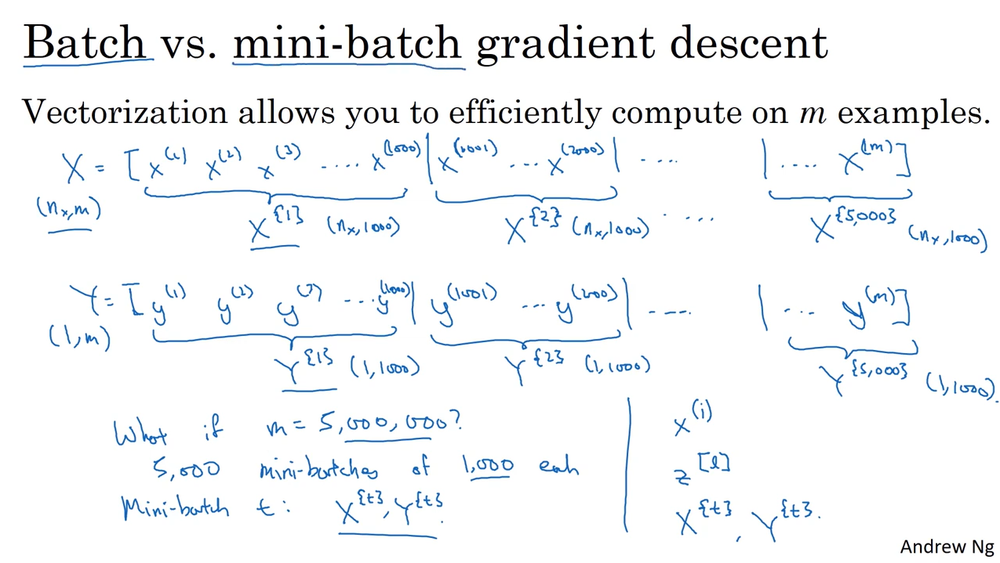

---

## Mini-Batch Process
1. Split data into batches of fixed size (e.g., 32, 64, 128, 256, 512)
2. For each batch: forward pass → loss → backprop → parameter update.
3. Repeat for all batches in each epoch.

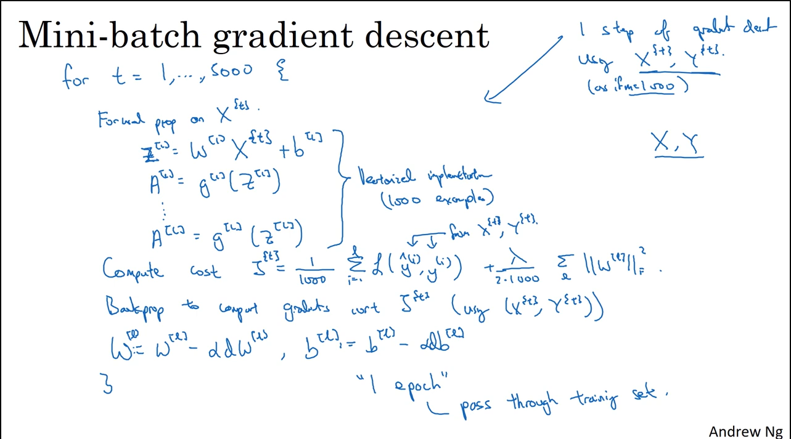

### Choosing Mini Batch Size
- Types of Gradient Descent by Mini-Batch Size
  - If m = total training set, then it is normal batch gradient descent.(Slow But Stable)
  - If m = 1, then it is Stochastic Gradient Descent (SGD). (Fast But Noisy)
  - If 1 < m < total size, then it is mini batch gradient descent. (Fast and stable and it is widely used)

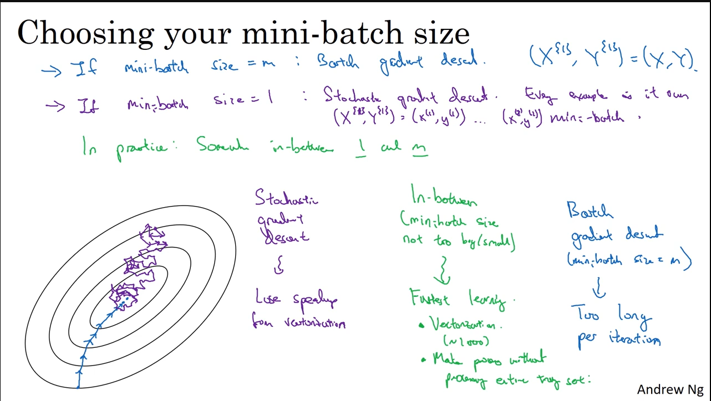

---

# Exponentially Weighted Averages
- It is an optimazation method to smooth out noisy data or track rends over time.
- It gives more weight to recent values and less to older ones.

vt = βv(t−1)​ + (1−β)θt
​
- Where:
  - vt = Current Average
  - β = Smoothing Factor (usually close to 1 like 0.9 or 0.99)
  - θt = Current Data Point
  - vt-1 = Previous Average

- High β (e.g., 0.98): Smoother, slower response, less noise.
- Moderate β (e.g., 0.9): Balanced smoothness and responsiveness.
- Low β (e.g., 0.5): Faster response, noisier.

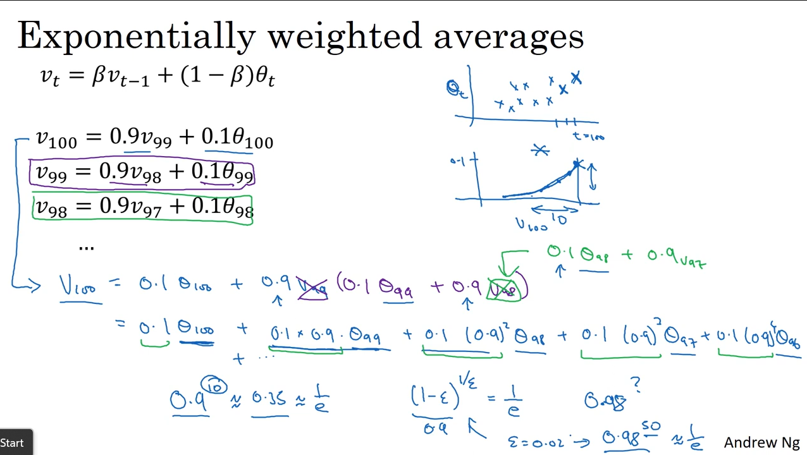

*Bias Correction*

- Bias correction is a technique used to improve the accuracy of exponentially weighted averages, especially during the initial phase when the estimate may be skewed or less accurate.
- When you first initialize the exponentially weighted average with zero, the early estimates can be biased low. Bias correction helps adjust these early estimates to be more accurate.
- To correct this bias, you divide the moving average by a correction factor 1 - β^t.
- Bias Correction Formula: Vt_corrected = Vtcorrected = Vt/(1 - β<pow>t</pow>)
- During the initial phase of the moving average, bias correction significantly improves the accuracy of the estimates.
- As t becomes large, the term β^t approaches zero, so the bias correction has less impact.

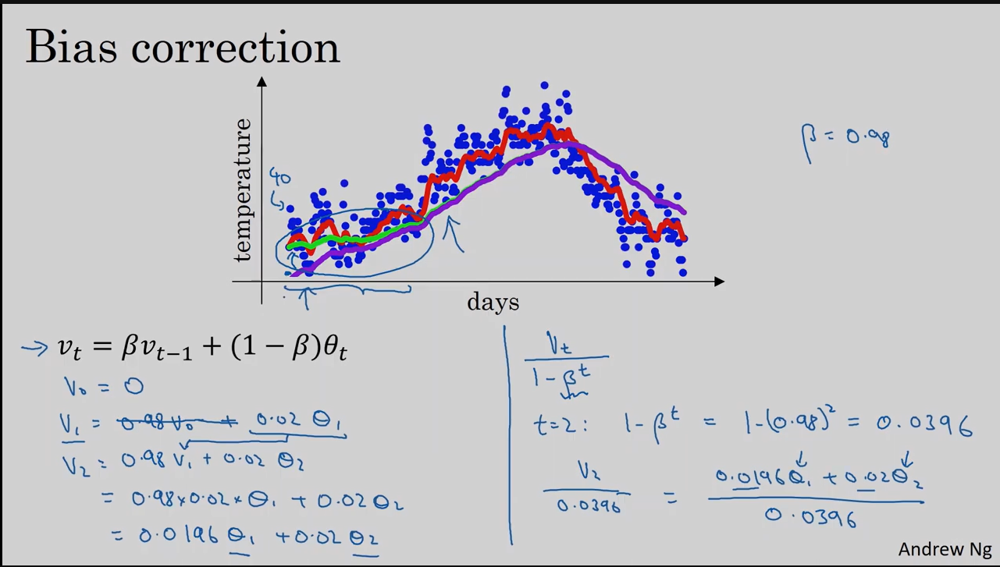

## Gradient Descent with Momentum
Gradient Descent with Momentum is an optimization technique used to train models faster and more smoothly.

- Standard Gradient Descent can be slow and may get stuck in local minima.
- Momentum helps the optimizer to build velocity, enabling it to move faster in relevant directions and dampen oscillations.

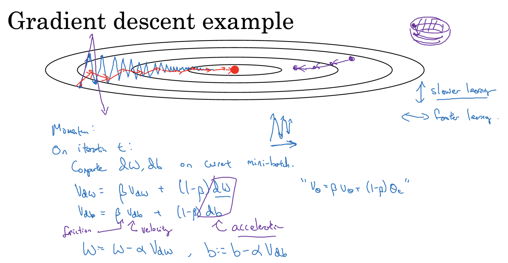

Let:
- `v` = velocity (accumulated gradient)
- `β` = momentum hyperparameter (typically 0.9)
- `θ` = parameters (weights)
- `α` = learning rate
- `∇J(θ)` = gradient of the cost function

Step-by-step:
1. *Initialize*: `v = 0`
2. *Update velocity*:  `v = β * v - α * ∇J(θ)`
3. *Update parameters*:  `θ = θ + v`
vdW = β vdW + (1 - β) dw -> W = W - learning_rate * vdW
vdb = β vdb + (1 - β) db -> b = b - learning_rate * vdb

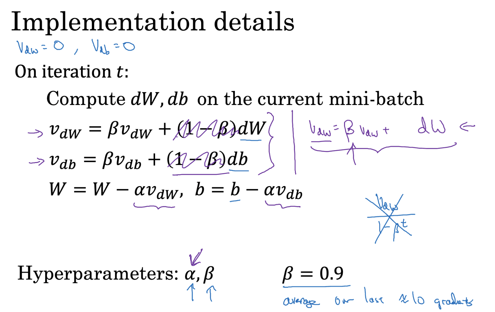

# RMSprop : Root Mean Square Propogation
- RMSprop is an adaptive learning rate optimization algorithm that improves convergence by controlling oscillations during training.
- In standard Gradient Descent, the same learning rate is applied to all parameters causing instability when the gradients vary in scale, especially in directions with steep curvature (vertical oscillations).
- RMSprop adapts the learning rate for each parameter, helping the algorithm stabilize and converge faster.

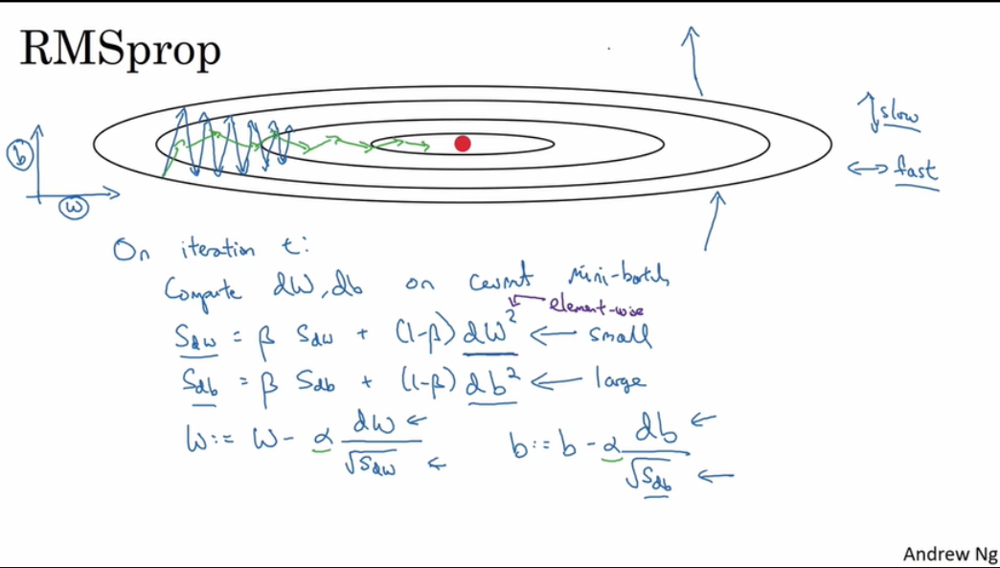

---

# Adam Optimizer (Adaptive Moment Estimation)
- Adam is a popular optimizer that blends the ideas of **Momentum and RMSprop** to train deep learning models quickly and reliably.
- Momentum remembers the general direction from past updates, which helps keep training steady and avoids random zigzags.
- RMSprop changes the step size for each parameter depending on how steep or flat the loss surface is, preventing jumps that are too big or too small.

- How Adam works:
  - It keeps track of two running averages — one for the gradients and one for the squared gradients.
  - In each training step, these averages are updated using the latest gradient information.
  - The parameters are then updated using both of these averages, allowing each parameter to have its own adjusted learning rate.

This mix of remembering past steps and adjusting step sizes makes Adam both stable and efficient

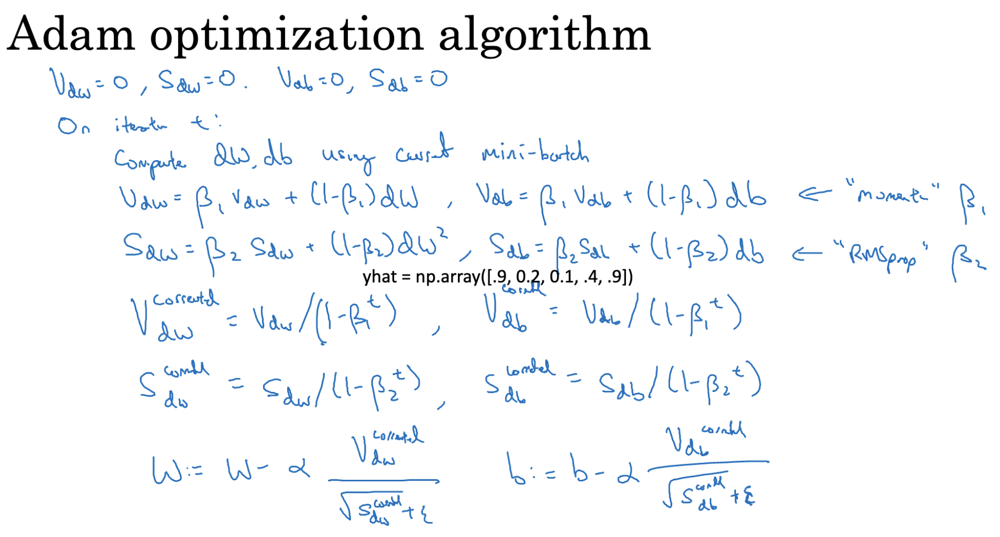

---

## Hyperparameter Choice
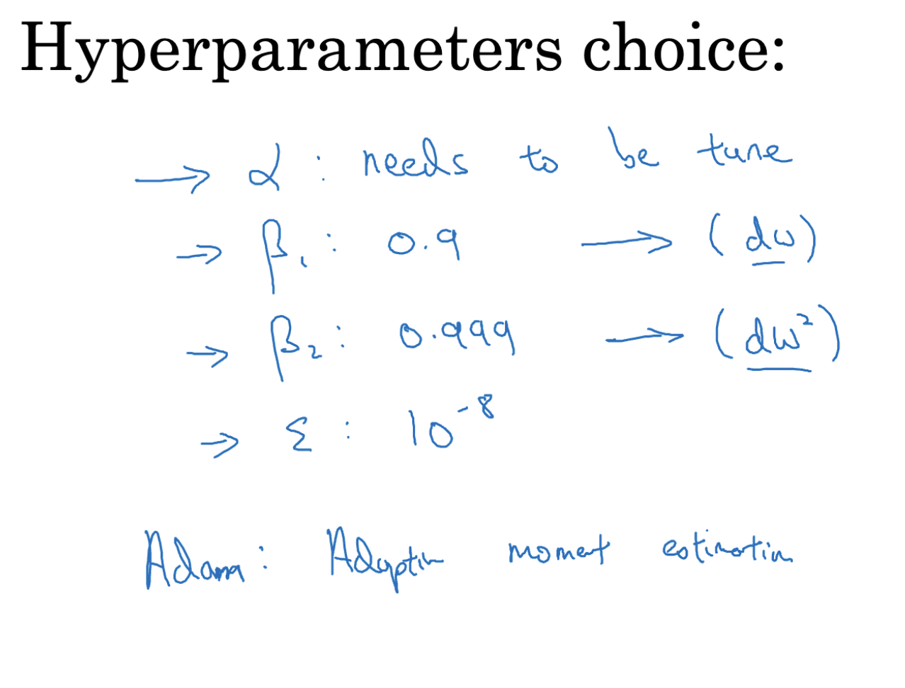

---

## Learning Rate Decay
- Learning rate decay is a method used to improve training by slowly lowering the learning rate as the model learns.
- At the start, a higher learning rate lets the model learn faster and explore many possible solutions.
- Over time, the learning rate is reduced so the model can make smaller, more careful adjustments to its parameters.
- This gradual slowdown helps the model fine-tune its learning and reduces the risk of getting stuck in bad solutions.
α = (1 / (1 + decay_rate * epoch_num)) * 𝛼(0)

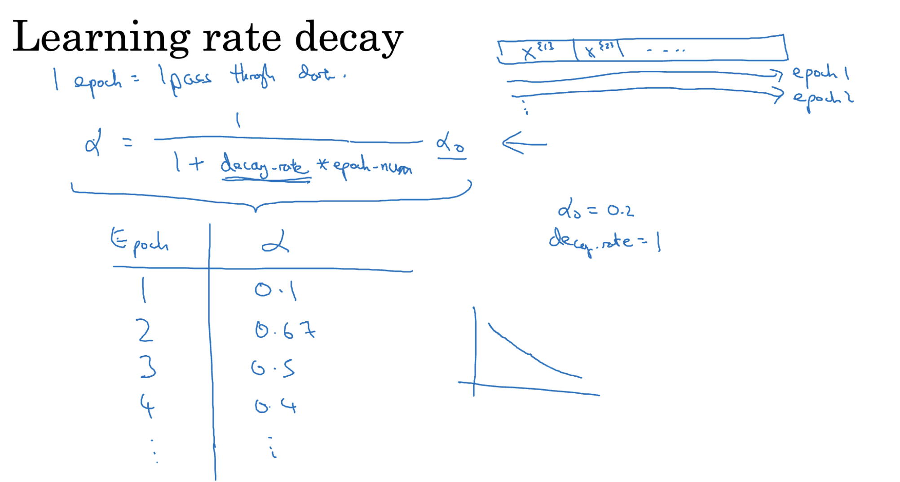

#### Other learning rate decay

1. `α = constant / sqrt(epoch_num) * α(0)`
2. `α = α(0) * e^(-decay_rate * epoch_num)`
3. `α = α(0) * decay_rate^(floor(epoch_num / decay_steps))`

---
