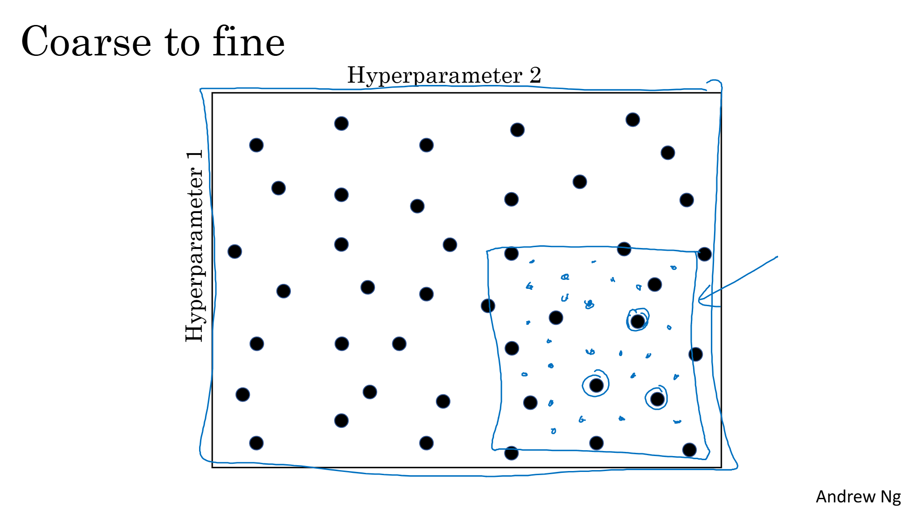
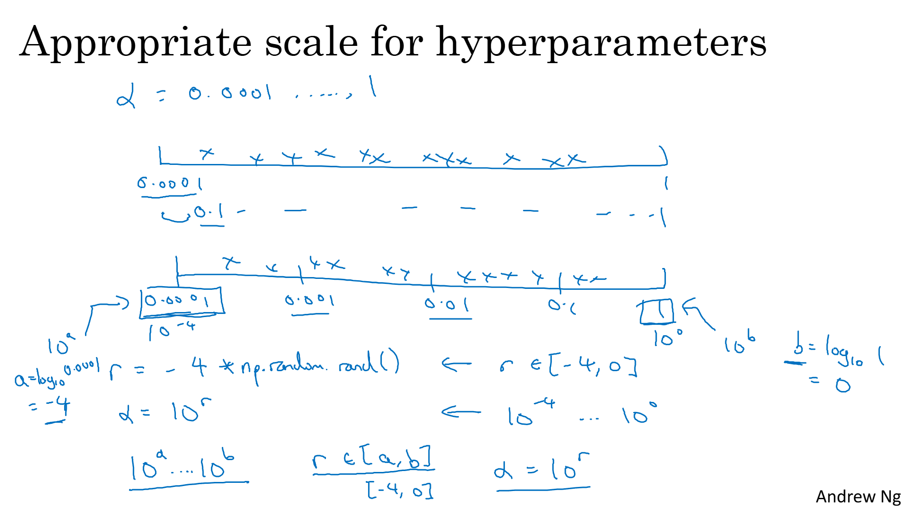
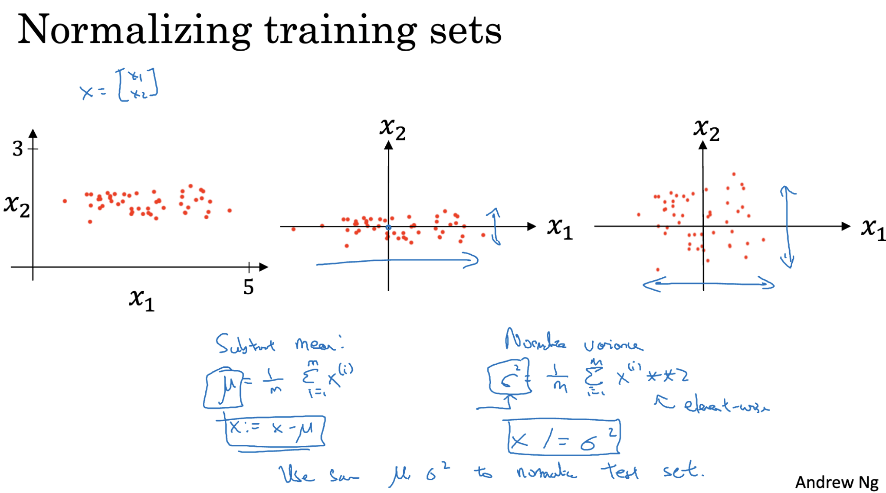
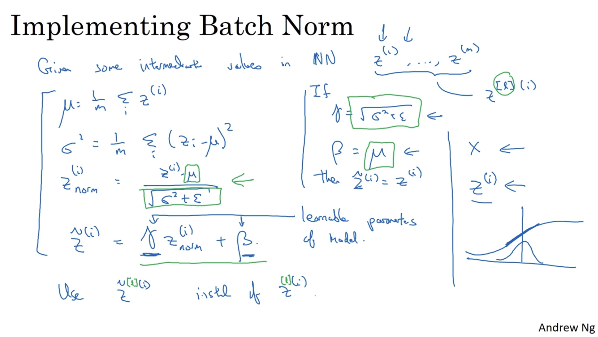
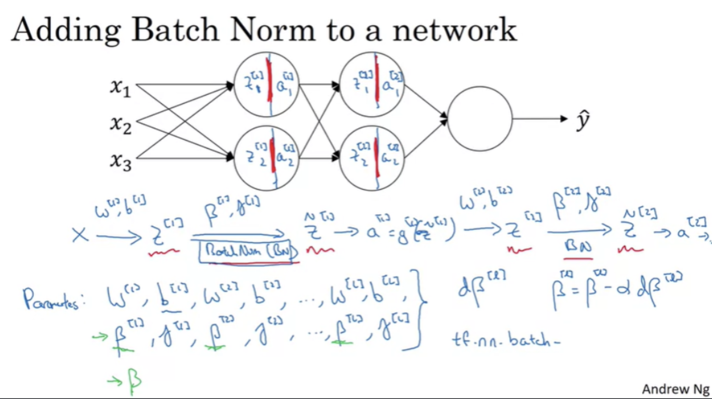
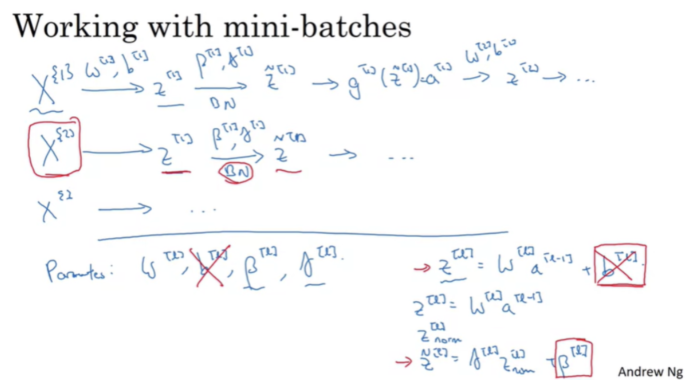
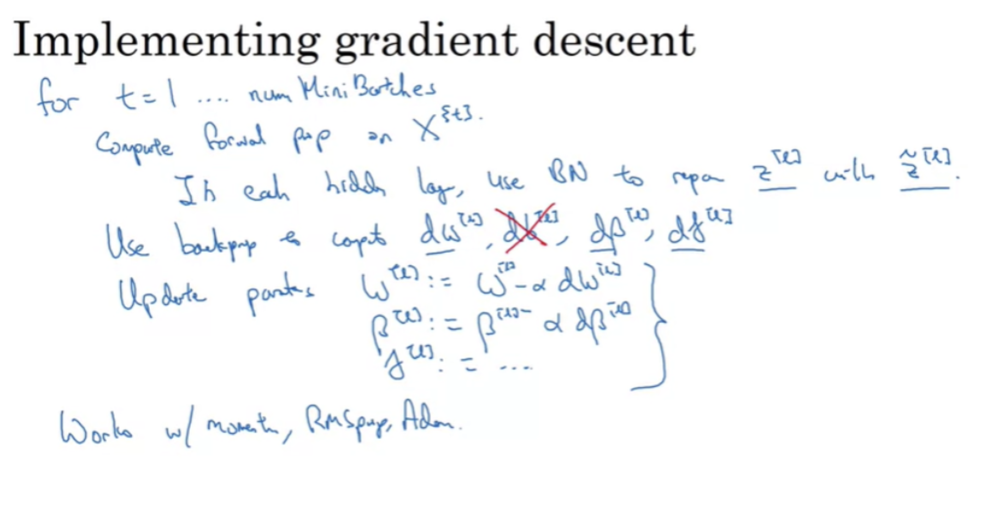
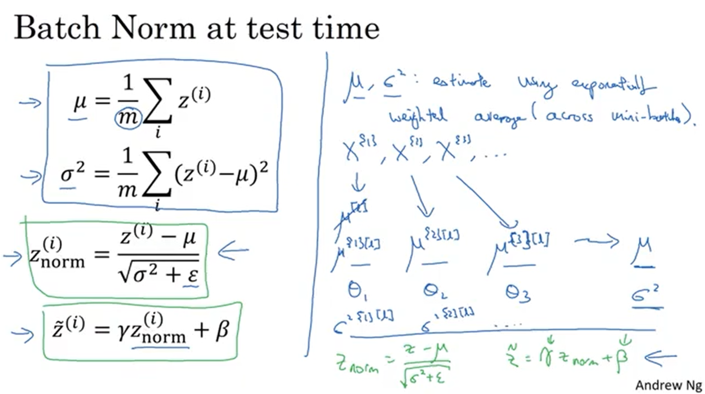
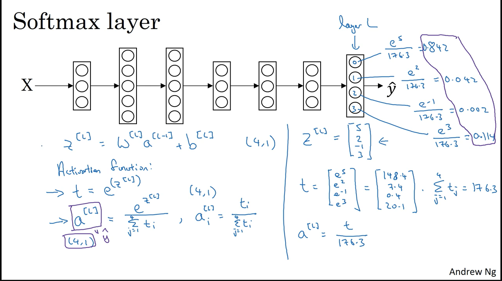
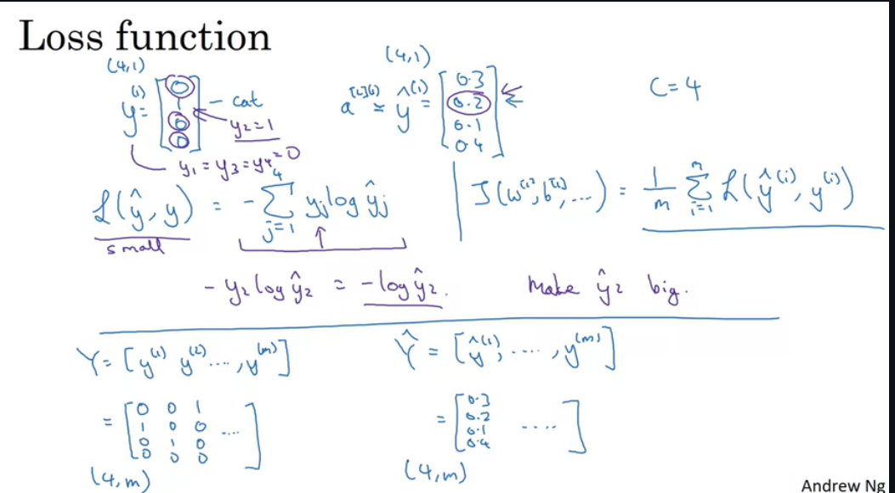

# Hyperparameter
- Hyperparameters are the parameters that guide us during the training process. Unlike model parameters, they are not learned from the training data — instead, they are set beforehand and can be tuned accordingly to improve performance. They influence how the model’s parameters are updated during training. 

Important hyperparameters include:
- *Learning Rate* - controls how fast the network learns on the data. Most critical hyperparameter.
- *Momentum term* – accelerate the training process and reduces oscillations.
- *Mini-batch size* – determines the number of examples processed before each parameter update.
- *Regularization parameters* – such as L2 penalty, L1 or dropout rate to prevent overfitting.
- *Activation function selection* – e.g., ReLU, sigmoid, tanh, softmax etc.
- *Number of hidden layers*
- *Number of neurons per layer*

---

## Hyperparameter Tuning
Earlier, hyperparameter tuning often used grid search, testing evenly spaced all combinations, but it became inefficient as number of hyperparameters increased.
Now **Random Sampling** has taken over grid-search , it picks random values for parameters and covers more possibilities and is more efficient, especially when it’s unclear which hyperparameters will have the greatest impact.

---

### Coarse-to-Fine Search
Start with a broad search over a wide value range, then focus on promising regions with finer sampling. This systematic approach helps identify the hyperparameter combination that best optimizes network performance.

---

Choosing the correct scale for hyperparameters is crucial, as it can significantly influence the training process and final performance of a model.
- For hyperparameters with a small countable and narrow range (hidden units: 50–100, layers: 2–4), we use **uniform scaling** as each value is equally likely to exist.
- For hyperparameters with a wide range (learning rate α, decay rates β), we use **logarithmic scaling** to avoid oversampling some regions and neglecting others.

Example:

If α ranges from 0.0001 to 1, uniform sampling would concentrate most values between 0.1 and 1, skipping much of the lower end, thus we prefer using logarithmic scaling ( evenly sampling )

0.0001 can be written as 10^-4
R = -4 * np.random.rand()  
α = 10 ** R                
1 can be written as 10^0
- Random number between -4 and 0
- Learning rate between 10^-4 and 1

This approach ensures even sampling near extreme values (especially close to 1), where small changes can have a big impact.

---

### Approaches to Hyperparameter Tuning

1. Babysitting Approach : Train a single model at a time, adjust the hyperparameters, and closely monitor its performance.
  - Best suited when limited computational resources are avaiable.
  - Allows for careful observation and manual fine-tuning.

2. Parallel Training : Train multiple models simultaneously, each with different hyperparameter settings, and compare their results to identify the best configuration.
  - Suitable when ample computational resources are available.
  - Speeds up the search process and is useful for large-scale tuning.

---

## Batch Normalization
Batch Normalization is a technique used to speed up training and improve stability in deep neural networks by normalizing the inputs to each layer.
Normalizing input features means (subtracting the mean and dividing by the standard deviation) helping to speed up learning and improve training stability.

  

### How it works (per mini-batch):

1. For all activations Z in a given layer, calculate the mean across the mini-batch.
2. Calculate the variance of these activations to measure how much they deviate from the mean.
3. Subtract the mean from each activation and Divide by the standard deviation so they have unit variance. (Normalizing Activations)
4. Multiply by a learnable parameter γ (gamma) to control the spread of the activations and Add a learnable parameter β (beta) to shift the mean as needed.

### Fitting Batch Normalization into a Neural Network
1. Batch Normalization Step
- Normalize the activations using the procedure described earlier (mean, variance, scaling, and shifting).
- After normalization, apply the activation function (e.g., ReLU, Sigmoid) to the adjusted values.
2. Forward Propagation
- Pass the activated outputs through each layer of the network.
- Apply Batch Normalization at each layer to keep the inputs to that layer at a consistent mean and variance. 
3. Backpropagation
- Compute the gradients of the loss with respect to both the weights W and the Batch Norm parameters γ (gamma) and β (beta).
- No gradients are computed for the bias term b, as it is effectively canceled out during normalization.
4. Parameter Updates
- Update W, γ, and β using their respective gradients.
- Use optimization algorithms such as Gradient Descent or Adam for efficient updates.
5. Training Iterations
- Repeat the forward and backward passes, continually refining the parameters to minimize the loss function.

---

### Implementing Gradient Descent using Batch Normalization

---

## Why Does Batch Normalization Work?
1. Normalizing Input Features
- Ensures that input features are scaled to a similar range.
- Speeds up learning by keeping feature distributions consistent across the network.

2. Improving Robustness
- Makes the network more resilient to changes in input distribution.
- Example: A model trained on black cats can generalize better to colored cats.

3. Regularization Effect
- Introduces small noise due to mini-batch statistics, similar to a mild form of dropout.
- Helps reduce overfitting, though the effect weakens with larger batch sizes.

4. Training vs. Testing
- Training: Uses the mean and variance of the current mini-batch for normalization.
- Testing: Uses running averages of mean and variance collected during training for consistent results.

---

### Multi-Class Classification
- Binary classification uses logistic regression to predict one of two possible outcomes for a given input. (e.g., 0 or 1).
- When there are more than two possible classes, we use Softmax Regression (also called multinomial logistic regression).
- Softmax outputs a probability for each class, with all probabilities summing to 1.
- The class with the highest probability is chosen as the prediction.

--- 

## Softmax Regression
Softmax Regression (also called multinomial logistic regression) is a generalization of logistic regression for multi-class classification problems.
- It is used to classify inputs into one of C possible classes.
- The output layer contains C units, each representing a class.
- The Softmax activation function is used to convert raw scores into probabilities.
- Each unit outputs the probability of the input belonging to its class.
- These probabilities always sum to 1.

How it works:

1. For the final output layer, compute:

`Z=W⋅(activation from previous layer)+b`

where W is the weight matrix and b is the bias vector.

2. For each score Z(i), calculate: `T(i)=e^Z(i)`
 
3. Normalization (Softmax Function) - Convert scores into probabilities

`a(i) = e^Z(i)/Σ(e^Z(j))`
  
where a(i) is the probability of class i, and the denominator is the sum of exponentiated scores for all C classes.

The class with the highest probability is chosen as the prediction.

---

### Training a softmax classifier:

- Softmax vs Hard Max:

  - Softmax produces a probability distribution over all classes, with the probabilities summing to 1.
  - Hard Max assigns a probability of 1 to the class with the highest score and 0 to all others.

Steps to Train a Softmax Classifier:
  - 1. Forward Pass:
      - For the final layer, compute the score vector Z:
         - `𝑍 = 𝑊 ⋅ activation of previous layer + 𝑏`
         - Where W is the weight matrix and b is the bias vector.

  - 2. Apply Softmax Activation:
        - We calculate a temporary variable called `T` by taking the exponential of the values in the output layer.
        - Compute element-wise exponentiation: `T(i) = e^Z(i)`.
        - Then we apply normalization to all exponentiated values T in the output layer such that they add up to 1. Giving us the probabilities for each category.
        - The normalization means the probablity of each T(i) value in output layer which is :
           - `a(i) = e^Z(i)/Σ(e^Z(j))` where j ranges from 1 to C.
           - Where a(i) is the probability for class i, C is the number of classes.

  - 3. Define Loss Function:
   - Use the cross-entropy loss function for softmax classification.
     - For a single training example with target class `y` and predicted probabilities `p`, the loss is:
       - `L = -log(p(y))`
     - For the entire training set, the loss function is the average cross-entropy loss over all examples:
       - `J = -1/m Σ (y * log(p))` where `m` is the number of training examples.

  - 4. Gradient Computation:
    - Compute the gradients of the loss function with respect to the weights and biases.
    - The derivative of the cost w.r.t. `Z` at the output layer is:
     - `∂J/∂Z = Y_hat - Y`
     - Where `Y_hat` is the predicted probabilities and `Y` is the one-hot encoded true labels.

  - 5.Parameter Update:
   - Use gradient descent or other methods to update the weights and biases.
     - `W = W - learning_rate * ∂J/∂W`
     - `b = b - learning_rate * ∂J/∂b`

  - 6. Repeat Until Convergence:
    - Repeat steps 1-5 for a number of iterations or until the loss converges to a minimum value.
    

---