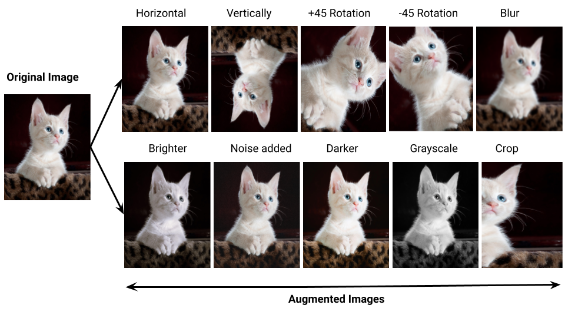

### **Classic Neural Network Architectures**

- **LeNet-5**:
  - **Purpose**: Recognizes handwritten digits (e.g., from images).
  - **Input**: 32x32 grayscale images (black and white, no color).
  - **Structure**:
    - Convolution Layer 1: 6 filters (5x5) extract features → 28x28x6 output.
    - Pooling Layer 1: Average pooling (2x2) reduces size → 14x14x6.
    - Convolution Layer 2: 16 filters (5x5) → 10x10x16.
    - Pooling Layer 2: Average pooling (2x2) → 5x5x16.
    - Fully Connected Layers: Flatten to 400 nodes, connect to 120, then 84, then 10 outputs for digits 0-9.
  - **Why Simple**: Early CNN for basic tasks; uses convolutions and pooling to learn patterns like lines.

- **AlexNet**:
  - **Purpose**: Classifies general images (e.g., 1,000 categories).
  - **Input**: 227x227 RGB images (color).
  - **Structure**:
    - Convolution Layer 1: 96 filters (11x11), stride = 4 → 55x55x96.
    - Pooling Layer 1: Max pooling (3x3) → 27x27x96.
    - Convolution Layer 2: 256 filters (5x5) → 13x13x256.
    - Pooling Layer 2: Max pooling (3x3) → 6x6x256.
    - Fully Connected Layers: Flatten to 9,216 nodes, connect to two 4,096-node layers, then softmax for 1,000 classes.
  - **Why Effective**: Deeper than LeNet; won image contests by handling complex features.

- **VGG-16**:
  - **Purpose**: Simplified image classification.
  - **Input**: 224x224 RGB images.
  - **Structure**:
    - Convolution Layers: Start with 64 filters (3x3) → 224x224x64, then max pooling → 112x112x64.
    - Increase filters (128, 256, 512) in groups, with pooling after each to halve size.
    - Fully Connected Layers: Flatten final maps, connect to two 4,096-node layers, then softmax for 1,000 classes.
  - **Why Simple**: Consistent 3x3 filters and pooling; easy to build, but deep (16 layers).

---

### **ResNets (Residual Networks)**

- **What It Is**: CNNs with **skip connections** (shortcuts) to train very deep networks (e.g., 100+ layers) without problems like vanishing gradients.
- **How It Works**:
  - **Traditional Path**: Data flows sequentially: $ a^{[L+2]} = g(Z^{[L+2]}) $, where  g  is an activation like ReLU.
  - **Residual Block**: Add shortcut: $ a^{[L+2]} = g(Z^{[L+2]} + a^{[L]}) $, skipping layers.
    - Formula: Skip adds input $ a^{[L]} $ to deeper output before activation.
  - **Building ResNets**: Stack residual blocks (e.g., 34 or 152 layers); use 1x1 convolutions if dimensions don’t match.
- **Why It Works**:
  - Skip connections let the network learn “identity” (output = input) easily, so extra layers don’t hurt performance.
  - Prevents degradation in deep networks; gradients flow better.
- **Example**: In image recognition, ResNet-50 detects objects accurately by skipping layers, outperforming shallower networks.

---

### **1x1 Convolution (Network in Network)**

- **What It Is**: A convolution with a 1x1 filter, acting like a single neuron per pixel across channels.
- **How It Works**:
  - For a 6x6x3 image, a 1x1x3 filter multiplies each pixel’s 3 channels by weights, sums, and applies activation.
  - Multiple filters (e.g., 32) create a new output with reduced/expanded channels (e.g., 6x6x32).
  - Formula: Output value = sum of (input channels × filter weights) + bias, then activation.
- **Why Useful**:
  - **Shrinks Channels**: Reduces computation (e.g., from 32 to 5 channels).
  - **Adds Non-Linearity**: Combines channels without changing height/width.
- **Example**: In a CNN, 1x1 convolution compresses 6x6x32 features to 6x6x5, saving resources while learning patterns.

---

### **Inception Network**

- **What It Is**: A CNN that uses multiple filter sizes (e.g., 1x1, 3x3, 5x5) in one layer to capture features at different scales.
- **How It Works**:
  - **Inception Module**: Apply different convolutions (1x1, 3x3, 5x5) and pooling to input, then concatenate outputs.
  - **Bottleneck**: Use 1x1 convolutions to reduce channels before larger filters, saving computation.
    - Example: 1x1 convolution shrinks channels, then apply 5x5 filter.
- **Building Inception**: Stack modules (e.g., 22 layers); add side branches for predictions to regularize.
- **Why It Works**: Combines filter types for rich features without too much computation.
- **Example**: Classifies images efficiently, winning contests by detecting multi-scale patterns like edges and shapes.

---

### **MobileNet**

- **What It Is**: A lightweight CNN for mobile devices, using **depthwise separable convolutions** to reduce computation.
- **Depthwise Separable Convolution**:
  - **Standard Convolution**: One filter processes all channels (high computation).
  - **Depthwise**: One filter per channel (e.g., 3x3 on each RGB channel separately).
  - **Pointwise**: 1x1 convolution combines outputs.
    - Formula: Reduces multiplications from $ h \times w \times c \times f^2 \times k $ to $ h \times w \times c \times (f^2 + k) $.
- **MobileNet v1**: 13 depthwise separable layers + pooling + fully connected + softmax.
- **MobileNet v2**: Adds residual connections and bottleneck blocks:
  - **Expansion**: 1x1 convolution expands channels (e.g., 6x6x3 → 6x6x18).
  - **Depthwise + Pointwise**: Process and compress back (e.g., to 6x6x3).
  - Repeats 17 blocks for efficiency.
- **Why It Works**: Low power, fast on phones; reduces operations by 75-90%.
- **Example**: Mobile app for object detection runs quickly on a phone.

---

### **EfficientNet**

- **What It Is**: A CNN that scales depth, width, and resolution together for better performance with less computation.
- **How It Works**: Use a formula to balance network size based on resources (e.g., more depth for stronger devices).
- **Why It Works**: Efficient scaling outperforms fixed-size models like MobileNet.
- **Example**: On low-power devices, EfficientNet detects images faster and more accurately than ResNet.

---

### **Practical Advice for Using ConvNets**

- **Transfer Learning**:
  - Use a pre-trained CNN (e.g., on ImageNet) as a starting point for your task.
  - Freeze early layers (keep weights), train later layers on your data.
  - Saves time/resources; great for small datasets.
  - Example: Use pre-trained ResNet for dog breed classification—fine-tune on dog images.

- **Data Augmentation**:
  - Artificially expand your dataset by modifying images (e.g., flip, crop, shift colors).
  - **Techniques**:
    - Mirroring: Flip horizontally (if it doesn’t change meaning).
    - Random Cropping: Crop random parts to learn varied views.
    - Color Shifting: Adjust RGB values for lighting variations.
  - Why: Improves model robustness, prevents overfitting.
  - Example: For cat images, flip or crop to create "new" training data, helping the model generalize.

---

- **ResNets**: “Like shortcuts in a maze—skip layers to go deeper without getting lost.”
- **1x1 Convolution**: “Shrinks or combines color layers in an image, like summarizing a story.”
- **Inception**: “Uses different-sized magnifying glasses at once to see small and big details.”
- **MobileNet**: “A slim CNN for phones—splits work into simple steps to run fast.”
- **EfficientNet**: “Smartly grows the network to fit your phone’s power.”
- **Transfer Learning**: “Borrow a pre-built house and just decorate it for your needs.”
- **Data Augmentation**: “Flip or tweak photos to make more training examples, like remixing songs.”
