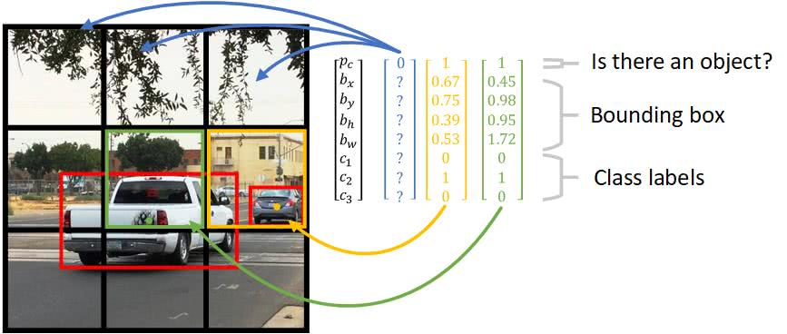
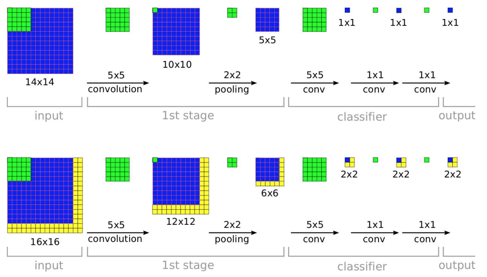
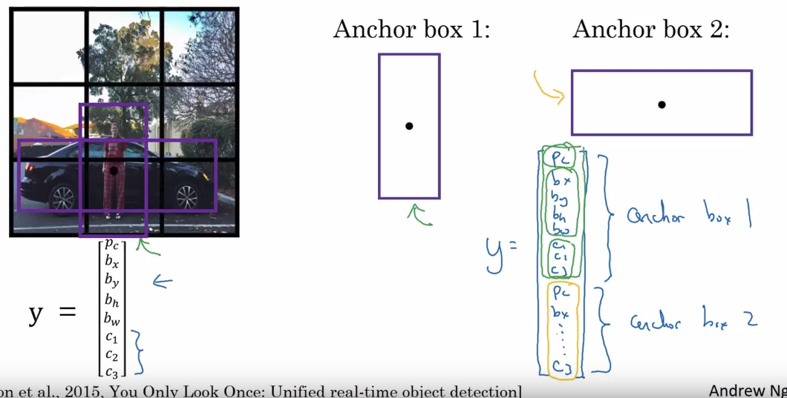

### **C4W3L01: Object Localization**

 Object localization extends image classification by not only identifying what an object is (e.g., "car") but also determining its location in an image using a bounding box. This is a foundational step for object detection.

- **Classification vs. Localization**:
  - Classification: Outputs a class label (e.g., "car").
  - Localization: Outputs a class label and bounding box coordinates ($ b_x, b_y $ for center, $ b_h, b_w $ for height/width).
- **Output Vector**: 
  - For an object: $ Y = [P_c, b_x, b_y, b_h, b_w, c_1, c_2, c_3, ...] $
    - $ P_c $: Probability an object exists (1 if present, 0 if not).
    - $ b_x, b_y $: Center coordinates of the bounding box.
    - $ b_h, b_w $: Height and width of the bounding box.
    - $ c_1, c_2, c_3, ... $: Class probabilities (e.g., pedestrian, car, motorcycle).
  - If no object ($ P_c = 0 $): Other components are irrelevant ("don't care").
- **Loss Function**:
  - If $ P_c = 1 $: Minimize loss for all components (e.g., cross-entropy for classes + squared error for box coordinates).
    - Example: $ L = -[y \log(\hat{y}) + (1-y) \log(1-\hat{y})] + (b_x - \hat{b}_x)^2 + ... $
  - If $ P_c = 0 $: Minimize only $ P_c $ loss (e.g., $ -\log(1-\hat{P}_c) $).
- **Training**: Use labeled images with class and bounding box annotations to train a CNN.

**Example**: In a self-driving car system, a CNN processes an image, outputs "pedestrian" with a bounding box around the person’s location, helping the car avoid collisions.

**Why It Matters**: Localization is the first step toward detecting multiple objects in complex scenes, critical for applications like autonomous driving.

---

### **C4W3L02: Landmark Detection**

 Landmark detection identifies specific points (landmarks) on an object, such as facial keypoints (e.g., eyes, nose) or joints in pose estimation.

- **Goal**: Predict coordinates ($ x, y $) for predefined landmarks.
- **Output**: Vector of coordinates, e.g., $ Y = [l_1x, l_1y, l_2x, l_2y, ..., l_nx, l_ny] $ for $ n $ landmarks.
- **Training**:
  - Dataset: Images with manually annotated landmark coordinates.
  - CNN: Takes image input, outputs landmark coordinates.
  - Loss: Minimize error between predicted and true coordinates (e.g., squared error: $ L = \sum (l_{ix} - \hat{l}_{ix})^2 + (l_{iy} - \hat{l}_{iy})^2 $).
- **Applications**: Face recognition (e.g., aligning faces), emotion detection, pose estimation, augmented reality (AR) filters.

**Example**: In an AR app, a CNN detects 68 facial landmarks to accurately place virtual glasses on a user’s face.

**Why It Matters**: Provides precise feature localization, enabling applications requiring detailed spatial understanding.

---

### **C4W3L03: Object Detection**

 Object detection identifies and locates multiple objects in an image, combining classification and localization for each object.

- **Sliding Windows Detection**:
  - **Training Set**: Images with and without objects, labeled with class and bounding box.
  - **Classifier**: Train a CNN to classify regions (e.g., "car" or "no car").
  - **Process**:
    - Slide a window across the image at different positions/sizes.
    - Classify each window to detect objects.
    - Record positive detections with bounding boxes.
  - **Challenges**:
    - Slow: Many windows (e.g., thousands for a 1000x1000 image).
    - Smaller strides improve accuracy but increase computation.
- **Output**: Multiple bounding boxes with class labels.

**Example**: A security camera scans an image, detects multiple people and cars, and outputs bounding boxes for each.

**Why It Matters**: Enables detecting multiple objects in real-world scenes, foundational for advanced detection systems.

---

### **C4W3L04: Convolutional Implementation of Sliding Windows**

 Optimizes sliding windows for object detection by using convolutional layers to process the entire image at once, sharing computations.

- **Traditional Sliding Windows**:
  - Crop small regions (e.g., 14x14) and run each through a CNN.
  - Problem: Repeated computations for overlapping regions, very slow.
- **Convolutional Approach**:
  - Process the entire image (e.g., 16x16x3) with convolutional layers.
  - Example:
    - Input: 16x16x3 image.
    - Conv Layer: 5x5 filters → 12x12x16 feature maps.
    - Max Pooling: Reduces to 6x6x16.
    - Final Conv (1x1): Outputs 1x1x4 (class probabilities for each region).
  - **Fully Convolutional Network (FCN)**: Replaces fully connected layers with 1x1 convolutions for efficiency.
  - **Shared Computation**: Convolutions apply to all regions simultaneously, reducing redundant calculations.
- **Output**: Grid of predictions (e.g., 2x2x4 for a 16x16 image with 4 classes).

**Example**: For a 1000x1000 image, convolutional sliding windows detect cars in one pass, much faster than cropping thousands of regions.

**Why It Matters**: Makes object detection computationally feasible for real-time applications.

---

### **C4W3L06: Intersection Over Union (IoU)**

 IoU measures the accuracy of a predicted bounding box by comparing it to the ground truth.

- **Definition**:
  - **Intersection**: Overlapping area between predicted and true bounding boxes.
  - **Union**: Total area covered by both boxes (including overlap).
  - **Formula**: $ \text{IoU} = \frac{\text{Area of Intersection}}{\text{Area of Union}} $.
- **Range**: 0 (no overlap) to 1 (perfect overlap).
- **Threshold**: IoU ≥ 0.5 typically considered "correct" (adjustable).
- **Use**: Evaluates detection performance; used in metrics like mean Average Precision (mAP).

**Example**: Predicted box overlaps 70% with true car box → IoU = 0.7 (good detection).

**Why It Matters**: Quantifies bounding box accuracy, critical for evaluating and refining detection models.

---

### **C4W3L07: Non-Max Suppression (NMS)**

 NMS eliminates redundant bounding boxes for the same object, keeping only the most confident one.

- **Problem**: Multiple boxes may detect the same object (e.g., overlapping boxes for a car).
- **NMS Algorithm**:
  1. Assign confidence scores to boxes (e.g., $ P_c $).
  2. Select box with highest score.
  3. Discard overlapping boxes with IoU ≥ threshold (e.g., 0.5).
  4. Repeat with next highest-scoring box until no boxes remain.
- **Output**: Clean set of non-overlapping boxes.

**Example**: Three boxes around a car with scores 0.9, 0.8, 0.7. NMS keeps the 0.9 box, discards others with IoU > 0.5.

**Why It Matters**: Ensures one box per object, improving clarity in crowded scenes.

---

### **C4W3L08: Anchor Boxes**

 Anchor boxes allow detection of multiple objects in the same grid cell by using predefined box shapes.

- **Problem**: Single grid cell may contain multiple objects (e.g., car and pedestrian overlapping).
- **Anchor Boxes**: Predefined shapes (e.g., tall for pedestrians, wide for cars).
- **Output per Grid Cell**: For $ k $ anchors, predict $ [P_c, b_x, b_y, b_h, b_w, c_1, c_2, ...] \times k $.
  - Example for 2 anchors: $ [P_{c1}, b_{x1}, b_{y1}, b_{h1}, b_{w1}, c_{1_1}, c_{1_2}, ..., P_{c2}, b_{x2}, b_{y2}, b_{h2}, b_{w2}, c_{2_1}, c_{2_2}, ...] $.
- **Assignment**: Objects assigned to anchor with best IoU to ground truth shape.

**Example**: In a YOLO grid cell, two anchors detect a tall pedestrian and a wide car, outputting separate boxes.

**Why It Matters**: Handles overlapping objects, improving detection in dense scenes.

---

### **C4W3L09: YOLO Algorithm**

 YOLO (You Only Look Once) is a fast, single-pass object detection algorithm treating detection as regression.

- **Grid Division**: Split image into grid (e.g., 19x19).
- **Per Grid Cell**:
  - Predict $ k $ anchor boxes, each with:
    - $ P_c $: Object probability.
    - $ b_x, b_y, b_h, b_w $: Bounding box coordinates.
    - Class probabilities (e.g., $ c_1, c_2, c_3 $).
  - Output: Grid x Grid x Anchors x (5 + num_classes).
- **Steps**:
  1. Train CNN on labeled grid data.
  2. Predict boxes and scores.
  3. Apply NMS to remove duplicates.
- **Advantages**: Fast (single pass), real-time capable.

**Example**: In a street image, YOLO divides into 19x19 grid, detects cars/pedestrians in one pass, outputs boxes after NMS.

**Why It Matters**: Balances speed and accuracy for real-time applications like video surveillance.

---

### **C4W3L10: Region Proposals**

 Region proposals suggest candidate regions likely containing objects, improving efficiency over sliding windows.

- **Selective Search**: Proposes ~2,000 regions using image features (e.g., color, texture).
- **R-CNN**: Classify each region with a CNN.
- **Fast R-CNN**: Share convolutions across regions for speed.
- **Faster R-CNN**: Use a Region Proposal Network (RPN) to predict regions, fully end-to-end.
- **Output**: Bounding boxes with class labels.

**Example**: In a photo, selective search proposes regions around faces/cars, then Faster R-CNN classifies and refines boxes.

**Why It Matters**: Focuses computation on likely object areas, faster than exhaustive sliding windows.

---

- **Object Localization**: “Finds an object in a photo and draws a box around it, like spotting a dog and marking its place.”
- **Landmark Detection**: “Pinpoints key spots, like eyes on a face, to help apps like Snapchat place filters.”
- **Object Detection**: “Finds multiple objects in a photo, like cars and people, and boxes them.”
- **Convolutional Sliding Windows**: “Scans the whole image at once to find objects faster than checking each piece separately.”
- **IoU**: “Checks how well a box matches the real object’s location, like grading how accurate your guess is.”
- **NMS**: “Cleans up extra boxes around the same object, keeping the best one.”
- **Anchor Boxes**: “Uses preset box shapes to catch different objects in one spot, like a tall box for people and a wide one for cars.”
- **YOLO**: “Looks at the whole image once to quickly find and box objects, great for video.”
- **Region Proposals**: “Guesses where objects might be first, then checks only those spots to save time.”
