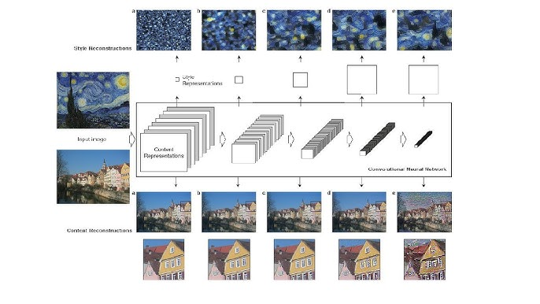

### **Face Recognition (from Video Transcripts)**

 Face recognition involves verifying or identifying a person from an image, addressing the **one-shot learning** challenge where only one image per person is available at test time.

- **Face Verification vs. Recognition**:
  - **Verification**: One-to-one; checks if an image matches a claimed identity (e.g., "Is this Danielle?").
    - Input: Image + claimed ID.
    - Output: Yes/no (e.g., 99.9% accuracy needed for reliability).
  - **Recognition**: One-to-many; identifies a person from a database (e.g., "Who is this?").
    - Harder: For 100 people, 1% verification error → high recognition error.
- **One-Shot Learning**:
  - Problem: Only one image per person in the database (e.g., one photo of each employee).
  - Challenge: Traditional CNNs with softmax (e.g., 5 outputs for 4 people + "none") fail with small datasets and require retraining for new people.
  - Solution: Learn a **similarity function** $ d(image_1, image_2) $.
    - Small $ d $: Same person.
    - Large $ d $: Different people.
    - Threshold $ \tau $: Predict same person if $ d < \tau $.
  - Example: Compare new image to database images; smallest $ d $ identifies the person.

- **Triplet Loss**:
  - **Concept**: Train on triplets (Anchor, Positive, Negative).
    - Anchor (A): Reference image.
    - Positive (P): Same person as A.
    - Negative (N): Different person.
  - **Objective**: Ensure $ ||f(A) - f(P)||^2 + \alpha \leq ||f(A) - f(N)||^2 $.
    - $ \alpha $: Margin (e.g., 0.2) to prevent trivial solutions (e.g., all encodings = 0).
  - **Loss Function**: $ L(A, P, N) = \max(||f(A) - f(P)||^2 - ||f(A) - f(N)||^2 + \alpha, 0) $.
    - Loss = 0 if margin satisfied; otherwise, penalizes to push encodings apart.
  - **Training Set**: Need multiple images per person (e.g., 10,000 images of 1,000 people).
    - Example: 10 images per person to form A, P, N triplets.
  - **Choosing Triplets**: Select "hard" triplets where $ d(A, P) \approx d(A, N) $ to make learning effective.
  - **Example**: Train on triplets (Danielle, Danielle, Kian); minimize $ d(A, P) $, maximize $ d(A, N) $.

- **Binary Classification Alternative**:
  - **Approach**: Treat face verification as binary classification (same = 1, different = 0).
  - **Input**: Pair of images; compute element-wise differences (e.g., $ |f(x_1)_k - f(x_2)_k| $).
  - **Output**: Sigmoid on features (e.g., $ \hat{y} = \sigma(\sum w_k |f(x_1)_k - f(x_2)_k| + b) $).
  - **Variations**: Use chi-square similarity or other metrics.
  - **Efficiency**: Pre-compute database encodings to save computation at test time.
  - **Example**: Compare new employee image to pre-computed database encodings; predict "same" if $ \hat{y} \approx 1 $.

**Example**: At a company turnstile, a face recognition system verifies an employee’s identity using one stored photo, letting them pass if the encoding matches closely.

**Why It Matters**: Enables secure, efficient identity verification with minimal data, used in access control, phone unlocking, etc.

---

### **Siamese Network**

 A Siamese Network is designed for tasks like face recognition, where the goal is to compare two images and determine if they are of the same entity (e.g., person). It consists of two identical convolutional neural networks (CNNs) with shared weights, processing two input images to produce encodings (feature vectors) for comparison.

- **Architecture**:
  - **Twin CNNs**: Two identical CNNs with the same architecture and parameters process two images, $ x_1 $ and $ x_2 $.
  - **Encodings**: Each CNN outputs a fixed-size vector (e.g., 128D), denoted $ f(x_1) $ and $ f(x_2) $, representing the image in a feature space.
  - **Distance Function**: The difference between encodings is computed as $ d(x_1, x_2) = ||f(x_1) - f(x_2)||^2 $, typically the squared L2 norm.
  - **Goal**: Train the network so $ d(x_1, x_2) $ is small for images of the same person and large for different people.
- **Training**:
  - **Objective**: Minimize $ d(x_i, x_j) $ for same-person pairs and maximize it for different-person pairs.
  - **Backpropagation**: Adjust CNN parameters to optimize encodings, typically using a loss function like triplet loss (see previous response) or binary classification.
  - **Data Requirement**: Needs pairs or triplets of images (e.g., 10,000 images of 1,000 people, with multiple images per person for training).
- **Example**:
  - Input: Two images of Danielle. The Siamese Network outputs encodings $ f(x_1) $ and $ f(x_2) $. If $ d(x_1, x_2) < \tau $ (threshold, e.g., 0.5), they are the same person.
  - Application: Employee turnstile verifies identity by comparing a live photo to a stored photo.

**Why It Matters**: Solves one-shot learning by learning a general similarity function, avoiding retraining for new individuals. Critical for face verification/recognition in real-world systems.

---

### **Logistic Regression for Face Recognition**

 An alternative to triplet loss, this approach treats face verification as a binary classification problem, predicting whether two images depict the same person (1) or different people (0).

- **Siamese Network Setup**:
  - Two CNNs produce encodings $ f(x_1) $ and $ f(x_2) $, each 128D (or higher).
  - **Features**: Compute element-wise differences, e.g., $ |f(x_1)_k - f(x_2)_k| $ for $ k = 1, ..., 128 $.
- **Logistic Regression**:
  - **Input**: Features derived from encodings, e.g., $ [|f(x_1)_1 - f(x_2)_1|, ..., |f(x_1)_{128} - f(x_2)_{128}|] $.
  - **Output**: $ \hat{y} = \sigma(\sum_{k=1}^{128} w_k |f(x_1)_k - f(x_2)_k| + b) $, where $ \sigma $ is the sigmoid function.
    - $ \hat{y} \approx 1 $: Same person.
    - $ \hat{y} \approx 0 $: Different people.
  - **Alternative Features**: Use chi-square similarity, e.g., $ \sum_{k} \frac{(f(x_1)_k - f(x_2)_k)^2}{f(x_1)_k + f(x_2)_k} $.
- **Training**:
  - **Dataset**: Pairs of images labeled as same (1) or different (0).
  - **Loss**: Binary cross-entropy, $ L = -[y \log(\hat{y}) + (1-y) \log(1-\hat{y})] $.
  - **Optimization**: Backpropagate to adjust CNN weights and logistic regression parameters ($ w_k, b $).
- **Efficiency Trick**:
  - **Pre-computation**: Store encodings for database images to avoid recomputing during inference.
  - Example: Compare a new employee’s live photo encoding to pre-computed database encodings.
- **Example**:
  - Input: Two images (Danielle, Kian). Compute $ |f(x_1)_k - f(x_2)_k| $, feed to logistic regression. Output $ \hat{y} \approx 0 $ (different people).

**Why It Matters**: Simplifies face verification as a standard supervised learning task, leveraging familiar binary classification techniques. Efficient with pre-computed encodings.

---

### **Neural Style Transfer**

 Neural Style Transfer (NST) generates an image $ G $ that combines the content of one image $ C $ (e.g., a dog) with the style of another image $ S $ (e.g., a Picasso painting). It uses a pre-trained CNN (e.g., VGG) and optimizes a cost function via gradient descent.

- **Problem Formulation**:
  - **Inputs**: Content image $ C $, style image $ S $, generated image $ G $.
  - **Goal**: Minimize cost function $ J(G) = \alpha J_{\text{content}}(C, G) + \beta J_{\text{style}}(S, G) $.
    - $ J_{\text{content}} $: Measures content similarity between $ C $ and $ G $.
    - $ J_{\text{style}} $: Measures style similarity between $ S $ and $ G $.
    - $ \alpha, \beta $: Hyperparameters weighting content vs. style.
- **Algorithm**:
  - Initialize $ G $ randomly (e.g., 100x100x3 noise image).
  - Use gradient descent: $ G \leftarrow G - \eta \frac{\partial J(G)}{\partial G} $, updating pixel values of $ G $.
- **Content Cost Function**:
  - **Layer Selection**: Use activations from a middle layer $ l $ (not too shallow or deep) of a pre-trained CNN (e.g., VGG).
  - **Activations**: $ a^{[l](C)} $ (content image) and $ a^{[l](G)} $ (generated image).
  - **Cost**: $ J_{\text{content}}(C, G) = \frac{1}{2} ||a^{[l](C)} - a^{[l](G)}||^2 $.
    - Measures L2 norm of activation differences (unrolled as vectors).
    - Encourages $ G $ to have similar content (e.g., a dog) as $ C $.
  - **Intuition**: Shallow layers enforce pixel similarity; deeper layers enforce high-level content (e.g., objects).
- **Style Cost Function**:
  - **Style Definition**: Style is the correlation between activations across channels in layer $ l $.
  - **Style Matrix (Gram Matrix)**:
    - For style image $ S $: $ G^{[l](S)} $, an $ n_c \times n_c $ matrix (where $ n_c $ is number of channels).
    - Element $ G^{[l](S)}_{kk'} = \sum_i \sum_j a^{[l](S)}_{ijk} a^{[l](S)}_{ijk'} $.
      - Sums over height ($ i $) and width ($ j $), multiplying activations of channels $ k $ and $ k' $.
    - Similarly for $ G^{[l](G)} $.
    - Represents unnormalized cross-covariance (not mean-subtracted correlation).
  - **Cost**: $ J_{\text{style}}^{[l]}(S, G) = \frac{1}{(2 n_h n_w n_c)^2} \sum_k \sum_{k'} (G^{[l](S)}_{kk'} - G^{[l](G)}_{kk'})^2 $.
    - Frobenius norm of style matrix differences, normalized by layer size.
  - **Multi-Layer Style**: Sum style costs across layers, weighted by $ \lambda^{[l]} $: $ J_{\text{style}}(S, G) = \sum_l \lambda^{[l]} J_{\text{style}}^{[l]}(S, G) $.
    - Early layers capture low-level features (e.g., edges); deeper layers capture high-level patterns.
- **Example**:
  - Content: Photo of a dog. Style: Picasso painting.
  - Initialize $ G $ as random noise.
  - Minimize $ J(G) $, adjusting pixels to resemble dog in Picasso’s style.

  

- **Intuition**:
  - Content cost ensures $ G $ retains the dog’s shape.
  - Style cost ensures $ G $ has Picasso-like textures/colors (e.g., correlated vertical lines and orange tints).

**Why It Matters**: Enables artistic image generation, blending content and style for creative applications like AI art.

---

### **1D and 3D Convolutions**

 While 2D convolutions are standard for images, 1D and 3D convolutions extend CNNs to time-series (e.g., EKG signals) and volumetric data (e.g., CT scans).

- **1D Convolution**:
  - **Input**: 1D signal, e.g., EKG time-series (14x1 for single channel).
  - **Filter**: 1D, e.g., 5x1.
  - **Operation**: Slide filter over signal, producing output (e.g., 14x1 → 10x1 with stride 1).
  - **Multiple Channels/Filters**:
    - Input: 14x$ n_c $ (e.g., multiple EKG leads).
    - Filter: 5x$ n_c $.
    - Output: 10x$ n_f $ (e.g., 16 filters → 10x16).
  - **Example**: Detect heartbeats in EKG by applying a 5D filter to identify patterns at different time points.
  - **Use Case**: Medical diagnosis (e.g., arrhythmia detection).
- **3D Convolution**:
  - **Input**: 3D volume, e.g., CT scan (14x14x14x1 for single-channel).
  - **Filter**: 3D, e.g., 5x5x5x1.
  - **Operation**: Slide filter over height, width, depth, producing output (e.g., 10x10x10x$ n_f $).
  - **Multiple Filters**: Output 10x10x10x16 for 16 filters.
  - **Example**: Detect tumors in a CT scan by identifying 3D patterns.
  - **Use Case**: Medical imaging, video analysis (treating time as depth).
- **Comparison to 2D**:
  - 2D: 14x14x3 → 5x5x3 filter → 10x10x16 (16 filters).
  - 1D: 14x1 → 5x1 filter → 10x16.
  - 3D: 14x14x14x1 → 5x5x5x1 filter → 10x10x10x16.
- **Alternative for 1D**: Recurrent Neural Networks (RNNs) or LSTMs are often used for sequential data, but 1D CNNs are simpler for fixed-pattern detection.

**Example**:
- **1D**: EKG signal (1000x1) convolved with 5x1 filter detects heartbeat peaks.
- **3D**: CT scan (100x100x100) convolved with 5x5x5 filter identifies tumor regions.

**Why It Matters**: Extends CNNs to diverse data types, enabling applications in medical diagnostics, video processing, and more.

---

- **Siamese Network**: “Like twins comparing two photos to see if they’re the same person. If the photos are similar, their ‘fingerprints’ (encodings) are close; if different, they’re far apart.”
- **Logistic Regression**: “Takes the differences between two photo fingerprints and decides if they’re the same person (yes/no) using a math formula.”
- **Neural Style Transfer**: “Mixes a photo’s content (like a dog) with an artist’s style (like Picasso’s colors) to create a new picture.”
- **1D Convolution**: “Scans a heartbeat signal to find patterns, like spotting heartbeats in a line of numbers.”
- **3D Convolution**: “Looks through a 3D body scan to find things like tumors, like searching a 3D puzzle.”
