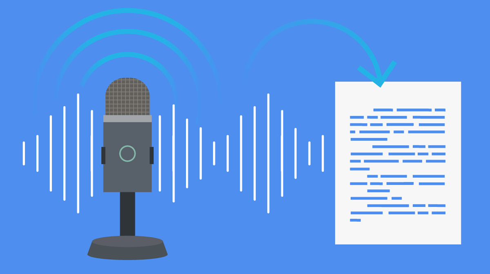

<h1 align="center"> Voice 2 English 🗣️</h1>

  

  <strong>The goal is to convert any spoken language into transcript of that original language and then convert that transcript into english language.</strong>

 

## 📑 Table of Contents

- [About the Project](#-about-the-project)
- [Results](#-results)
- [Tech Stack](#️-tech-stack)
- [File Structure](#-file-structure)
- [Dataset](#-dataset-miracl-vc1)
- [Model Architecture](#-model-architecture)
- [Installation and Setup](#-installation-and-setup)
- [Future Scope](#-future-scope)
- [Acknowledgements](#-acknowledgement)
- [Contributors](#-contributors)

## 📘 About the Project

This project focuses on developing an advanced voice-to-English translation system that converts spoken input from any language into English text. The pipeline begins with Automatic Speech Recognition (ASR) models, which transcribe the spoken language into its original text form. Next, a Neural Machine Translation (NMT) model translates this transcript into fluent and contextually accurate English. The dataset is divided into training and testing sets to ensure fair and consistent evaluation. The system leverages modern deep learning architectures optimized through extensive hyperparameter tuning to maximize transcription and translation accuracy. Finally, the project includes a real-time speech translation feature, enabling seamless live audio input and instant English output.

## 📊 Results

### Testing

### Accuracy

## ⚙️ Tech Stack

| **Category**                | **Technologies**                                                                                       |
|-----------------------------|----------------------------------------------------------------------------------------------------|
| **Programming Languages**   |               |
| **Frameworks**              | 
| **Libraries**               |              |
| **Deep Learning Models**    |    #:~:text=Its%20architecture%20consists%20of%20two,(GRU)%20instead%20of%20LSTM.) |
| **Dataset**                 |                                                                             |
| **Tools**                   |                              |
| **Visualization & Analysis**|                   |

## 📁 File Structure

    ├── Dataset Preprocessing
        ├── ctc.ipynb
        ├── asr.ipynb
    ├── Mini Projects
        ├── fruit_classifier.ipynb
        ├── 
        ├── 
        ├── 
        ├── 
    ├── Model Architecture
       ├── asr-ctc.ipynb
       ├── asr-transformers.ipynb
       ├── nmt.ipynb
    ├── Model Evaluation
       ├── Accuracy.ipynb
       ├── Testing.ipynb
    ├── Notes
       ├── Purvasha Singh
       ├── Vaishnavi Sanap
       ├── Harsh Sankhe      
    ├── README.md

## 💾 Dataset: Bhaashaanuvad

The **Bhaashaanuvad** dataset is designed to support research in multilingual speech-to-text and translation systems. It focuses on converting spoken audio from various Indian and global languages into accurate transcriptions and their corresponding English translations. Below is a breakdown of its structure and contents:

Audio Samples: Contains recordings of spoken sentences in multiple languages (such as Hindi, Marathi, Bengali, Tamil, and others).

Transcriptions: Each audio file is paired with a text transcript of the original language, facilitating ASR (Automatic Speech Recognition) training.

Translations: Provides parallel English translations of the transcripts, enabling effective NMT (Neural Machine Translation) training.

Purpose: Built to train and evaluate end-to-end speech translation pipelines, particularly systems that integrate ASR and NMT models for real-time multilingual voice translation.

Format: Data is organized in JSON and CSV formats, with fields for audio_path, source_text, and translated_text.

  ├──DatasetDict (Root)
    ├── 📁 hindi (88,566 rows)
    ├── chunked_audio_filepath → path to each audio chunk (.wav)
    ├── text → original transcript (in Hindi)
    ├── pred_text → model-predicted transcript
    ├── audio_filepath → full original audio file path
    ├── start_time → starting time (of chunk in seconds)
    ├── duration → chunk duration (in seconds)
    ├── alignment_score → matching score between audio & text
    ├── en_text → English translation of transcript

[Download the Bhaashaanuvad dataset on HuggingFace](https://huggingface.co/collections/ai4bharat/bhasaanuvaad-672b3790b6470eab68b1cb87)

## 🤖 Model Architecture

🧩 Format 1: ASR (BiLSTM + CTC + CNN) + NMT (Transformer)

1. Convolutional Neural Network (CNN)
Initial convolutional layers extract low-level spectral and temporal features from the input spectrograms or MFCCs, capturing important acoustic patterns.

2. Bidirectional Long Short-Term Memory (BiLSTM)
The BiLSTM layers process the extracted features in both forward and backward directions, enabling the model to understand context from the entire sequence of speech frames.

3. Connectionist Temporal Classification (CTC)
The CTC layer aligns predicted sequences with variable-length input audio. It enables training without requiring precise frame-level alignment, producing a sequence of transcribed text characters or phonemes.

4. Reshape & Output Layer (ASR Output)
The final tensor output from the CTC decoder represents the transcribed text in the original spoken language.

5. Transformer-based Neural Machine Translation (NMT)
The ASR transcript is fed into a Transformer-based NMT model, which uses multi-head attention and positional encoding to translate the source-language text into fluent English.

6. Decoder Layer (English Output)
The final decoder produces the translated English text, leveraging both encoder context and learned attention mechanisms for accuracy.

💡 This hybrid architecture combines the temporal modeling strength of BiLSTM with the contextual understanding power of Transformers.

⚙️ Format 2: ASR (Transformer) + NMT (Transformer)

1. Feature Extraction (Spectrogram/MFCC)
The input audio is converted into spectrograms or MFCC representations, forming the foundation for transformer-based speech modeling.

2. Transformer Encoder (ASR)
The ASR model uses a pure transformer encoder with self-attention mechanisms to capture both local and global speech dependencies without recurrence.

3. CTC or Attention-based Decoder (ASR Output)
Depending on configuration, the decoder generates either character-level transcriptions (CTC-based) or word-level outputs using attention mechanisms.

4. Intermediate Text Representation
The recognized speech text (original language) becomes the input to the translation model, ensuring modularity and flexibility.

5. Transformer Encoder-Decoder (NMT)
A second Transformer model takes the recognized text as input, encoding the source sentence and decoding it into English. It leverages multi-head attention, positional encoding, and feed-forward layers for context-aware translation.

6. Final Output Layer
The NMT decoder outputs a sequence of English words or tokens, forming the final translated sentence.

💡 This fully transformer-based pipeline is end-to-end, efficient, and highly scalable — achieving state-of-the-art performance in multilingual voice translation.

## 🌟 Future Scope

1. Multilingual Expansion:
Extend the current system to support more regional and global languages, enabling seamless translation between multiple language pairs and making it highly adaptable for diverse linguistic users.

2. Real-Time Speech Translation Interface:
Develop a user-friendly web or mobile interface that allows users to speak in any language and receive instant English translations — making the system practical for live communication, travel, and accessibility tools.

3. Emotion & Context Awareness:
Incorporate paralinguistic features like tone, pitch, and emotion recognition to produce translations that better capture the speaker’s intent and sentiment, not just the literal meaning.

## 📜 Acknowledgement

We would like to express our gratitude to all the tools and courses which helped in successful completion of this project.

**Research Papers**
- [https://huggingface.co/learn/audio-course/en/chapter3/introduction](https://huggingface.co/learn/audio-course/en/chapter3/introduction)
- [https://keras.io/examples/audio/transformer_asr/](https://keras.io/examples/audio/transformer_asr/)
- [https://keras.io/examples/audio/ctc_asr/](https://keras.io/examples/audio/ctc_asr/)

**Videos**
- [https://youtu.be/ZXiruGOCn9s?si=MoDN_55z-8Ns216k](https://youtu.be/ZXiruGOCn9s?si=MoDN_55z-8Ns216k)
- [https://youtu.be/SZorAJ4I-sA?si=F-cHsJH6L4-VED4I](https://youtu.be/SZorAJ4I-sA?si=F-cHsJH6L4-VED4I)

**Courses**
- [Andrew Ng's Deep Learning Specialization](https://www.coursera.org/specializations/deep-learning)

A special thanks to our project mentors [Sourish Phate](https://github.com/sourishphate), [Niharika](https://github.com/23f2003701-1) and to the entire [Project X](https://github.com/ProjectX-VJTI) community for unwavering support and guidance throughout this journey.

## 👥 Contributors

- [Purvasha Singh](https://github.com/purrvax)
- [Vaishnavi Sanap](https://github.com/shnavii11)
- [Harsh Sankhe](https://github.com/harsh-sankhe)

DatasetDict (Root)
│
 ├── 📁 hindi (88,566 rows)
 │ ├── chunked_audio_filepath → path to each audio chunk (.wav)
 │ ├── text → original transcript (in Hindi)
 │ ├── pred_text → model-predicted transcript
 │ ├── audio_filepath → full original audio file path
 │ ├── start_time → starting time (of chunk in seconds)
 │ ├── duration → chunk duration (in seconds)
 │ ├── alignment_score → matching score between audio & text
 │ ├── en_text → English translation of transcript

